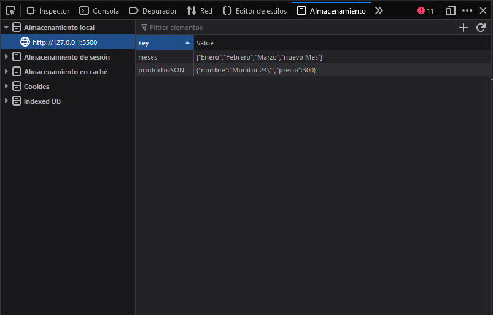
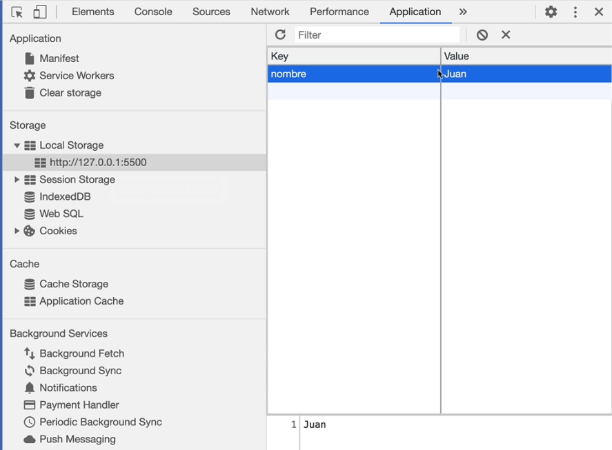

# Sección 15: **LocalStorage en JavaScript**


## 15.1. Primeros pasos con Local Storage

Veamos algunos ejemplos de LocalStorage...

Pertenece a la API de JavaScript, podemos verlo en la ventana global en la consola Windows.

Podemos ver nuestros localstorage en el inspector de elemento del navegador.

mozilla firefox



google chrome



`LocalStorage`: los datos persisten, podemos cerrar el navegador, reiniciar la máquina y los datos están almacenados aún.

`SessionStorage`: cuando cierro el navegador ya se pierden los datos. 

En sintaxis funcionan exactamente igual. 

```jsx
// Local Storage funciona con una especie de Llave valor...
// para agregar un elemento se utiliza .setItem
localStorage.setItem('nombre', 'Juan');

// añadir algo a sessionstorage
sessionStorage.setItem('nombre', 'Pablo');

// Local Storage solo soporta strings, no soporta arrays ni objetos pero puedes almacenarlos convirtiendolos a string..

const producto = {
    nombre: 'Monitor 24"',
    precio: 300
}

//convertimos el objeto en un string para poder guardar en el LocalStorage
const productoString = JSON.stringify(producto);
// de esta manera podremos guardar en localStorage un "objeto"
localStorage.setItem('productoJSON', productoString);

// Lo mismo con un array/arreglo, debemos pasarlo a string para poder guardarlo
const meses = ['Enero', 'Febrero', 'Marzo'];
// podemos aplicar directamente el stringify al guardar
localStorage.setItem('meses',  JSON.stringify(meses));
```

## 15.2. Obtener datos de LocalStorage

En esta sección veamos como obtener los datos almacenados en el LocalStorage

### . getItem

Para obtener de regreso los datos en el localStorage utilizamos el metodo .getItem. Si tratamos de obtener algo que no existe nos devolverá NULL

```jsx
const nombre = localStorage.getItem('nombre');
console.log(nombre); // te devuelve el valor que pusee la "llave"

// si tratamos de obtener algo que no existe nos devolvera NULL

// para obtener un objeto del localStorage utilizamos JSON.parse
// nos convierte un string a objeto/arreglo
const productoJSON = localStorage.getItem('productoJSON');
console.log(JSON.parse( productoJSON ));

const meses = JSON.parse( localStorage.getItem('meses'));
console.log(meses);
```

## 15.3. Eliminar y Actualizar elementos de LocalStorage

En esta sección veamos como eliminar elementos del storage.

### .removeItem()

para eliminar un elemento del localStorage le pasamos lo que queremos eliminar dentro de la llave a .removeItem()

```jsx
localStorage.removeItem('nombre');

// En cuanto a toda la funcionalidad de un CRUD, nos haria falta un update, 
// no hay como tal un Update en localStorage... lo que podrías hacer es...
// reescribir el valor
const mesesArray = JSON.parse(localStorage.getItem('meses'));
console.log(mesesArray)
mesesArray.push('nuevo Mes');
console.log(mesesArray);
localStorage.setItem('meses', JSON.stringify(mesesArray))

// limpia/elimina todo el contenido del localStorage
localStorage.clear();
```