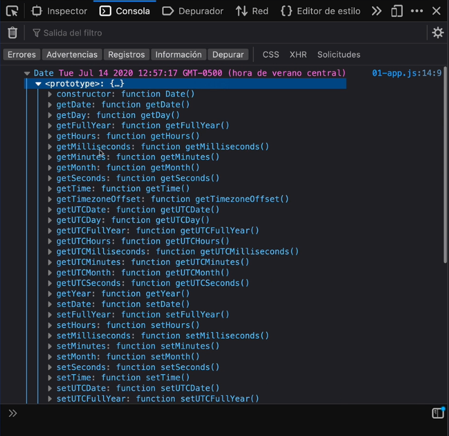

# Sección 16: **Fechas en JavaScript**


## 16.1 El Objeto Date()

En javascript hay un objeto llamado `Date` te devuelve el tiempo del momento en el que estas instanciando `Date` las fechas son de tipo OBJETOS

```jsx
const diaHoy = new Date();
let valor;

// En este momento
Date.now();// devuelve los miliseguntos transcurridos desde el 01/01/1970 hasta la fecha, no requiere instanciarse

// Date es Mes, dia y año
let cumple = new Date('1-5-1987'); // 
cumple = new Date('January 5 1987');

// .toString lo cambiaria de object a string
console.log(typeof valor)

// Convertir fecha a string

// cumple.toString();
valor = cumple;

valor = diaHoy.getMonth(); // mes en el que estamos, 0 enero, 1 febrero, ...
valor = diaHoy.getDate();
valor = diaHoy.getDay();
valor = diaHoy.getFullYear(); // anho actual
valor = diaHoy.getMinutes(); // minuto actual
valor = diaHoy.getHours(); // devuelve la hora actual
valor = diaHoy.getTime(); // devuelve los miliseguntos transcurridos desde el 01/01/1970 hasta la fecha
valor = diaHoy.getFullYear();
valor = diaHoy.setFullYear(2018); // con (.set) -> puedes modificar el objeto fecha por ejemplo -> .setFullYear(2018)

console.log(valor);
```

en firefox puedes ver más métodos para la función `date`

`.get` sirve para extraer el valor 

`.set` sirve para modificar el valor del objeto de fecha



## 16.2 MomentJS tu aliado para formatear Fechas

Es una librería que permite pasarle un formato de fecha que desees. Hay muchos ejemplos de su aplicación en su página oficial y lo que soporta.

[Moment.js | Home](https://momentjs.com/)

```jsx
// libreria MomentJS
const diaHoy = new Date();
moment.locale('es'); // queremos las fechas en espanol  
console.log(  moment().format('MMMM Do YYYY, h:mm:ss a', diaHoy) ); // podemos pasarle un formato que querramos

// operaciones con fechas 
console.log ( moment().add(3, 'days').calendar() );

//probando un formato mas amigable de la libreria momentJs para visualizar fechas
console.log( moment().format('LLLL', diaHoy) )
```