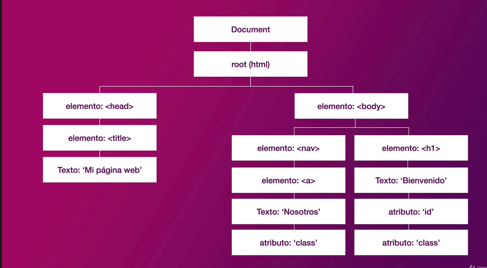
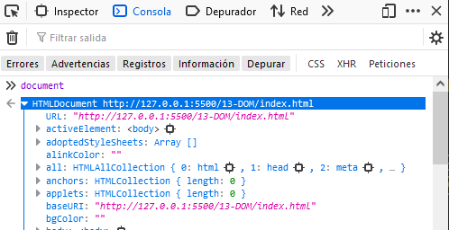

# Sección 13: **JavaScript DOM (Document Object Model)**


## 13.1 Qué es el DOM

Cuando comenzamos en el mundo del **desarrollo web**, normalmente comenzamos por aprender a escribir etiquetado o **marcado HTML** y además, añadir **estilos CSS** para darle color, forma y algo de interacción. Sin embargo, a medida que avanzamos, nos damos cuenta de que en cierta forma podemos estar bastante limitados.

Si únicamente utilizamos HTML/CSS, solo podremos crear **páginas «estáticas»** (*sin demasiada personalización por parte del usuario*), pero si añadimos Javascript, podremos crear **páginas «dinámicas»**. Cuando hablamos de páginas dinámicas, nos referimos a que podemos dotar de la potencia y flexibilidad que nos da un lenguaje de programación para crear documentos y páginas mucho más ricas, que brinden una experiencia más completa y con el que se puedan automatizar un gran abanico de tareas y acciones.

### **¿Qué es el `DOM`?**

Las siglas **`DOM`** significan **`Document Object Model`**, o lo que es lo mismo, la estructura del documento HTML. Una página HTML está formada por múltiples etiquetas HTML, anidadas una dentro de otra, formando un árbol de etiquetas relacionadas entre sí, que se denomina **árbol DOM** (*o simplemente DOM*).



En Javascript, cuando nos referimos al **DOM** nos referimos a esta estructura, que podemos modificar de forma dinámica desde Javascript, añadiendo nuevas etiquetas, modificando o eliminando otras, cambiando sus atributos HTML, añadiendo clases, cambiando el contenido de texto, etc.

Al estar "amparado" por un **lenguaje de programación**, todas estas tareas se pueden automatizar, incluso indicando que se realicen cuando el usuario haga acciones determinadas, como por ejemplo: pulsar un botón, mover el ratón, hacer clic en una parte del documento, escribir un texto, etc.

En resumen El DOM (Document Object Model) es todo nuestro código HTML y puedo acceder a través de java script a los elementos y datos para poder trabajar con ellos, modificar, eliminar, o crear nuevos elementos, HTML, etc.

## 13.2 Acceder a elementos del HTML con document

en java script tenemos acceso a un objeto que se llama `document`, básicamente es todo el HTML que tenemos en nuestros proyectos.



Siempre se hace referencia a `document` para seleccionar elementos de nuestro página HTML 

podemos tener control de todo nuestro documento con el DOM

```jsx
let elemento;

// document devuelve elementos de tipo HTMLCollection muy similares a los arreglos
elemento = document;
elemento = document.all; // selecciona todos los elementos que conforma nuestro HTML
elemento = document.all[0]; // 
elemento = document.head; // se refiere a la parte superior 
elemento = document.body; // todo lo que este dentro de la etiqueta body
elemento = document.domain; // en que URL esta cargado el proyecto
elemento = document.URL;
elemento = document.characterSet;
elemento = document.contentType;
elemento = document.forms; // te va a decir cuantos formularios hay en el proyecto
elemento = document.forms[0]; // puedo acceder a sus diferentes elementos
elemento = document.forms[0].id;
elemento = document.forms[0].method;
elemento = document.forms[0].action;

elemento = document.links; // podemos obtener todos los enlaces del proyecto
elemento = document.links[4].id;
elemento = document.links[4].className; // retorna en string las clases del elemento
elemento = document.forms[4].classList; // retorna las clases que posee el elemento, retorna DOMTokenList similar a un arreglo
elemento = document.forms[4].classList[0];

elemento = document.images; // saber cuantas imagenes tiene la web

elemento = document.scripts; // podemos seleccionar todos los scripts
elemento = document.scripts[2].getAttribute('src'); // 

console.log(elemento);
```

## 13.3 Métodos de acceso del DOM -  getElementsByClassName

Estaremos viendo como seleccionar elementos por su clase.

```jsx
// Seleccionando el header...
// Todos tus selectores inician con document...
// .getElementsByClassName nos va a permitir seleccionar por nombre de clases
// Es muy importante las mayusculas y minusculas...
const header = document.getElementsByClassName('header'); 
console.log(header);

const hero = document.getElementsByClassName('contenido-hero');
console.log(hero);

// Como las classes se pueden repetir, obviamente todas las coincidencias de classes se
// asignaran a contenedores, nos puede devolver multiples elementos.
const contenedores = document.getElementsByClassName('contenedor');
console.log(contenedores);

// Si una clase no existe, no va a retornar nada...
// nos retornara un HTMLCollection vacio 
const noExiste = document.getElementsByClassName('no-existe');
console.log(noExiste);
```

## 13.4 Métodos de acceso del DOM - getElementById

Estaremos viendo como seleccionar un elemento por su ID, recuerda los ID solo se deben utilizar uno con ese mismo nombre por documento.

```jsx
// en su propia sintaxis si notas la palabra Element no Elements
// nos indica que solo va a devolver un solo elemento y no un HTMLCollection
const formulario = document.getElementById('formulario');
console.log(formulario);

// Si no existe estará vacio nuestro resulltado, nos devuelve NULL
const noExiste = document.getElementById('no-existe');
console.log(noExiste);

// si existe en nuestro HTML un ID que se repite 2 veces
// .getElementById seleccionara y retornara solo el primer resultado que encuentre.
```

`getElementById` y`getElementsByClassName` Existen otro par de selectores que hoy en día son los más comunes, casi ya no se utilizan, tienen una sintaxis muy similar a la de CSS, así que vamos viéndolos en la siguiente sección.

## 13.5 Métodos de acceso del DOM - querySelector

Estaremos viendo una introducción a `querySelector`.

`querySelector` va a retornar máximo 1 elemento, si hay múltiples coincidencias solo va a retornar el primero, podemos seleccionar clases, ID

recuerda que solo va a retornarnos máximo un elemento, o ningún en caso de que no lo encuentre.

```jsx
// QuerySelector utiliza una sintaxis como de selector de CSS, por lo tanto si deseas
// seleccionar una clase, debe tener un punto al inicio...
const card = document.querySelector('.card'); 

// a pesar de tener múltiples cards (elementos), solo nos va a retornar el primero que encuentre
console.log(card);

// al ser una sintaxis tipo CSS puedes utilizar selectores más especificos...
// Usamos la ESPECIFICIDAD la manera mediante la cual los navegadores deciden qué valores de
// una propiedad CSS son más relevantes para un elemento
// las clases se separan por orden -> ('.ClasePadre .ClaseHijo')
const info = document.querySelector('.premium .info');
console.log(info);

// Seleccionar el segundo card... de hospedaje
// podemos utilizar pseudo-clases de CSS, por ejemplo
// nth-child() -> nos permite seleccionar varios elementos hijos de la clase indicando su posición
const segundoCard = document.querySelector('.hospedaje .card:nth-child(2)');
console.log(segundoCard);

// Ahora estas son clases, veamos como seleccionar un ID
// En CSS seleccionas los ID con un signo de numeral.
const formulario = document.querySelector('#formulario'); 
console.log(formulario);

// solo retorna el primer elemento que encuentre primero...
// También los ID pueden tener selectores especificos como el de arriba, pero recuerda 
// un ID es único asi que no tendría mucho sentido no?
// seleccionamos ID + clase 
const formulario = document.querySelector('.contenido-hero #formulario'); 
console.log(formulario);

// Si un selector no existe, 
const noExiste = document.querySelector('#no-existe');
console.log(noExiste);

// Recuerda que también en CSS puedes seleccionar etiquetas asi que si quieres seleccionar
// la navegación podrías tener algo asi:
const nav = document.querySelector('nav');
console.log(nav);
```

## 13.6 Métodos de acceso del DOM - querySelectorAll

`querySelectorAll` Retorna todos los elementos con el selector que estamos aplicando.

La buena noticia es que la sintaxis para selectores es la misma, es decir, similar a CSS, con el punto para las `classes` y el numeral para los `ID`, también puedes añadir un `selector específico`.

Pero la diferencia principal, es que `querySelectorAll` va a retornar todos los elementos que concuerden con el selector y no va a limitarte al primero como `querySelector`.

Por ejemplo: En nuestro HTML hay muchos cards, cuando utilizamos querySelector vimos que retornaba únicamente el primero.

```jsx
// en nuestro ejemplo HTML tenemos multiples card
// nos devuelve un NodeList, tambien similar a un arreglo 
const cards = document.querySelectorAll('.card'); 
console.log(cards);

// si recuerdas tenemos dos elementos en nuestro HTML con el id de formulario

const formularios = document.querySelectorAll('#formulario'); 
// Puedes ver quue eso si funciona, sin embargo recuerda que no rescomendable tener el 
// mismo ID más de una vez por docuemnto...
console.log(formularios); 

// Si no hay elementos no va a retornar nada
// Si un selector no existe, 
const noExiste = document.querySelectorAll('#no-existe');
console.log(noExiste); // retorna un NodeList que estara vacio
```

## 13.7 Modificar Textos o Imágenes con JS

Seleccionar elementos del `DOM` nos va a permitir modificar nuestro HTML y hacerlo más interactivo. Veamos, por ejemplo, como modificar el texto de la parte superior.

```jsx
// Primero tenemos que seleccionar el elemento en el que vamos a trabajar...
const encabezado = document.querySelector('.contenido-hero h1');
// console.log(encabezado);

// Si deseas acceder al texto hay 3 formas de hacerlo...
console.log(encabezado.innerText); // no encuentra/accede/retorna el texto, si esta oculto en CSS -> visibility: hidden
console.log(encabezado.textContent); // si encuentra/accede/retorna el texto a pesar de tener la propiedad CSS -> visibility: hidden
console.log(encabezado.innerHTML); // retorna texto con HTML

// ahora también puedes tener algo de encadenamiento o chaining cuando creamos codigo.
// seleccionar diferentes elementos del DOM
const textoEncabezado = document.querySelector('.contenido-hero h1').textContent;
console.log(textoEncabezado);
```

### Modificar nuestro HTML desde JavaScript

```jsx
// Puedes ver que estoy asignando obteniendo el Texto del HTML a una variable
// pero también podemos modificarlo directamente el HTML de diferentes formas...
// podemos realizar todo tipo de cambios sobre el DOM 
document.querySelector('.contenido-hero h1').textContent = 'Nuevo Heading'

// otra opción seria con una variable.
const nuevoTexto = 'Nuevo Heading';
document.querySelector('.contenido-hero h1').textContent = nuevoTexto;

// También puedes cambiar una imagen...
const imagen = document.querySelector('.card img');
console.log(imagen.src);
// Cambiar la imagen... (tener en cuenta la direccion ruta de la imagen)
imagen.src = 'img/hacer2.jpg';
```

## 13.8 Cambiando el CSS con JavaScript

En JavaScript también es posible cambiar el CSS de un elemento, o agregar o quitar clases.

```jsx
// Vamos a cambiar el color de texto del h1

const heading = document.querySelector('h1');

// siguiendo el ejemplo en la consola coloca  "heading."
// hay todo un objeto con propiedades CSS que puedes utilizar
console.log(heading.style);

// Las propiedades que le puedes pasar a JavaScript en su codigo, son similares a las de CSS, 
// con la diferencia de que el guion se elimina y la segunda palabra su primer letra es mayuscula.
// encontraras las mismas propiedades de CSS para aplicar en JS

// heading.style.backgroundColor = 'red'; 
// heading.style.textTransform = 'uppercase';
// heading.style.fontFamily = 'Arial';

// Ahora yo no recomiendo que pongas style, ya que tu archivo JS será muy grande, 
// otra desventaja es que la apariencia debe ser algo que sea responsabilidad del CSS, 
// no de JS, pero lo que si puedes hacer es agregar o quitar classes.

// siguiendo el ejemplo Vamos a seleccionar el primer card del HTML, puedes ver que tiene un parrafo
// con una categoria llamada concierto, eso le cambia el color: 
const card = document.querySelector('.card'); //seleccionamos el primer card
console.log(card); 
console.log(card.classList); // Classlist nos permitirá listar las classes
card.classList.add('nueva-clase'); 
// te permitirá añadir una clase.. 
// desde JS podemos mostrar, agregar una clase
// si deseas añadir múltiples classes debes agregar una coma en cada una
// card.classList.add('nueva-clase', 'segunda-clase'); 

// ahora si deseas eliminar una clase utilizas .remove
card.classList.remove('card'); 
// de la misma forma si deseas remover múltiples
// classes tendrías que hacerlo agregando una coma
```

Con esto te puedes ir dando una idea de todo lo que es posible hacer con JavaScript...

## 13.9 Traversing the DOM

Veamos lo que se conoce como Traversing the DOM.

Todo en JavaScript está conectado en el `document`, la forma en que te moverás entre diferentes elementos se le conoce como `Traversing the DOM`, es decir, ir recorriéndolo. Como si fuera un mapa, como si fueras turista en una ciudad que no conoces y vas recorriendo sobre los lugares que son de tu interés.

```jsx
const navegacion = document.querySelector('.navegacion');
console.log(navegacion);

// Cada elemento en la navegación o de las etiquetas los elementos se les conoce como Nodos.
// y podrás listarlos de la siguiente forma...
console.log(navegacion.childNodes); // retorna tambien como un elemento los espacios en blanco

// también existe algo llamado Children
// children si va a enlistar elementos que sean reales, es decir codigo HTML no tienen en cuenta el espacio en blanco
console.log(navegacion.children)

// Resumen: La diferencia es que childNodes te va a mostrar hasta los espacios en blanco, 
// children te muestra solo los elementos html...

// Hay mucha información aqui...
console.log(navegacion.children[0].nodeType) // devuelve un numero o valor que equivale al tipo de Node, 1 = elemento, 2 = atributo, 3 = texto....
console.log(navegacion.children[0].nodeName) // nos dice que tipo de etiqueta es...

// si selecciono el primer card...
const card = document.querySelector('.card');
console.log(card.nodeType);
console.log(card.nodeName);

// 1 = Elemento
// 2 - Atributo
// 3 - Text node
// 8 - Commentario
// 9 - Documento
// 10 doctype

// en javascript puedes seleccionar un elemento y navegar en sus diferentes elementos... esto es como se conoce al traversing the DOM
// por ejemplo el card...
// naveguemos en los elemenos hijos con CHILDREN

console.log(card.children);

// Si quieres acceder a ese div con la clase de info puedes colocar...
console.log(card.children[1]);

// Si quieres acceder a  los elementos hijos de ese info... recuerda puedes anidar las propiedades.
console.log(card.children[1].children[1]);

// Acceder al titulo
console.log(card.children[1].children[1].textContent);

// Modificar ese titulo con un traversing
card.children[1].children[1].textContent = 'Cambiando el Texto con traversing...'

// Intenta cambiar el texto que dice concierto por algo más siguiendo esta sintaxis de ir navegando por el DOM...

// veamos por ejemplo como acceder a una imagen...
console.log(card.children); // nos lista el contenido de card
console.log(card.children[0]); // accediendo a imagen
console.log(card.children[0].src); // 

// Cambiar la imagen...
card.children[0].src = 'img/hacer2.jpg';

// Children es una buena forma de acceder a los elementos por su posición, pero supongamos 
// que de nuestra navegación queremos acceder al primer o último enlace...

console.log(navegacion.FirstElementChild); // selecciona el primer elemento del nivel
console.log(navegacion.lastElementChild); // seleciona el ultimo elemento del nivel

// Si desesa acceder al primero
console.log(navegacion.firstChild)
console.log(navegacion.firstElementChild);

// Cambiar el primer texto...
navegacion.firstElementChild.textContent = 'Nuevo Enlace...'

// vimos como hacer traversing de un elemento padre hacia el hijo,
// JavaScript también te permite seleccionar un elemento hijo e ir navegando hacia el padre...

// vamos a seleccionar el primer enlace...
const enlace = document.querySelector('a');
console.log(enlace);

// Hay diferentes formas de navegar entre los elementos padres...
console.log(enlace.parentNode)// toma los elementos en blanco
console.log(enlace.parentNode) // toma los elementos validos en el HTML

// En algunos casos ambos parentNode y parentNode van a dar el mismo resultado, 
// en otros recuerda el espacio es importante...

// También puedes ir al padre del padre...
console.log(enlace.parentElement.parentElement)

// En JavaScript también es posible de hacer traversing a elementos que estan en el 
// mismo nivel (elemento hermano), digamos el vecino aunque en javascript se les conoce como hermanos...
// osea selecciona el siguiente elemento "hermano" que esta al mismo nivel
console.log(enlace);
console.log(enlace.nextElementSibling);// selecciona el elemento hermano
console.log(enlace.nextElementSibling.nextElementSibling);

console.log(card.nextElementSibling);

// También hay una forma de ir digamos en la otra dirección, osea seleccionar elementos
// de reversa de abajo para arriba, en otras palabras elementos previos...

const ultimoCard = document.querySelector('.card:nth-child(4)');
console.log(ultimoCard)

console.log(ultimoCard.previousElementSibling);
```

## 13.10 Eliminar elementos en el DOM

Después de una superextensa explicación de Traversing y acceder a elementos, veamos como eliminar elementos del DOM.

¿Es muy común no? Cuando borras una foto de Facebook o un tweet se elimina automáticamente, también cuando quitas elementos del carrito de compras de amazon.

Cuando le diste me gusta a una foto por accidente y le quitas el like, también hay un cambio, así que sin duda eliminar elementos llega a ser muy común.

```jsx
// Hay 2 formas de eliminar, 
// una es eliminar un elemento por si mismo
// la otra es eliminarlo desde el padre.

// seleccionamos el primer enlace de nuestro HTML
const primerEnlace = document.querySelector('a');
primerEnlace.remove(); // eliminar por si mismo, seleccionamos el elemento y eliminamos con .remove

// La otra forma es por el padre..
// es decir tenemos una referencia del padre y eliminamos el elemento hijo
const navegacion = document.querySelector('.navegacion');

// el siguiente paso es identificar el elemento a borrar..
// console.log(navegacion.children); 

// con .children tendremos los elementos hijos del elemento que hemos seleccionado .navegacion
// y tenemos la referencia, osea la posicion para poderlo eliminar con .removechild y le pasamos
// el nodo que deseamos eliminar
// navegacion.removeChild(navegacion.children[2]);

// Otra forma es creando una variable...

const borrar = navegacion.children[2]
navegacion.removeChild(borrar);
```

Como resumen recuerda, hay 2 formas de eliminar elementos, uno es por el elemento por sí mismo y el otro requiere el padre y la referencia del hijo.

## 13.11 Generar HTML con JavaScript

Finalmente, otro tema importante cuando trabajas con el DOM, es la creación de HTML desde JavaScript.

Cuando publicas un tweet, tienes un textarea que al enviarlo se agrega al listado de tweets, de ahí la gente comienza a darle me gusta, así que veamos como hacerlo generar HTML desde JavaScript.

Y no te preocupes si todo no queda claro, estaremos practicando mucho lo que es el DOM Scripting ya con muchos otros proyectos.

```jsx
// Vamos a crear un nuevo enlace... lo primero que hay que hacer es crear el elemento HTML, 
// en este caso un enlace...
// .createElement nos permite crear nuevos elementos, y colocamos la etiqueta que queremos utilizar
const enlace = document.createElement('A');

// Segundo paso es crear el texto del enlace no? lo haremos con textContent
enlace.textContent = 'Nuevo Enlace';
// aun no hemos agregado al DOM

// Despues vamos a asignar una ruta 
enlace.href = '/nuevo-enlace';

// podemos ir agregando atributos de ser necesario
// podemos colocar atributos personalizados a nuestro enlace
enlace.setAttribute('data-enlace', 'nuevo-enlace')

// tambien podemos agregar agregar una clase
enlace.classList.add('alguna-clase');

// Finalmente se agrega el enlace donde deseas mostrarlo...
// seleccionamos navegacion por que aqui queremos agregar nuestro enlace
const navegacion = document.querySelector('.navegacion');
// con .appendChild agregamos un hijo nuevo a quien? a la navegacion que acabamos de seleccionar
// pero agrega en la ultima posicion osea seria el ultimo hijo del elemento padre navegacion
navegacion.appendChild(enlace);

// si queremos insertar en la primera posicion osea la pocision 0 de nuestra navegacion seria
console.log(navegacion.children); // para ver la posicion de los hijos osea de los enlaces
navegacion.insertBefore(enlace, navegacion.children[1]); // el segundo parametro es nuestro nodo de referencia

console.log(enlace);

// Vamos a crear un segundo ejemplo, crearemos un cards...
// sin duda será algo más complejo...

// crear los 3 parrafos.
// primer parrafo
const parrafo1 = document.createElement('P');
parrafo1.textContent = 'Concierto';
parrafo1.classList.add('categoria');
parrafo1.classList.add('concierto');

// Segundo parrafo
const parrafo2 = document.createElement('P');
parrafo2.textContent = 'Concierto de Rock';
parrafo2.classList.add('titulo');

// 3er parrafo...
const parrafo3 = document.createElement('p');
parrafo3.textContent = '$800 por pesrona';
parrafo3.classList.add('precio');

// crear el div con la clase de info...
const info = document.createElement('div');
info.classList.add('info');
info.appendChild(parrafo1)
info.appendChild(parrafo2)
info.appendChild(parrafo3);

// Vamos a crear la imagen
const imagen = document.createElement('img');
imagen.src = 'img/hacer2.jpg'; // direccion de donde va a encontrar la imagen a utilzar

// Crear el Card..
const card = document.createElement('div');
card.classList.add('card');

// Vamos a asignar la imagen al card...
card.appendChild(imagen);

// y el info
card.appendChild(info);

// Insertarlo en el HTML...
const contenedor = document.querySelector('.hacer .contenedor-cards');
contenedor.appendChild(card); // al inicio info

console.log(parrafo1);
console.log(parrafo2);
```

## 13.12 Un Ejemplo más avanzado de lo que podemos hacer con JS

```jsx
// No siempre estarás haciendo traversing a tu dom, 

//seleccionamos nuestro boton flotante
const btnFlotante = document.querySelector('.btn-flotante');

// seleccionamos el footer
const footer = document.querySelector('.footer');

// cuando doy click a un boton sucede una accion, un evento y va a reaccionar
// aqui vamos a agregar una accion a nuestro boton flotante
// nuestro primer argumento sera el evento en este caso estamos "escuchando" un "click "
// en el segundo argumento nombramos la funcion declarada, o funcion anonima

//funcion anonima, seria una funcion con arrow function
//btnFlotante.addEventListener('click', () =>{
//	console.log('Diste click en el boton')
//});

//funcion declarada
btnFlotante.addEventListener('click', mostrarOcultarFooter);

function mostrarOcultarFooter() {
		//.contains no permite verificar si un elemente contiene una clase
		// si tiene la clase de activo significa que nuestro footer se esta viendo
		// por lo tanto si esta activo quiero remover esa clase
    if( footer.classList.contains('activo') ) {
        footer.classList.remove('activo');
        this.classList.remove('activo');
        this.textContent = 'Idioma y Moneda';
    } else {
        footer.classList.add('activo');
        this.classList.add('activo');
        this.textContent = 'X Cerrar';
    }
}
```