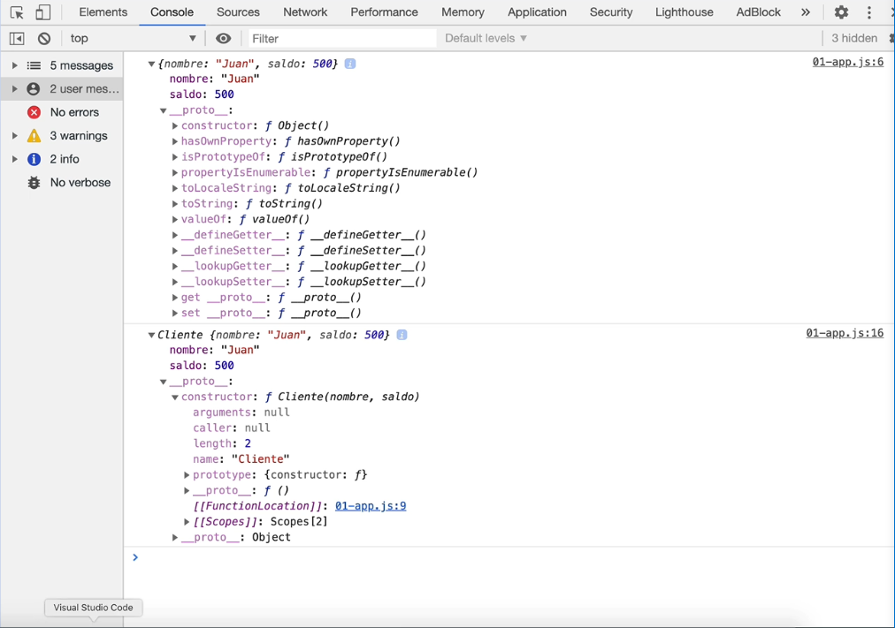
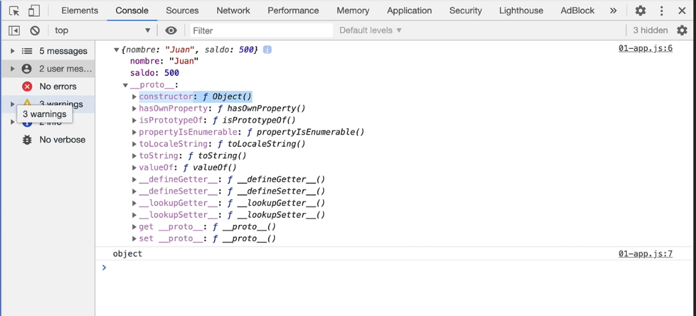
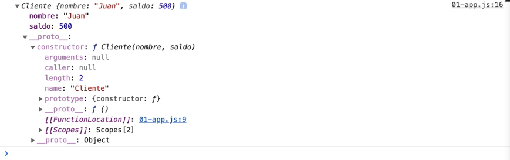
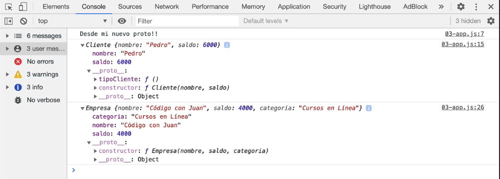
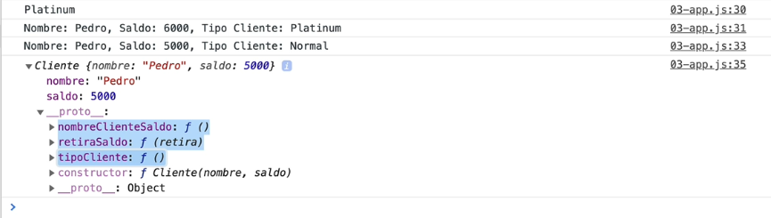

# Sección 17: **Prototypes en JavaScript**

## 17.1 Veamos que es el Proto y crear un tipo de objeto Nuevo

En este capítulo estaremos viendo que son los prototypes y como utilizarlos. 

Los prototypes están muy relacionados con los objetos, de hecho el prototype está disponible en todos los objetos.

Cada `proto` son funciones que puedes pasar a un tipo de objeto. 



Previamente, habíamos visto 2 formas de crear objetos.

## Object Literal

- (la más común, pero también es la menos dinámica ni reutilizables)
    - Podemos ver todos los tipos de `proto` que están disponibles para el mismo tipo de objeto
    - Recuerda que los `Object literal` no te permite creer objetos dinámicos, ni reutilizables.
        

        

```jsx
// Object literal, que es algo asi:
// Esta forma aunque es la más común, también es menos dinamica..
const cliente = {
    nombre: 'Juan',
    saldo: 500
}
```

## Object Constructor

- (es menos común, pero te permite crear objeto reutilizable y dinámicos)
    - puedo creer múltiples instancias.
        

        

```jsx
// Si necesitas añadir o crear un objeto reutilizable tienes que utilizar un constructor de función

// En JavaScript hoy en día tenemos clases, pero previamente la programación orientada a objetos era de la siguiente forma:
function Cliente(nombre, saldo) {
    this.nombre = nombre;
    this.saldo = saldo;
}

const juan = new Cliente('Juan', 400);

console.log(juan); // Puedes ver que si expandimos juan en la consola tenemos algo llamado el Prototype...
```

## 17.2 El Problema de no usar Prototypes

Con el prototype puedes agregar funciones que son exclusivas para un determinado objeto.  De esta forma podemos expandir el prototype y conocer todas las funciones disponibles para dicho objeto. Y evitamos confundirnos o equivocarnos en el código. Con un proyecto pequeño de 3, 4 funciones no es recomendable usar prototypes, sin embargo, un proyecto donde muchas personas van a estar modificando y van a haber muchos objetos diferentes es muy útil el uso de prototypes.

```jsx
// El problema que solucionan los prototypes...
function Cliente(nombre, saldo) {
    this.nombre = nombre;
    this.saldo = saldo;
}

const juan = new Cliente('Juan', 400);
console.log(juan);

// Supongamos que queremos una función que muestre el nombre y saldo...
function formatearCliente(cliente) {
    const {nombre, saldo} = cliente;
    return `El Cliente ${nombre} tiene un saldo de ${saldo}`;
}

console.log( formatearCliente(juan));

function Empresa(nombre, saldo, categoria) {
    this.nombre = nombre;
    this.saldo = saldo;
    this.categoria = categoria;
}

const ccj = new Empresa('Código Con Juan', 400);
console.log(ccj);

// Debido a que tengo una propiedad nueva (empresa), es dificil reutilizar esa función, lo cual nos llevaria digamos a muchas
// funciones que no sabriamos cuales utilizar para los diferentes objetos, esa es una ventaja que nos dan los prototypes ya
// que podemos crear funciones que se podrían atar o utilizar unicamente con determinados objetos...
```

## 17.3 Creando un Prototype

Como están atados a los objetos, los prototypes se utilizan como métodos. Y expandiendo los prototypes desde la consola podemos saber que funciones tenemos disponible para nuestro objeto.



```jsx
//creamos el constructor del objeto para CLIENTE
function Cliente(nombre, saldo) {
    this.nombre = nombre;
    this.saldo = saldo;
}

// Obtener Tipo de Cliente
// sintaxis -> funcions.prototype.nuevometodo/funcion
// Con prototypes tienes que utilizar function

// difencia entre arrow function y function nomarl
// function buscara en el mismo objeto en el objeto actual
// mientras que un arrow function irá hacia la ventana global marcandote un undefined
// podrias usar arrow function siempre y cuando no hagas referencia a un "this."

Cliente.prototype.tipoCliente = function()  { 
    let tipo;
    if(this.saldo > 10000) {
        tipo = 'Gold';
    } else if(this.saldo > 5000) {
        tipo = 'Platinum';
    } else {
        tipo  = 'Normal';
    }
    return tipo;
}

// Otro Prototipo para el nombre completo
// podemos haceerr referencia a otros prototypes dentro del mismo objeto
Cliente.prototype.nombreClienteSaldo = function()  {
    return `Nombre: ${this.nombre}, Saldo ${this.saldo}, Tipo Cliente:  ${this.tipoCliente()} `;
}

Cliente.prototype.retiraSaldo = function(retiro)  {
    this.saldo -= retiro;
}

// Instanciarlo
const pedro = new Cliente('Pedro', 6000);

// Acceder a los prototypes
console.log ( pedro.tipoCliente() );

// Un prototype que accede a otros prototypes
console.log ( pedro.nombreClienteSaldo() );

// reescribir un valor
pedro.retiraSaldo(2000);

// comprobar saldo
console.log ( pedro.nombreClienteSaldo());
```




