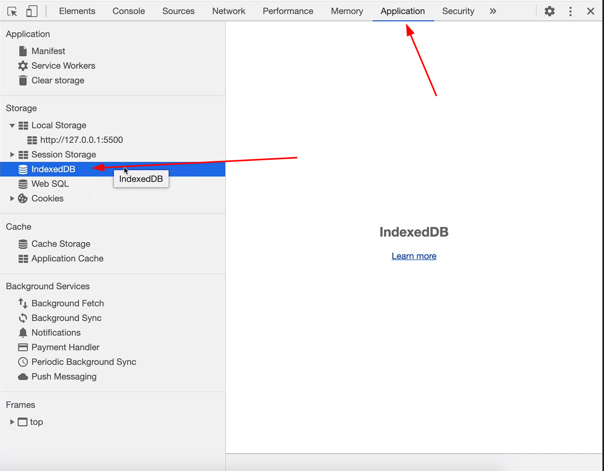
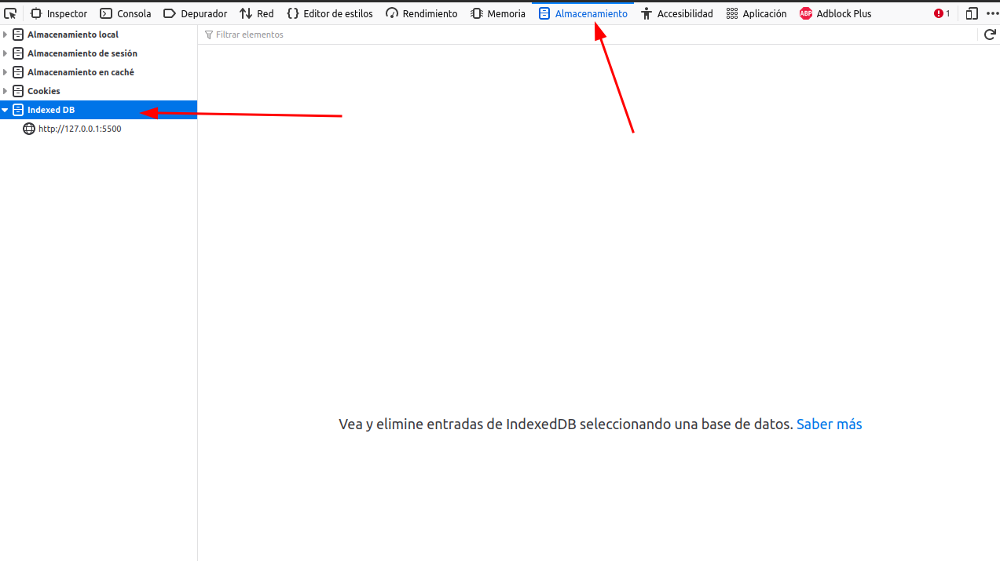
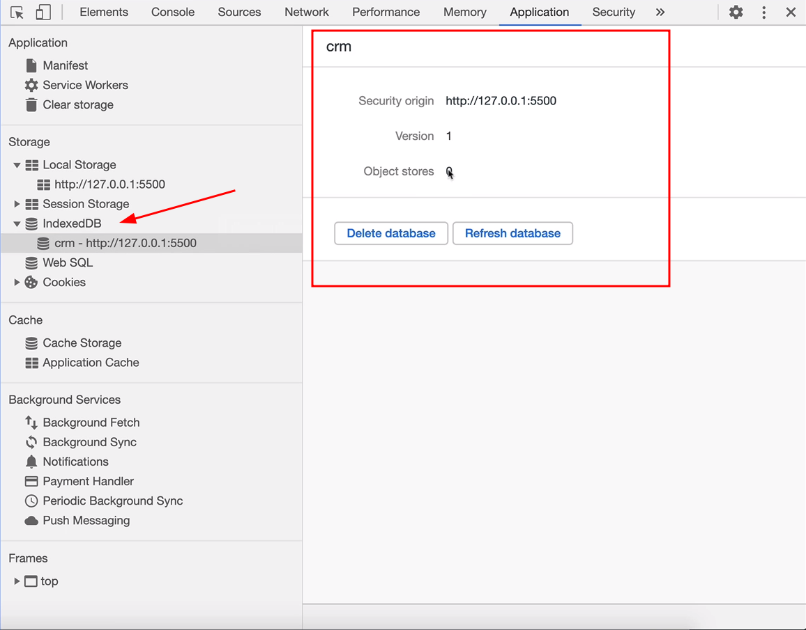

# Sección 21: **IndexDB base datos en javascript**

## 21.1 Introducción a IndexedDB

IndexedDB es una base de datos NoSQL que se utiliza para almacenar grandes cantidades de datos en el navegador del usuario. Algunas de las características y detalles más importantes de IndexedDB son los siguientes:

1. NoSQL: IndexedDB es una base de datos NoSQL, lo que significa que no tiene un esquema fijo y no requiere que los datos estén estructurados en una tabla relacional. En cambio, los datos se almacenan en objetos y se pueden recuperar usando índices.
2. Almacenamiento de datos en objetos: IndexedDB almacena datos como objetos. Esto permite a los desarrolladores almacenar y recuperar datos complejos de manera eficiente, lo que es útil para aplicaciones que requieren almacenamiento de datos complejos como imágenes, videos, documentos y archivos.
3. Almacenamiento en el lado del cliente: Los datos se almacenan en el lado del cliente, lo que significa que las aplicaciones web pueden acceder a ellos sin tener que enviar solicitudes al servidor.
4. Almacenamiento persistente: Los datos almacenados en IndexedDB persisten incluso después de que se cierre la aplicación o el navegador web. Esto significa que los usuarios pueden volver a la aplicación más tarde y encontrar sus datos tal como los dejaron.
5. JavaScript API: IndexedDB se utiliza a través de una API de JavaScript, lo que significa que las aplicaciones web pueden acceder a ella utilizando el lenguaje de programación que ya conocen.
6. Índices: IndexedDB utiliza índices para permitir búsquedas rápidas y eficientes de datos. Los índices se crean para las propiedades de los objetos almacenados y se utilizan para buscar rápidamente los datos.
7. Transacciones: IndexedDB utiliza transacciones para garantizar la integridad de los datos y la eficiencia de las operaciones. Las transacciones permiten a los desarrolladores agrupar varias operaciones en una sola y ejecutarlas de manera atómica, lo que significa que todas las operaciones se completarán o ninguna.
8. Capacidad de almacenamiento: IndexedDB tiene una capacidad de almacenamiento bastante grande en comparación con otras tecnologías de almacenamiento de datos en el lado del cliente. Los navegadores modernos permiten hasta 50 MB de almacenamiento en IndexedDB, aunque algunos navegadores permiten más.
9. Acceso asincrónico: Todas las operaciones en IndexedDB se realizan de forma asincrónica. Esto significa que el código no se bloqueará mientras se ejecutan operaciones de lectura y escritura en la base de datos, lo que mejora el rendimiento de la aplicación.
10. Soporte para transacciones en segundo plano: IndexedDB admite transacciones en segundo plano que permiten a los desarrolladores realizar operaciones en la base de datos sin afectar la interacción del usuario con la aplicación.
11. Es compatible con todos los principales navegadores modernos: IndexedDB es compatible con todos los navegadores modernos

En resumen, IndexedDB es una base de datos NoSQL que ofrece una gran capacidad de almacenamiento, índices para búsquedas eficientes, transacciones para la integridad de los datos, acceso asincrónico y transacciones en segundo plano. Es compatible con todos los principales navegadores modernos y es útil para aplicaciones que requieren almacenamiento de datos complejos y búsquedas eficientes.

### IndexDB vs. LocalStorage

IndexedDB y localStorage son ambas tecnologías de almacenamiento en el lado del cliente que se utilizan en el navegador web, pero hay algunas diferencias clave entre ellas:

1. Capacidad de almacenamiento: Una de las diferencias más importantes entre IndexedDB y localStorage es la capacidad de almacenamiento que ofrecen. `localStorage` generalmente tiene una capacidad de almacenamiento más limitada que IndexedDB, con un límite de almacenamiento que varía según el navegador, pero suele estar en el rango de 5-10 MB. `IndexedDB`, por otro lado, puede ofrecer una capacidad de almacenamiento mucho mayor, con algunos navegadores que permiten hasta 50 MB o más.
2. Tipo de datos almacenados: localStorage solo puede almacenar datos en formato de cadena, mientras que IndexedDB puede almacenar datos más complejos, como objetos, matrices y datos binarios. Esto hace que IndexedDB sea más útil para aplicaciones que necesitan almacenar y recuperar datos complejos, como imágenes, videos y archivos.
3. Estructura de datos: localStorage almacena datos en pares clave-valor, similar a un objeto JavaScript, mientras que IndexedDB almacena datos en objetos. IndexedDB permite la creación de índices que pueden acelerar las búsquedas, mientras que localStorage no proporciona esta capacidad.
4. Transacciones: IndexedDB utiliza transacciones para garantizar la integridad de los datos y la eficiencia de las operaciones, mientras que localStorage no ofrece soporte para transacciones.
5. Acceso asincrónico: Ambas tecnologías permiten el acceso asincrónico a los datos almacenados, lo que significa que las operaciones no bloquean el hilo principal del navegador. Sin embargo, IndexedDB utiliza una API más avanzada para acceder a los datos de manera asincrónica, lo que permite un mejor rendimiento en operaciones más complejas.

En resumen, IndexedDB es más adecuado para aplicaciones que necesitan almacenar grandes cantidades de datos complejos y realizar búsquedas eficientes, mientras que localStorage es más adecuado para aplicaciones que necesitan almacenar datos simples en pequeñas cantidades. Además, IndexedDB proporciona soporte para transacciones, índices y una mayor capacidad de almacenamiento, mientras que localStorage es más simple y fácil de usar en comparación con IndexedDB.

Ten en cuenta que funciona en el cliente, en otras palabras en el navegador y los datos almacenados siguen siendo visibles para cualquiera, por lo que no es recomendable almacenar passwords, tarjetas de créditos o información sensible.

## 21.2 Creando la base de datos

Para encontrar la base de datos IndexedDB en su navegador, puede utilizar las herramientas de desarrollador integradas en su navegador. Aquí hay algunos pasos generales para encontrar IndexedDB en algunos navegadores populares:

Google Chrome: Abra la página web que utiliza IndexedDB, haga clic derecho en la página y seleccione "Inspeccionar". Luego, en la ventana de herramientas de desarrollador que se abre, seleccione la pestaña "Application". Aquí puede encontrar IndexedDB en la sección "Storage" en el panel izquierdo.



Mozilla Firefox: Abra la página web que utiliza IndexedDB y haga clic derecho en la página. Seleccione "Inspeccionar elemento" y luego seleccione la pestaña "Storage" en la ventana de herramientas de desarrollador que se abre. Aquí puede encontrar IndexedDB en la sección "IndexedDB" en el panel izquierdo.



Tenga en cuenta que la ubicación específica de IndexedDB puede variar según el navegador y la versión del mismo.

```jsx

// se agrega un escucha de evento al objeto "document". 
// El evento que se escucha es "DOMContentLoaded", que se dispara cuando se ha cargado todo el contenido HTML 
// y se pueden manipular los elementos de la página. Cuando se dispara el evento, se ejecuta la función "crmDB()".
document.addventListener('DOMContentLoaded', () => {
	crmDB();
})

// La función "crmDB()" es una función que crea y configura una base de datos en IndexedDB.
function crmDB() {
	//se crea una variable "crmDB" que abre una nueva base de datos en IndexedDB. La base de datos se llama "crm" y su versión es 1.
	let crmDB = window.indexdeDB.open('crm', 1);

	// Si hay un error al abrir la base de datos, se ejecuta esta función que imprime un mensaje
	crmDB.onerror = function(){
		console.log('Hubo un error a la hora de crear la BD');	
	}

	// Si la base de datos se abre correctamente, se ejecuta esta función que imprime un mensaje
	crmDB.onsucces= function(){
		console.log('Base de datos Creada');
	}

	// Configuracion de la base de datos
	// Esta es una función que se ejecuta solo una vez, cuando se actualiza la versión de la base de datos.
	crmDB.onupgradeneeded = function () {
		console.log('Este metodo solo se ejecuta una vez...');
	}

}
```



En resumen, este código utiliza IndexedDB para crear una base de datos llamada "crm" con la versión 1.0, y establece funciones para manejar los casos de éxito, error y actualización de la base de datos.

## 21.3 Creando las Tablas

establecemos la función `onupgradeneeded` que se ejecutara cuando la base de datos se actualice y se cree una nueva versión. 

```jsx

// se agrega un escucha de evento al objeto "document". 
// El evento que se escucha es "DOMContentLoaded", que se dispara cuando se ha cargado todo el contenido HTML 
// y se pueden manipular los elementos de la página. Cuando se dispara el evento, se ejecuta la función "crmDB()".
document.addventListener('DOMContentLoaded', () => {
	crmDB();
})

// La función "crmDB()" es una función que crea y configura una base de datos en IndexedDB.
function crmDB() {

	//se crea una variable "crmDB" que abre una nueva base de datos en IndexedDB. La base de datos se llama "crm" y su versión es 1.
	let crmDB = window.indexdeDB.open('crm', 1);

	// Si hay un error al abrir la base de datos, se ejecuta esta función que imprime un mensaje
	crmDB.onerror = function(){
		console.log('Hubo un error a la hora de crear la BD');	
	}

	// Si la base de datos se abre correctamente, se ejecuta esta función que imprime un mensaje
	crmDB.onsucces= function(){
		console.log('Base de datos Creada');
	}

	// Configuracion de la base de datos
	// Se establece la función que se ejecutará cuando la base de datos se actualice y se cree una nueva versión.
	// La función recibe como parámetro un objeto de evento e.
	crmDB.onupgradeneeded = function (e) {
		
		// ahora se obtiene el objeto result que contiene la base de datos creada.
		// El objeto <e> que se está recibiendo como parámetro contiene información sobre el evento que ha sido disparado, incluyendo el objeto <result>.
		const db = e.target.result;

		//Se crea un objeto store (almacenamiento de objetos) llamado "crm" utilizando el método createObjectStore() de la base de datos db. 
		//El objeto keyPath especifica la propiedad que actuará como clave primaria de este store.
		//en este caso llamada "crm" y se autoincrementará mediante autoIncrement para cada objeto almacenado.
		const objectStore = db.createObjectStore('crm', {
			keyPath: 'crm',
			autoIncrement: true
		});

		//definir las columnas
		//Se definen los índices que se utilizarán para buscar y ordenar los datos almacenados en el objeto store.
		//En este caso, se definen índices para las propiedades "nombre", "email" y "telefono" del objeto almacenado. 
		//El índice "email" se define como único, lo que significa que no se permitirá almacenar dos objetos con el mismo valor en la propiedad "email".
		objectStore.createIndex('nombre','nombre', {unique: false});
		objectStore.createIndex('email','email', {unique: true});
		objectStore.createIndex('telefono','telefono', {unique: false});

//Se muestra en la consola el mensaje "Columnas creadas" para indicar que se han creado los índices con éxito.
	console.log('Columnas creadas')
	}

}
```