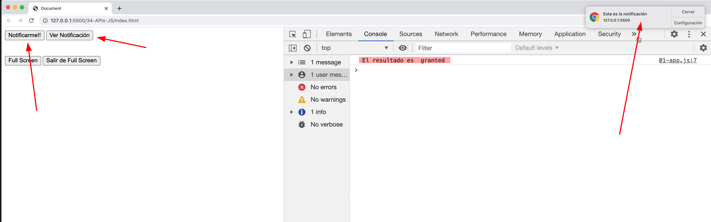

# Sección 23: **APIS Nativas JavaScript**

## 23.1 Notificacion API

La API Notification de JavaScript es una interfaz que permite a las aplicaciones web mostrar notificaciones en el escritorio del usuario. Esto significa que puedes enviar mensajes o alertas importantes, incluso cuando la página web no está activa en la pantalla del usuario. Utiliza el sistema de notificaciones nativo del sistema operativo en el que se está ejecutando el navegador.

Para utilizar la API Notification, primero debes solicitar permiso al usuario para mostrar notificaciones en su escritorio. Este permiso se solicita una sola vez, y una vez que se concede, la aplicación web puede mostrar notificaciones utilizando el constructor de la API Notification sin tener que solicitar permiso cada vez.

Una vez que se ha concedido el permiso, puedes crear notificaciones utilizando la función **`Notification()`**. Esta función toma dos parámetros: el título de la notificación y un objeto que define las opciones de la notificación (como el cuerpo del mensaje, el icono de la notificación, etc.).

Las notificaciones pueden incluir un título, un icono y un cuerpo de texto. Además, se pueden agregar acciones a la notificación que el usuario puede realizar, como hacer clic en un botón para abrir una página web.

```jsx
// Pedir permiso para mostrar notificaciones
Notification.requestPermission().then(function(permission) {
  if (permission === 'granted') {
    // Crear una nueva notificación
    var notification = new Notification('Título de la notificación', {
      body: 'Cuerpo de la notificación',
      icon: 'ruta/a/icono.png'
    });
    
    // Agregar una acción a la notificación
    notification.addAction('Abrir', 'ruta/a/pagina.html');
  }
});
```

Ten en cuenta que la API Notification solo funciona en navegadores compatibles y puede variar según el navegador y la plataforma en la que se esté ejecutando. Además, ten en cuenta que las notificaciones pueden ser molestas si se utilizan en exceso, por lo que es importante usarlas de manera responsable y en situaciones apropiadas.

### Implementando API de Notificación Nativas

Este código utiliza la API Notification de JavaScript para crear y mostrar notificaciones en el escritorio del usuario.



```jsx
// Notificaciones nátivas

// Primero, se selecciona el botón "Notificar" del DOM utilizando el método querySelector, asigna el botón "#notificar" a la variable "notificarBtn" 
const notificarBtn = document.querySelector('#notificar');

// se agrega un evento click que llama al método requestPermission de la API Notification "Notification.requestPermission()". Este método solicita al usuario permiso para mostrar notificaciones.
// La respuesta se maneja en la promesa que devuelve requestPermission, donde se imprime en la consola el resultado obtenido.
notificarBtn.addEventListener('click', () => {
    Notification
        .requestPermission()
        .then( resultado => {
            console.log('El resultado es ', resultado)
         })
})

// Ir mas alla con nuestra notificación...
// se selecciona el botón "Ver Notificación" del DOM utilizando querySelector asigna el botón "#verNotificacion" a la variable "verNotificacionBtn" y se agrega un evento click.
const verNotificacionBtn = document.querySelector('#verNotificacion');

verNotificacionBtn.addEventListener('click', () => {
		//se verifica si se ha concedido permiso para mostrar notificaciones mediante la propiedad permission de la API Notification
    if(Notification.permission == 'granted') {
				// Si el permiso está concedido, se crea una nueva notificación con el título "Esta es la notificación"
				// y el cuerpo "Tutorial de JavaScript", y se le asigna un ícono.
        const notificacion = new Notification('Esta es la notificación', { 
            icon: 'img/logo.png',
            body: 'Tutorial de JavaScript'
        });

        // Ir al sitio web desde la notificacion
				// Además, se agrega un evento onclick a la notificación que abre el sitio web de Google cuando se hace clic en la notificación.
        notificacion.onclick = function() {
            window.open('https://www.google.com')
        }

    }
})
```

En resumen, este código proporciona una idea básica de cómo utilizar la `API Notification` para crear y mostrar notificaciones en el escritorio del usuario, y cómo agregar acciones personalizadas a las notificaciones para realizar acciones adicionales al hacer clic en ellas. Sin embargo, es importante tener en cuenta que la compatibilidad de la `API Notification` varía según el navegador y el sistema operativo.

## 23.2 API Intersection Observer 

El Intersection Observer es una API de JavaScript que permite a los desarrolladores observar cambios en la intersección de un elemento con un contenedor específico. Esto es útil cuando se quiere realizar una acción cuando un elemento se encuentra en el área visible de la pantalla del usuario o, por el contrario, cuando está fuera de ella.

El uso principal del Intersection Observer es para la carga de imágenes, técnicas de carga perezosa (lazy loading) de imágenes o elementos multimedias ej: videos que están en la parte inferior de una página web. En lugar de cargar todos los elementos al mismo tiempo, se puede utilizar el Intersection Observer para cargar solo los elementos que están a punto de aparecer en la pantalla del usuario, reduciendo así el tiempo de carga de la página.

El funcionamiento de Intersection Observer es simple: se crea una instancia del objeto IntersectionObserver que recibe una función callback que se ejecutará cada vez que se observe una intersección del elemento observado con el área visible del contenedor. Esta función callback recibe un array de objetos IntersectionObserverEntry que contienen información sobre el elemento observado y su intersección con el área visible del contenedor.

Para crear un objeto IntersectionObserver se utiliza el siguiente código:

```jsx
const observer = new IntersectionObserver(callback, options);
```

Donde "callback" es la función que se ejecutará cuando se observe una intersección, y "options" es un objeto que contiene opciones de configuración para el observer y es opcional, se utiliza para configurar el comportamiento del observador. Puede incluir las siguientes propiedades:

- **`root`**: Especifica el elemento que se utilizará como contenedor para la observación. Por defecto, este valor es el viewport del navegador (es decir, la ventana del navegador). Si se desea observar un elemento dentro de un contenedor específico, se puede indicar ese contenedor en esta propiedad.
- **`rootMargin`**: Define un margen adicional (en píxeles) que se añadirá alrededor del contenedor especificado en la propiedad **`root`**. Esto puede ser útil si se desea detectar la intersección antes de que el elemento esté completamente visible en la pantalla.
- **`threshold`**: Define un umbral de intersección, que indica el porcentaje del elemento que debe estar visible en el contenedor para que se considere una intersección. Por defecto, este valor es 0 (es decir, se considera una intersección incluso si el elemento está parcialmente visible). Se puede configurar este valor para que la intersección se detecte cuando el elemento está completamente visible, o para que se detecte antes.

Una vez creado el objeto observer, se puede observar un elemento utilizando el método observe:

```jsx
observer.observe(element);
```

Donde "element" es el elemento que se desea observar.

En resumen, Intersection Observer es una API útil para mejorar el rendimiento de las páginas web al cargar contenido de manera perezosa, permitiendo que los elementos se carguen solo cuando son visibles para el usuario, reduciendo así la cantidad de datos que se deben cargar inicialmente.

Aquí te dejo un ejemplo de cómo podrías utilizar el Intersection Observer:

```jsx
// Seleccionamos el elemento que queremos observar
// se selecciona un elemento HTML con la clase "mi-elemento" utilizando el método querySelector.
const elementoObservado = document.querySelector('.mi-elemento');

// Creamos una instancia del Intersection Observer
const observador = new IntersectionObserver((entries, observer) => {
	// Código a ejecutar cada vez que se observe una intersección
  // entries es un array de objetos que contienen información sobre cada uno de los elementos observados
	// Dentro de la función callback, se utiliza el método forEach del array entries para iterar sobre cada uno de los objetos IntersectionObserverEntry 
	//y comprobar si el elemento observado está dentro o fuera del área visible del contenedor
  entries.forEach(entry => {
    if (entry.isIntersecting) {
      // El elemento está dentro del área visible, realizamos la acción que deseemos
      console.log('El elemento está dentro del área visible');
    } else {
      // El elemento está fuera del área visible, podemos realizar otra acción
      console.log('El elemento está fuera del área visible');
    }
  });
});

// Configuramos el observador para que observe el elemento seleccionado
observador.observe(elementoObservado);
```

En este ejemplo, estamos observando un elemento con la clase **`.mi-elemento`**. Cuando el elemento está dentro del área visible, se muestra un mensaje en la consola. Si está fuera, se muestra otro mensaje.  Es importante destacar que esta API es muy flexible y se pueden configurar varias opciones, como el threshold o umbral de intersección que se desea observar, la raíz del elemento contenedor, entre otras.

## 23.3 Detectar si hay conexión a internet o no

La propiedad **`navigator.onLine`** en JavaScript es una propiedad booleana que indica si el navegador está conectado a internet o no.

Cuando el valor de esta propiedad es **`true`**, significa que el navegador está conectado a internet, y cuando es **`false`**, significa que el navegador no tiene conexión a internet.

Esta propiedad es útil para realizar acciones en línea o fuera de línea en una aplicación web. Por ejemplo, se puede utilizar para mostrar un mensaje al usuario indicando que no hay conexión a internet cuando **`navigator.onLine`** es **`false`**, o para sincronizar datos en segundo plano cuando la conexión a internet está disponible de nuevo, enviar o recibir datos de un servidor remoto.

Es importante tener en cuenta que la propiedad **`navigator.onLine`** no indica la velocidad de la conexión a internet ni el estado de los servidores o sitios web específicos. Simplemente, indica si hay una conexión activa entre el navegador y el dispositivo que proporciona acceso a internet.

Este es un ejemplo muy básico, pero puede ser útil para hacer una verificación rápida del estado de conexión del usuario. También puedes utilizar el valor de **`navigator.onLine`** en otras partes de tu código para tomar decisiones en función del estado de conexión del usuario.

```jsx
// En este ejemplo, simplemente verificamos el valor de la propiedad navigator.onLine utilizando un condicional if. 
// Si el valor es true, el usuario está conectado a Internet, se muestra el mensaje "Estás conectado a Internet" en la consola del navegador. 
// De lo contrario, si el valor es false, se muestra el mensaje "No estás conectado a Internet".
if (navigator.onLine) {
  console.log('Estás conectado a Internet');
} else {
  console.log('No estás conectado a Internet');
}
```

```jsx
// Seleccionamos el elemento en el que mostraremos el estado de conexión
const estadoConexion = document.getElementById('estado-conexion');

// Verificamos el estado de conexión inicial del usuario utilizando la propiedad navigator.onLine
if (navigator.onLine) {
	//Si el valor de navigator.onLine es true, establecemos el texto del elemento estadoConexion en "Estás conectado a Internet".
  estadoConexion.textContent = 'Estás conectado a Internet';
} else {
	// De lo contrario, establecemos el texto en "No estás conectado a Internet".
  estadoConexion.textContent = 'No estás conectado a Internet';
}

// utilizamos los eventos online y offline para detectar cuando el estado de conexión del usuario cambia

// Escuchamos el evento "online" para detectar cuando el usuario se conecta a Internet
window.addEventListener('online', () => {
  estadoConexion.textContent = 'Estás conectado a Internet';
});

// Escuchamos el evento "offline" para detectar cuando el usuario pierde la conexión a Internet
window.addEventListener('offline', () => {
  estadoConexion.textContent = 'No estás conectado a Internet';
});
```

De esta manera, podemos proporcionar retroalimentación visual al usuario sobre su estado de conexión y actualizarla automáticamente cuando cambia.