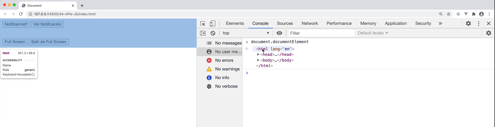

# Sección 23: **APIS Nativas JavaScript**

## 23.1 Notificacion API

La API Notification de JavaScript es una interfaz que permite a las aplicaciones web mostrar notificaciones en el escritorio del usuario. Esto significa que puedes enviar mensajes o alertas importantes, incluso cuando la página web no está activa en la pantalla del usuario. Utiliza el sistema de notificaciones nativo del sistema operativo en el que se está ejecutando el navegador.

Para utilizar la API Notification, primero debes solicitar permiso al usuario para mostrar notificaciones en su escritorio. Este permiso se solicita una sola vez, y una vez que se concede, la aplicación web puede mostrar notificaciones utilizando el constructor de la API Notification sin tener que solicitar permiso cada vez.

Una vez que se ha concedido el permiso, puedes crear notificaciones utilizando la función **`Notification()`**. Esta función toma dos parámetros: el título de la notificación y un objeto que define las opciones de la notificación (como el cuerpo del mensaje, el icono de la notificación, etc.).

Las notificaciones pueden incluir un título, un icono y un cuerpo de texto. Además, se pueden agregar acciones a la notificación que el usuario puede realizar, como hacer clic en un botón para abrir una página web.

```jsx
// Pedir permiso para mostrar notificaciones
Notification.requestPermission().then(function(permission) {
  if (permission === 'granted') {
    // Crear una nueva notificación
    var notification = new Notification('Título de la notificación', {
      body: 'Cuerpo de la notificación',
      icon: 'ruta/a/icono.png'
    });
    
    // Agregar una acción a la notificación
    notification.addAction('Abrir', 'ruta/a/pagina.html');
  }
});
```

Ten en cuenta que la API Notification solo funciona en navegadores compatibles y puede variar según el navegador y la plataforma en la que se esté ejecutando. Además, ten en cuenta que las notificaciones pueden ser molestas si se utilizan en exceso, por lo que es importante usarlas de manera responsable y en situaciones apropiadas.

### Implementando API de Notificación Nativas

Este código utiliza la API Notification de JavaScript para crear y mostrar notificaciones en el escritorio del usuario.


```jsx
// Notificaciones nátivas

// Primero, se selecciona el botón "Notificar" del DOM utilizando el método querySelector, asigna el botón "#notificar" a la variable "notificarBtn" 
const notificarBtn = document.querySelector('#notificar');

// se agrega un evento click que llama al método requestPermission de la API Notification "Notification.requestPermission()". Este método solicita al usuario permiso para mostrar notificaciones.
// La respuesta se maneja en la promesa que devuelve requestPermission, donde se imprime en la consola el resultado obtenido.
notificarBtn.addEventListener('click', () => {
    Notification
        .requestPermission()
        .then( resultado => {
            console.log('El resultado es ', resultado)
         })
})

// Ir mas alla con nuestra notificación...
// se selecciona el botón "Ver Notificación" del DOM utilizando querySelector asigna el botón "#verNotificacion" a la variable "verNotificacionBtn" y se agrega un evento click.
const verNotificacionBtn = document.querySelector('#verNotificacion');

verNotificacionBtn.addEventListener('click', () => {
		//se verifica si se ha concedido permiso para mostrar notificaciones mediante la propiedad permission de la API Notification
    if(Notification.permission == 'granted') {
				// Si el permiso está concedido, se crea una nueva notificación con el título "Esta es la notificación"
				// y el cuerpo "Tutorial de JavaScript", y se le asigna un ícono.
        const notificacion = new Notification('Esta es la notificación', { 
            icon: 'img/logo.png',
            body: 'Tutorial de JavaScript'
        });

        // Ir al sitio web desde la notificacion
				// Además, se agrega un evento onclick a la notificación que abre el sitio web de Google cuando se hace clic en la notificación.
        notificacion.onclick = function() {
            window.open('https://www.google.com')
        }

    }
})
```

En resumen, este código proporciona una idea básica de cómo utilizar la `API Notification` para crear y mostrar notificaciones en el escritorio del usuario, y cómo agregar acciones personalizadas a las notificaciones para realizar acciones adicionales al hacer clic en ellas. Sin embargo, es importante tener en cuenta que la compatibilidad de la `API Notification` varía según el navegador y el sistema operativo.

## 23.2 API Intersection Observer 

El Intersection Observer es una API de JavaScript que permite a los desarrolladores observar cambios en la intersección de un elemento con un contenedor específico. Esto es útil cuando se quiere realizar una acción cuando un elemento se encuentra en el área visible de la pantalla del usuario o, por el contrario, cuando está fuera de ella.

El uso principal del Intersection Observer es para la carga de imágenes, técnicas de carga perezosa (lazy loading) de imágenes o elementos multimedias ej: videos que están en la parte inferior de una página web. En lugar de cargar todos los elementos al mismo tiempo, se puede utilizar el Intersection Observer para cargar solo los elementos que están a punto de aparecer en la pantalla del usuario, reduciendo así el tiempo de carga de la página.

El funcionamiento de Intersection Observer es simple: se crea una instancia del objeto IntersectionObserver que recibe una función callback que se ejecutará cada vez que se observe una intersección del elemento observado con el área visible del contenedor. Esta función callback recibe un array de objetos IntersectionObserverEntry que contienen información sobre el elemento observado y su intersección con el área visible del contenedor.

Para crear un objeto IntersectionObserver se utiliza el siguiente código:

```jsx
const observer = new IntersectionObserver(callback, options);
```

Donde "callback" es la función que se ejecutará cuando se observe una intersección, y "options" es un objeto que contiene opciones de configuración para el observer y es opcional, se utiliza para configurar el comportamiento del observador. Puede incluir las siguientes propiedades:

- **`root`**: Especifica el elemento que se utilizará como contenedor para la observación. Por defecto, este valor es el viewport del navegador (es decir, la ventana del navegador). Si se desea observar un elemento dentro de un contenedor específico, se puede indicar ese contenedor en esta propiedad.
- **`rootMargin`**: Define un margen adicional (en píxeles) que se añadirá alrededor del contenedor especificado en la propiedad **`root`**. Esto puede ser útil si se desea detectar la intersección antes de que el elemento esté completamente visible en la pantalla.
- **`threshold`**: Define un umbral de intersección, que indica el porcentaje del elemento que debe estar visible en el contenedor para que se considere una intersección. Por defecto, este valor es 0 (es decir, se considera una intersección incluso si el elemento está parcialmente visible). Se puede configurar este valor para que la intersección se detecte cuando el elemento está completamente visible, o para que se detecte antes.

Una vez creado el objeto observer, se puede observar un elemento utilizando el método observe:

```jsx
observer.observe(element);
```

Donde "element" es el elemento que se desea observar.

En resumen, Intersection Observer es una API útil para mejorar el rendimiento de las páginas web al cargar contenido de manera perezosa, permitiendo que los elementos se carguen solo cuando son visibles para el usuario, reduciendo así la cantidad de datos que se deben cargar inicialmente.

Aquí te dejo un ejemplo de cómo podrías utilizar el Intersection Observer:

```jsx
// Seleccionamos el elemento que queremos observar
// se selecciona un elemento HTML con la clase "mi-elemento" utilizando el método querySelector.
const elementoObservado = document.querySelector('.mi-elemento');

// Creamos una instancia del Intersection Observer
const observador = new IntersectionObserver((entries, observer) => {
	// Código a ejecutar cada vez que se observe una intersección
  // entries es un array de objetos que contienen información sobre cada uno de los elementos observados
	// Dentro de la función callback, se utiliza el método forEach del array entries para iterar sobre cada uno de los objetos IntersectionObserverEntry 
	//y comprobar si el elemento observado está dentro o fuera del área visible del contenedor
  entries.forEach(entry => {
    if (entry.isIntersecting) {
      // El elemento está dentro del área visible, realizamos la acción que deseemos
      console.log('El elemento está dentro del área visible');
    } else {
      // El elemento está fuera del área visible, podemos realizar otra acción
      console.log('El elemento está fuera del área visible');
    }
  });
});

// Configuramos el observador para que observe el elemento seleccionado
observador.observe(elementoObservado);
```

En este ejemplo, estamos observando un elemento con la clase **`.mi-elemento`**. Cuando el elemento está dentro del área visible, se muestra un mensaje en la consola. Si está fuera, se muestra otro mensaje.  Es importante destacar que esta API es muy flexible y se pueden configurar varias opciones, como el threshold o umbral de intersección que se desea observar, la raíz del elemento contenedor, entre otras.

## 23.3 Detectar si hay conexión a internet o no - navigatorOnline

La propiedad **`navigator.onLine`** en JavaScript es una propiedad booleana que indica si el navegador está conectado a internet o no.

Cuando el valor de esta propiedad es **`true`**, significa que el navegador está conectado a internet, y cuando es **`false`**, significa que el navegador no tiene conexión a internet.

Esta propiedad es útil para realizar acciones en línea o fuera de línea en una aplicación web. Por ejemplo, se puede utilizar para mostrar un mensaje al usuario indicando que no hay conexión a internet cuando **`navigator.onLine`** es **`false`**, o para sincronizar datos en segundo plano cuando la conexión a internet está disponible de nuevo, enviar o recibir datos de un servidor remoto.

Es importante tener en cuenta que la propiedad **`navigator.onLine`** no indica la velocidad de la conexión a internet ni el estado de los servidores o sitios web específicos. Simplemente, indica si hay una conexión activa entre el navegador y el dispositivo que proporciona acceso a internet.

Este es un ejemplo muy básico, pero puede ser útil para hacer una verificación rápida del estado de conexión del usuario. También puedes utilizar el valor de **`navigator.onLine`** en otras partes de tu código para tomar decisiones en función del estado de conexión del usuario.

```jsx
// En este ejemplo, simplemente verificamos el valor de la propiedad navigator.onLine utilizando un condicional if. 
// Si el valor es true, el usuario está conectado a Internet, se muestra el mensaje "Estás conectado a Internet" en la consola del navegador. 
// De lo contrario, si el valor es false, se muestra el mensaje "No estás conectado a Internet".
if (navigator.onLine) {
  console.log('Estás conectado a Internet');
} else {
  console.log('No estás conectado a Internet');
}
```

```jsx
// Seleccionamos el elemento en el que mostraremos el estado de conexión
const estadoConexion = document.getElementById('estado-conexion');

// Verificamos el estado de conexión inicial del usuario utilizando la propiedad navigator.onLine
if (navigator.onLine) {
	//Si el valor de navigator.onLine es true, establecemos el texto del elemento estadoConexion en "Estás conectado a Internet".
  estadoConexion.textContent = 'Estás conectado a Internet';
} else {
	// De lo contrario, establecemos el texto en "No estás conectado a Internet".
  estadoConexion.textContent = 'No estás conectado a Internet';
}

// utilizamos los eventos online y offline para detectar cuando el estado de conexión del usuario cambia

// Escuchamos el evento "online" para detectar cuando el usuario se conecta a Internet
window.addEventListener('online', () => {
  estadoConexion.textContent = 'Estás conectado a Internet';
});

// Escuchamos el evento "offline" para detectar cuando el usuario pierde la conexión a Internet
window.addEventListener('offline', () => {
  estadoConexion.textContent = 'No estás conectado a Internet';
});
```

De esta manera, podemos proporcionar retroalimentación visual al usuario sobre su estado de conexión y actualizarla automáticamente cuando cambia.

## 23.4 Ejecutar pantalla completa con JS - resquestFullscreen()

### Método **requestFullscreen()**

**`requestFullscreen`** es un método de JavaScript que se utiliza para solicitar que un elemento HTML se muestre en pantalla completa. Este método se llama en un elemento específico del DOM y puede ser utilizado en navegadores modernos que soportan la API Fullscreen.

Cuando se llama a **`requestFullscreen`** en un elemento, el navegador cambia el modo de visualización del elemento a pantalla completa, lo que significa que se expande para cubrir toda la pantalla del dispositivo. Esto puede ser útil para proporcionar una experiencia de visualización inmersiva para el usuario, especialmente para elementos como videos o imágenes.

### Otros metodos fullscreen

Hay varios métodos relacionados con el modo de pantalla completa

1. **`requestFullscreen()`**: Se utiliza para solicitar que un elemento del DOM se muestre en modo de pantalla completa. Este método se llama en el elemento que deseas mostrar en pantalla completa.
2. **`exitFullscreen()`**: Este método se utiliza para salir del modo de pantalla completa. Puedes llamar a este método en el objeto **`document`** o en el elemento que está en modo de pantalla completa.
3. **`fullscreenElement`**: Esta es una propiedad de solo lectura que devuelve el elemento en modo de pantalla completa, si hay uno. Si no hay ningún elemento en modo de pantalla completa, el valor de esta propiedad es **`null`**.
4. **`fullscreenEnabled`**: Esta es una propiedad de solo lectura que indica si el navegador admite el modo de pantalla completa. El valor de esta propiedad es **`true`** si el navegador admite el modo de pantalla completa y **`false`** en caso contrario.
5. **`fullscreenchange`**: Este es un evento que se dispara cuando cambia el estado del modo de pantalla completa. Por ejemplo, se dispara cuando se entra o sale del modo de pantalla completa. Puedes usar este evento para realizar acciones adicionales cuando se activa o desactiva el modo de pantalla completa.
6. **`fullscreenerror`**: Este es un evento que se dispara si se produce un error al intentar cambiar al modo de pantalla completa.

Es importante tener en cuenta que no todos los navegadores admiten estos métodos y propiedades, y algunos de ellos tienen diferentes prefijos de navegador. Por ejemplo, algunos navegadores pueden utilizar el prefijo `webkit` o **`moz`**antes de los nombres de los métodos y propiedades relacionados con el modo de pantalla completa. Es una buena práctica verificar primero si el método o propiedad está disponible en el navegador antes de utilizarlo.

Para utilizar **`requestFullscreen`**, primero debes seleccionar el elemento en el que deseas habilitar el modo de pantalla completa, utilizando el método **`document.querySelector`** o similar. Luego, llamas al método **`requestFullscreen`** en ese elemento para solicitar que se muestre en pantalla completa. Aquí te muestro un ejemplo de cómo utilizar **`requestFullscreen`**:

```jsx
// Seleccionamos el elemento que queremos mostrar en pantalla completa
const elementoPantallaCompleta = document.querySelector('.mi-elemento');

// Llamamos al método requestFullscreen en el elemento seleccionado
if (elementoPantallaCompleta.requestFullscreen) {
  elementoPantallaCompleta.requestFullscreen();
}
```

En este ejemplo, seleccionamos el elemento que queremos mostrar en pantalla completa utilizando **`document.querySelector`** y lo almacenamos en la variable **`elementoPantallaCompleta`**. Luego, comprobamos si el método **`requestFullscreen`** está disponible en el elemento utilizando un condicional **`if`**. Si el método está disponible, lo llamamos en el elemento para solicitar que se muestre en pantalla completa.

Es importante tener en cuenta que la solicitud de pantalla completa solo se puede realizar en respuesta a una acción del usuario, como un clic en un botón o un evento similar. Esto es para evitar que los sitios web abusen del modo de pantalla completa y lo activen sin el consentimiento del usuario.

#### Veamos otro ejemplo:

Este código se encarga de agregar un comportamiento de pantalla completa a dos botones HTML con ID **`abrir-pantalla-completa`**
 y **`salir-pantalla-completa`**. Cuando el usuario hace clic en el botón “abrir pantalla completa”, se ejecuta la función **`pantallaCompleta`**, que solicita que todo el documento se muestre en modo de pantalla completa utilizando el método **`requestFullscreen()`** en el elemento **`document.documentElement`**. Cuando el usuario hace clic en el botón “salir pantalla completa”, se ejecuta la función **`cerrarPantallaCompleta`**, que sale del modo de pantalla completa utilizando el método **`exitFullscreen()`**
 en el elemento **`document`**.



```jsx
// ejecutar el sitio web en pantalla completa...
// se seleccionan dos botones HTML con los ID abrir-pantalla-completa y salir-pantalla-completa 
// utilizando el método document.querySelector() y se guardan en las constantes abrirBtn y salirBtn.
const abrirBtn = document.querySelector('#abrir-pantalla-completa');
const salirBtn = document.querySelector('#salir-pantalla-completa');

// se agregan eventos de escucha EventListener de clic a los botones abrirBtn y salirBtn
// Cuando se hace clic en el botón abrirBtn, se llama a la función pantallaCompleta y cuando se hace clic en el botón salirBtn, se llama a la función cerrarPantallaCompleta.
abrirBtn.addEventListener('click',  pantallaCompleta);
salirBtn.addEventListener('click',  cerrarPantallaCompleta);

//Esta función se llama cuando el usuario hace clic en el botón abrirBtn.
// Llama al método requestFullscreen() en el objeto document.documentElement para solicitar que todo el documento se muestre en modo de pantalla completa.
function pantallaCompleta() {
    document.documentElement.requestFullscreen();
}

//Esta función se llama cuando el usuario hace clic en el botón salirBtn. Llama al método exitFullscreen() en el objeto document para salir del modo de pantalla completa.
function cerrarPantallaCompleta() {
    document.exitFullscreen();
}
```

En resumen, este código proporciona una manera fácil para que los usuarios puedan expandir y contraer el sitio web en modo de pantalla completa, usando dos botones simples.

## 23.5 Detectar cuando estamos viendo la página web actual - **visibilityState**

### VisibilityState

La propiedad **`visibilityState`** es una propiedad de solo lectura de la API **`Page Visibility`** en JavaScript que indica si la página web está visible o no para el usuario. Esta propiedad es útil para determinar si el usuario está interactuando con la página o si la página está oculta o minimizada en la pantalla.

**`visibilitychange`** es un evento que forma parte de la API **`Page Visibility`** y se dispara cada vez que el valor de la propiedad **`visibilityState`** cambia, es decir, cuando la página se oculta o se muestra. El evento se dispara en el objeto **`document`** y se puede detectar y escuchar mediante el método **`addEventListener()`** Este evento es muy útil para detectar cambios en la visibilidad de la página y así tomar medidas en consecuencia.

```jsx
// En este ejemplo, se añade un manejador de eventos al objeto document para el evento visibilitychange.
document.addEventListener('visibilitychange', function() {
	// Cuando se dispara el evento, se comprueba el valor actual de visibilityState
	// para determinar si la página está oculta o visible y se realiza la acción correspondiente.
  if (document.visibilityState === 'hidden') {
    // La página está oculta
  } else {
    // La página está visible
  }
});
```

La propiedad **`visibilityState`** puede tener uno de los siguientes valores:

- **`"visible"`**: indica que la página es visible y el usuario está interactuando con ella. Ejemplo: un usuario está mirando la página en su navegador y tiene la pestaña activa.
- **`"hidden"`**: indica que la página está oculta y el usuario no está interactuando con ella. Por ejemplo, cuando el usuario cambia a otra pestaña del navegador.
- **`"prerender"`**: indica que la página se está cargando en segundo plano (memoria cache) y aún no está visible para el usuario. Ejemplo: el usuario ha abierto la página en una nueva pestaña, pero aún no ha cambiado a esa pestaña para verla.

La propiedad **`visibilityState`** es útil para desarrollar aplicaciones que necesitan ajustar su comportamiento según si la página está visible o no. Por ejemplo, si estás desarrollando una aplicación que utiliza muchos recursos, puedes pausar algunos procesos cuando la página no está visible para reducir la carga del sistema y mejorar el rendimiento.

Aquí hay un ejemplo sencillo que muestra cómo utilizar **`visibilityState`**:

```jsx
// Verificar si la página está visible
if (document.visibilityState === 'visible') {
  // La página está visible, realizar una acción
  console.log('La página está visible');
} else {
  // La página no está visible, realizar otra acción
  console.log('La página no está visible');
}

// Agregar un evento de cambio de visibilidad
document.addEventListener('visibilitychange', () => {
  if (document.visibilityState === 'visible') {
    // La página está visible, realizar una acción
    console.log('La página está visible');
  } else {
    // La página no está visible, realizar otra acción
    console.log('La página no está visible');
  }
});
```

En este ejemplo, se utiliza la propiedad **`visibilityState`** para comprobar si la página está visible o no en el momento de la carga. También se agrega un evento de cambio de visibilidad que se dispara cuando el usuario cambia entre pestañas del navegador o minimiza la ventana del navegador. El evento comprueba si la página está visible o no y realiza una acción correspondiente en cada caso.

Aquí otro ejemplo simple de cómo se puede utilizar la propiedad **`visibilityState`** para pausar un video cuando la página está oculta:

```jsx
//se selecciona un elemento de video utilizando el método **document.querySelector()**
const video = document.querySelector('video');

//se agrega un evento **visibilitychange** a la propiedad **document** para detectar cuando cambia la visibilidad de la página. 
// Cuando la página se oculta (**visibilityState** es **"hidden"**), el video se pausa. 
// Cuando la página se vuelve a mostrar (**visibilityState** es **"visible"**), el video se reproduce.
document.addEventListener('visibilitychange', () => {
  if (document.visibilityState === 'hidden') {
    video.pause();
  } else {
    video.play();
  }
});
```

## 23.6 Speech API

Speech API (también conocida como Web Speech API) es una API de JavaScript que permite a los desarrolladores agregar la funcionalidad de reconocimiento `SpeechRecognition` y síntesis `SpeechSynthesis` de voz en aplicaciones web. Con esta API, es posible reconocer y transcribir voz en tiempo real, y sintetizar voz para generar mensajes de audio en respuesta.

La API de voz se divide en dos partes principales:

### `SpeechRecognition`

La API de reconocimiento de voz `SpeechRecognition`: permite a los desarrolladores capturar el audio del usuario y transcribirlo en texto en tiempo real utilizando tecnología de reconocimiento de voz. La API transcribe el habla en texto en tiempo real y envía el resultado a la aplicación para su procesamiento. La API también puede reconocer comandos de voz específicos y ejecutar acciones en función de esos comandos.

Existen varios manejadores de evento en la API de Web Speech Recognition que permiten realizar diferentes acciones en respuesta a eventos específicos. A continuación, se describen algunos de los manejadores de eventos más comunes:

1. **`onstart`**:  se activa cuando comienza el reconocimiento de voz. Puede usarse para realizar una acción de inicialización.
2. **`onspeechend`**:se activa cuando se ha detectado el final de una entrada de voz. Puede usarse para realizar una acción de limpieza o para reiniciar el reconocimiento de voz.
3. **`onresult`**: se activa cuando se ha detectado una entrada de voz válida y se ha procesado. Proporciona una lista de resultados que pueden ser utilizados por la aplicación.
4. **`onerror`**: se activa cuando se produce un error durante el reconocimiento de voz. Proporciona información sobre el error y puede usarse para tomar medidas correctivas.
5. **`onend`**: se activa cuando se ha detenido el reconocimiento de voz. Puede usarse para realizar una acción de limpieza o para reiniciar el reconocimiento de voz.
6. **`onnomatch`**: se activa cuando no se encuentra ninguna coincidencia en la entrada de voz. Puede usarse para proporcionar una respuesta adecuada al usuario.
7. **`onaudiostart`**: se activa cuando se comienza a capturar audio. Puede usarse para proporcionar una respuesta visual al usuario.
8. **`onaudioend`**: se activa cuando se detiene la captura de audio. Puede usarse para proporcionar una respuesta visual al usuario.
9. **`onsoundstart`**: se activa cuando se detecta un sonido en la entrada de voz. Puede usarse para proporcionar una respuesta visual al usuario.
10. **`onsoundend`**: se activa cuando se detecta el final de un sonido en la entrada de voz. Puede usarse para proporcionar una respuesta visual al usuario.

Cabe destacar que estos son solo algunos de los manejadores de eventos disponibles, pero es importante tener en cuenta que no todos los manejadores de eventos son compatibles con todos los navegadores y plataformas, y algunos pueden requerir permisos adicionales para funcionar correctamente. Por lo tanto, es importante verificar la documentación oficial de la API de Web Speech Recognition para obtener información detallada sobre los manejadores de eventos disponibles y sus requisitos de compatibilidad.

### `SpeechSynthesis`

La API de síntesis de voz `SpeechSynthesis`: permite a los desarrolladores generar voz en tiempo real utilizando una tecnología de síntesis de voz. La API ofrece una serie de voces sintéticas en diferentes idiomas y dialectos. Los desarrolladores pueden usar la API para generar voz en tiempo real o para crear archivos de audio que contengan la voz generada.

SpeechSynthesis tiene algunos manejadores de eventos diferentes en comparación con SpeechRecognition

1. onvoiceschanged: se activa cuando la lista de voces está disponible y cambia.
2. onstart: se activa cuando comienza la síntesis de voz.
3. onend: se activa cuando la síntesis de voz se completa, ya sea con éxito o con un error.
4. onerror: se activa cuando se produce un error en la síntesis de voz.
5. onpause: se activa cuando se pausa la síntesis de voz.
6. onresume: se activa cuando se reanuda la síntesis de voz después de una pausa.
7. onboundary: se activa cuando se alcanza un límite de palabras, caracteres o frases durante la síntesis de voz.
8. onmark: se activa cuando se encuentra una marca de referencia durante la síntesis de voz.
9. oncancel: se activa cuando se cancela la síntesis de voz.
10. onaudiostart, onaudioend, onvoiceschanged, onpause, onresume, onboundary, onmark, onstart, onend, onerror.

Estos son solo algunos de los manejadores de eventos disponibles en la API SpeechSynthesis, y puedes encontrar más información en la documentación oficial.

La API de voz es muy útil para hacer que las aplicaciones web sean más accesibles, ya que permite a los usuarios interactuar con ellas utilizando solo la voz en lugar de tener que escribir o hacer clic en los botones. También es útil para la creación de chatbots y asistentes virtuales, puesto que permite una interacción más natural con el usuario.

Algunos casos de uso comunes de la API de voz incluyen la creación de aplicaciones de dictado de voz, la traducción de voz en tiempo real, la automatización de llamadas telefónicas y la creación de aplicaciones de accesibilidad para personas con discapacidades visuales o motoras.

un ejemplo sencillo de cómo utilizar la Speech API de JavaScript para reconocer la voz del usuario y mostrar el texto en la pantalla:

HTML:

```html
<button id="startBtn">Iniciar reconocimiento de voz</button>
<div id="texto"></div>
```

JavaScript:

```jsx
const startBtn = document.getElementById('startBtn');
const texto = document.getElementById('texto');

// Verificar si el navegador soporta la Speech API
if ('webkitSpeechRecognition' in window) {
  // Crear instancia del objeto reconocimiento
  const reconocimiento = new webkitSpeechRecognition();

  // Establecer las opciones del objeto reconocimiento
  reconocimiento.continuous = true;
  reconocimiento.interimResults = true;
  reconocimiento.lang = 'es-ES';

  // Agregar un evento para cuando se detecte voz
  reconocimiento.onresult = function(event) {
    let textoTranscrito = '';
    for (let i = event.resultIndex; i < event.results.length; i++) {
      if (event.results[i].isFinal) {
        textoTranscrito += event.results[i][0].transcript;
      }
    }
    // Mostrar el texto transcrito en la pantalla
    texto.textContent = textoTranscrito;
  };

  // Agregar un evento para cuando se haga clic en el botón
  startBtn.addEventListener('click', function() {
    reconocimiento.start();
  });
} else {
  texto.textContent = 'Lo siento, la Speech API no está disponible en este navegador.';
}
```

Este código crea un botón y un contenedor de texto en HTML, y luego utiliza JavaScript para detectar si el navegador es compatible con la Speech API. Si lo es, se crea una instancia del objeto **`webkitSpeechRecognition`** y se configura para que detecte la voz del usuario en español. Luego se agrega un evento al botón que inicia el reconocimiento de voz cuando se hace clic en él. Cuando el objeto reconocimiento detecta voz, se transcribe el texto y se muestra en el contenedor de texto en pantalla. Si la Speech API no está disponible en el navegador, se muestra un mensaje de error en lugar del botón.

Ejemplo sencillo de **`SpeechRecognition`**:

```jsx
// Creamos un nuevo objeto SpeechRecognition
//una instancia del objeto SpeechRecognition, que se utilizará para configurar y realizar el reconocimiento de voz.
const recognition = new SpeechRecognition();

// Configuramos el reconocimiento de voz
recognition.lang = "es-ES"; // Idioma español de España
recognition.continuous = false; // El reconocimiento se detendrá después de una pausa en el habla
recognition.interimResults = true; // Devuelve resultados provisionales mientras se habla

// Creamos una variable donde se almacenará el texto reconocido
let textoReconocido = "";

// Evento que se dispara cuando se detecta una pausa en el habla del usuario
recognition.onresult = event => {
  // Obtenemos el último resultado del reconocimiento
  const resultado = event.results[event.results.length - 1];

  // Si el resultado es definitivo, almacenamos el texto reconocido
  if (resultado.isFinal) {
    textoReconocido += resultado[0].transcript;
  }
}

// Evento que se dispara cuando el reconocimiento ha finalizado
// En este evento, se muestra el texto reconocido en la consola del navegador.
recognition.onend = () => {
  console.log(textoReconocido);
}

// Iniciamos el reconocimiento de voz lamando al método start() del objeto SpeechRecognition. 
// Con esta línea, se activa el micrófono del dispositivo y se inicia el proceso de reconocimiento de voz.
recognition.start();

```

En resumen, este código crea una instancia del objeto **`SpeechRecognition`**, configura sus opciones, define eventos para manejar los resultados del reconocimiento y el final del mismo, y finalmente, inicia el reconocimiento de voz. Al finalizar el reconocimiento, se muestra el texto reconocido en la consola del navegador.