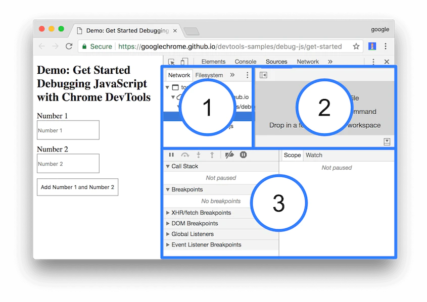

# Sección 30: **Debug, Medir Performance y Seguridad**

## 30.1 Performance.now()

En JavaScript, la función **`performance.now()`** se utiliza para medir el rendimiento y la precisión temporal de tu código. Proporciona un valor de tiempo de alta resolución y se utiliza comúnmente para medir el tiempo transcurrido entre dos puntos en el código, lo que permite evaluar el rendimiento de una función o sección específica.

La función **`performance.now()`** devuelve un valor de tipo **`DOMHighResTimeStamp`**, que representa el número de milisegundos transcurridos desde que se cargó la página o la aplicación. La precisión de este valor depende de la implementación del navegador y el sistema operativo, pero generalmente se mide con una resolución de microsegundos (1/1000 de milisegundo). A diferencia de otras funciones de tiempo en JavaScript, como **`Date.now()`** que tiene una precisión en milisegundos, **`performance.now()`** ofrece una mayor precisión temporal.

Aquí hay un ejemplo sencillo de cómo puedes utilizar **`performance.now()`** para medir el rendimiento de una porción de código en JavaScript:

```jsx
// Inicio de la medición
const startTime = performance.now();

// Código que deseas medir
for (let i = 0; i < 1000000; i++) {
  // Realizar operaciones aquí
}

// Fin de la medición
const endTime = performance.now();

// Calcular la duración en milisegundos
const duration = endTime - startTime;

console.log(`El código tardó ${duration} milisegundos en ejecutarse.`);
```

- En este ejemplo, se utiliza **`performance.now()`** para capturar la marca de tiempo antes y después de ejecutar un bucle que realiza alguna tarea repetitiva. Al restar **`startTime`** de **`endTime`**, obtendrás la duración en milisegundos que tardó en ejecutarse ese código específico.

Esta función es especialmente útil cuando deseas medir el rendimiento de diferentes algoritmos, funciones o enfoques para encontrar el más eficiente.

Recuerda que **`performance.now()`** puede variar ligeramente en su valor cada vez que se llama, puede variar en diferentes entornos y navegadores, y su precisión depende de la capacidad del hardware y la implementación del navegador en sí. Por lo que se recomienda realizar múltiples mediciones y calcular promedios para obtener resultados más precisos. Sin embargo, en general, se considera una forma confiable de medir el rendimiento dentro del navegador para optimizar y mejorar la eficiencia de tu código JavaScript.

## 30.2 Async o Defer?

**async** y **defer** son atributos que se pueden agregar a la etiqueta **<script>** en HTML para controlar cómo se carga y se ejecuta un archivo JavaScript externo en relación con la carga de la página.

### Async

- Cuando se agrega el atributo **async** a una etiqueta **<script>**, el archivo JavaScript se carga de forma asíncrona. Esto significa que el navegador no bloqueará la carga y el procesamiento del contenido HTML mientras descarga y ejecuta el archivo JavaScript. En su lugar, el archivo se descargará en paralelo y se ejecutará tan pronto como esté disponible. Esto puede mejorar el rendimiento de la página, pero también puede causar problemas si el script depende de elementos del DOM que aún no se han cargado.
- Es importante tener en cuenta que el orden de ejecución de múltiples scripts con **`async`** no está garantizado. Si hay varios scripts con el atributo **`async`**, pueden ejecutarse en cualquier orden según su disponibilidad, lo que puede afectar la lógica de tu código si dependes del orden de ejecución.
  Ejemplo:
  ```jsx
  <script async src="script.js"></script>
  ```

### Defer

- El atributo **defer** también permite la carga asíncrona de un archivo JavaScript, pero con una diferencia clave: el script se ejecutará solo después de que se haya cargado y analizado todo el contenido HTML. Esto garantiza que el script se ejecute en el orden correcto y que todos los elementos del DOM estén disponibles antes de que se ejecute el script. El atributo **defer** es útil cuando se tienen scripts que dependen de elementos del DOM o cuando se necesita mantener el orden de ejecución de varios scripts.
- A diferencia de **`async`**, el uso de **`defer`** garantiza que el script se ejecute después de que el documento HTML haya sido analizado, lo que permite que el script manipule elementos HTML existentes sin bloquear la carga de la página.
  Ejemplo:
  `jsx
    <script defer src="script.js"></script>
  `

### Aquí hay un ejemplo para ilustrar cómo se utilizan **`async`** y **`defer`** en las etiquetas **`<script>`**:

```jsx
<!DOCTYPE html>
<html>
<head>
  <title>Ejemplo de async y defer</title>
  <script src="script1.js" async></script>
  <script src="script2.js" defer></script>
</head>
<body>
  <!-- Contenido de la página -->
</body>
</html>
```

- En este ejemplo, el archivo "script1.js" se descargará de manera asíncrona y se ejecutará tan pronto como esté disponible, sin bloquear la carga de la página.
- Por otro lado, el archivo "script2.js" se descargará de manera asíncrona, pero se ejecutará después de que el documento HTML haya sido analizado, asegurando el orden de ejecución.

En resumen, **`async`** y **`defer`** son atributos que se utilizan para controlar la forma en que los archivos de script se descargan y ejecutan en una página web, brindando opciones para optimizar la carga y ejecución de los scripts. La elección entre **`async`** y **`defer`** depende de las necesidades específicas de tu código y del orden en el que se deben ejecutar los scripts.

La principal diferencia entre ellos es el momento en que se ejecutan los scripts: **async** ejecuta el script tan pronto como esté disponible, mientras que **defer** espera hasta que se haya cargado y analizado todo el contenido HTML.

## 30.3. Como utilizar debugger

En JavaScript, el término "debugger" se refiere tanto a una palabra clave específica (**`debugger`**) como a las herramientas de depuración disponibles en los navegadores web y en entornos de desarrollo.

### **Palabra clave "debugger"**:

- La palabra clave **`debugger`** es utilizada en JavaScript para detener la ejecución del código en un punto específico y permitir la depuración paso a paso. Cuando se encuentra la palabra clave **`debugger`** en el código, el intérprete de JavaScript pausa la ejecución y permite al desarrollador examinar y manipular el estado actual del programa utilizando las herramientas de depuración del entorno, ya sea en un navegador web o en un entorno de desarrollo.

#### Aquí hay algunos aspectos clave sobre la palabra clave **`debugger`**:

1. **Activación del depurador**: Cuando se alcanza una instrucción **`debugger`** durante la ejecución del código, se activa el depurador en el entorno correspondiente. Esto puede ser en el navegador web si estás depurando en un entorno de cliente, o en la consola si estás utilizando Node.js para ejecutar tu código.
2. **Pausa en el punto de interrupción**: Una vez que se encuentra la instrucción **`debugger`**, la ejecución se detiene en ese punto, lo que permite al desarrollador examinar el estado actual del programa. Esto significa que puedes inspeccionar el valor de las variables, examinar la pila de llamadas, evaluar expresiones y realizar un seguimiento de la ejecución paso a paso desde ese punto en adelante.
3. **Utilización del depurador**: Una vez que el depurador se ha activado, generalmente se tienen varias opciones para interactuar con él. Estas opciones pueden incluir avanzar a la siguiente instrucción, avanzar hasta el próximo punto de interrupción, retroceder en la ejecución, inspeccionar variables, modificar valores en tiempo real y ejecutar comandos específicos para obtener información adicional.
4. **Herramientas de depuración en navegadores**: Al utilizar la palabra clave **`debugger`** en un navegador web, se abrirán las herramientas de desarrollo específicas del navegador, como Chrome DevTools o Firefox Developer Tools. Estas herramientas proporcionan una interfaz gráfica de usuario para depurar el código, y ofrecen características avanzadas como puntos de interrupción condicionales, seguimiento de eventos, perfiles de rendimiento y más.
5. **Entorno de desarrollo y Node.js**: En un entorno de desarrollo o en Node.js, la palabra clave **`debugger`** activará un depurador en la consola o en una herramienta de línea de comandos específica para Node.js. Esto permite inspeccionar y depurar el código JavaScript en tiempo real desde la terminal.

Ejemplo de uso:

```jsx
function miFuncion() {
  // Código a depurar
  debugger; // Pausa la ejecución aquí
  // Más código a depurar
}
```

En este ejemplo, la ejecución se detendrá en la línea donde se encuentra **`debugger`**, permitiendo al desarrollador examinar las variables, ejecutar instrucciones paso a paso y analizar el estado del programa.

### **Herramientas de depuración en navegadores web**:

- Los navegadores modernos, como Google Chrome, Mozilla Firefox y Microsoft Edge, proporcionan herramientas de desarrollo que incluyen capacidades de depuración. Estas herramientas permiten al desarrollador inspeccionar y depurar código JavaScript en tiempo real mientras se ejecuta en el navegador. Las herramientas de depuración generalmente incluyen características como puntos de interrupción, seguimiento de la ejecución, inspección de variables y análisis de la pila de llamadas.
- Para acceder a las herramientas de depuración en un navegador web, generalmente se debe abrir el panel de herramientas de desarrollo (presionando F12 o haciendo clic derecho y seleccionando "Inspeccionar elemento"). Luego, se debe navegar a la pestaña "Sources" o "Fuentes" (puede variar según el navegador) y allí se podrán colocar puntos de interrupción y utilizar las funcionalidades de depuración.
- Aquí tenemos una vista previa de la herramienta de depuración en chrome



1. El panel del Navegador de archivos. Aquí se muestra una lista de todos los archivos que la página solicita.
2. El panel del Editor de código. Después de seleccionar un archivo en el Navegador de archivos, se muestra aquí el contenido de ese archivo.
3. El panel de Depuración de JavaScript. Contiene varias herramientas para inspeccionar el JavaScript de la página. Si la ventana de las herramientas de desarrollo es ancha, este panel se muestra a la derecha del panel del Editor de código.

Las herramientas de depuración, tanto la palabra clave **`debugger`** como las disponibles en los navegadores web, son fundamentales para detectar y solucionar problemas en el código JavaScript, ya que permiten examinar el estado de las variables, seguir la ejecución del programa y analizar posibles errores o comportamientos inesperados.
