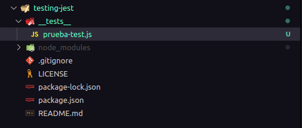
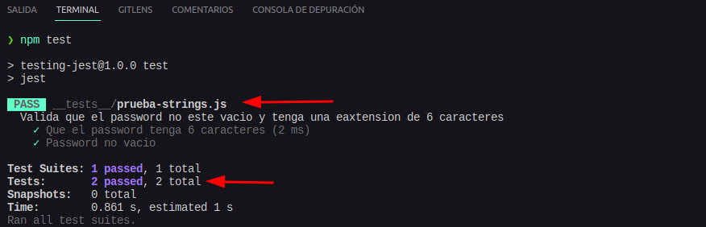
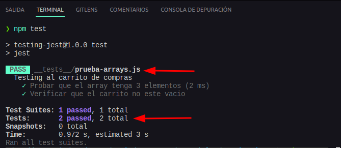

# Sección 32: **Jest**

## 32.1. Primeros pasos con Jest

El testing es una práctica esencial en el desarrollo de software que nos permite verificar la funcionalidad de nuestro código y detectar posibles errores. Jest es un framework de pruebas desarrollado por Facebook que facilita la escritura y ejecución de pruebas en JavaScript. A continuación, se presenta una guía paso a paso para comenzar a utilizar Jest en tus proyectos.

### 1. Instalación:

- Inicia tu proyecto de JavaScript ejecutando en la terminal **`npm init`** ubicado en la carpeta raíz. Completa los datos necesarios para generar el archivo **`package.json`**.
- Instala Jest como una dependencia de desarrollo ejecutando **`npm install --save-dev jest`**.
- Abre el archivo **`package.json`** en la raíz de tu proyecto, encuentra la sección **`"scripts"`** en el archivo. Modifica el script **`"test"`** para que ejecute Jest en su lugar. Puedes reemplazar la línea **`"echo \"Error: no test specified\" && exit 1"`** por **`"jest"`**.
- Al hacer este cambio, ahora podrás ejecutar tus pruebas utilizando el comando **`npm test`** o **`npm t`**, ya que Jest será el comando asociado al script "test" en el archivo **`package.json`**.

### 2. Estructura de archivos:

- Crea una carpeta llamada `tests` (doble guion bajo en el inicio y final) en la raíz de tu proyecto. Esta carpeta contendrá todos los archivos de prueba.
- Si deseas ubicar tus archivos de prueba fuera de la carpeta **`tests`**, asegúrate de que los nombres de los archivos terminen en **`.test.js`** o **`.spec.js`** para que Jest los detecte automáticamente.
- Ejemplo de como se ve la estructura inicial
  

### 3. Escritura de prueba/test:

- Cada archivo de prueba debe importar si es necesario el código que deseas probar.
- Utiliza el método **`test`** o **`it`** proporcionado por Jest para definir una prueba. Estos métodos reciben dos argumentos: una descripción de la prueba y una función que contiene las expectativas que se verificarán.
- Es importante tener en cuenta que puedes utilizar tanto **`test`** como **`it`** para definir tus pruebas, ya que son métodos equivalentes en Jest. Puedes elegir el que más te resulte cómodo.
- La función **`describe`** se utiliza para agrupar pruebas relacionadas dentro de un bloque. Toma dos argumentos: una descripción del grupo de pruebas y una función que contiene las pruebas dentro de ese grupo.
- Dentro de la función de prueba/test, utiliza las funciones **`expect`** y los `matchers` de Jest para definir las expectativas y comprobar los resultados esperados.
  - **expect:** es una función utilizada para definir las expectativas en tus pruebas. Proporciona una interfaz para realizar afirmaciones sobre los valores y comportamientos de tus programas.
  - Los **matchers** son métodos que se encargan de comparar el valor esperado con el valor actual y determinar si la prueba pasa o falla. Jest incluye una amplia gama de matchers para cubrir diferentes casos de uso.
    - Aquí hay algunos ejemplos de matchers comunes en Jest:
    - **`toBe(valorEsperado)`**: Compara si el valor actual es estrictamente igual al valor esperado utilizando el operador de igualdad (**`===`**).
    - **`toEqual(valorEsperado)`**: Compara si el valor actual es igual al valor esperado. A diferencia de **`toBe`**, **`toEqual`** realiza una comparación profunda de los objetos y matrices.
    - **`toBeDefined()`**: Verifica si el valor actual está definido.
    - **`toBeUndefined()`**: Verifica si el valor actual es **`undefined`**.
    - **`toBeNull()`**: Verifica si el valor actual es **`null`**.
    - **`toBeTruthy()`**: Verifica si el valor actual es considerado "verdadero" en un contexto booleano.
    - **`toBeFalsy()`**: Verifica si el valor actual es considerado "falso" en un contexto booleano.
    - **`toContain(valorEsperado)`**: Verifica si el valor esperado está contenido en el valor actual (para arreglos o cadenas de texto).
    - **`toBeGreaterThan(valorEsperado)`**: Verifica si el valor actual es mayor que el valor esperado.
    - **`toBeLessThan(valorEsperado)`**: Verifica si el valor actual es menor que el valor esperado.
    - **`toThrow()`**: Verifica si el valor actual lanza una excepción.
- Aquí tienes un ejemplo de cómo se usarían **`expect`** y los `matchers` en un ejemplo:
  ```jsx
  test("suma dos números", () => {
    expect(suma(2, 2)).toBe(4);
  });
  ```
  - En este caso, **`expect(suma(2, 2))`** define la expectativa de que la función **`suma`** con los argumentos 2 y 2 debe retornar 4. Luego, el matcher **`toBe(4)`** verifica si el resultado actual es igual a 4.
  - Recuerda que puedes combinar múltiples expectativas en una misma prueba para validar diferentes aspectos del código que estás probando.

### 4. Ejecución de pruebas:

- Ejecuta tus pruebas utilizando el comando **`npm test`** o **`npm t`** en la terminal.

```jsx
// archivo js de prueba
describe("Grupo de pruebas", () => {
  test("Hola mundo en jest", () => {
    // Aquí se pueden agregar expectativas y lógica de prueba
  });

  test("Otro Hola mundo", () => {
    // Aquí se pueden agregar expectativas y lógica de prueba
  });
});
```

- Analicemos el código de ejemplo
  - **`describe`**: Es una función que define un grupo de pruebas. Toma una descripción como primer argumento y una función como segundo argumento que contiene las pruebas asociadas al grupo.
  - **`"Grupo de pruebas"`**: Es una descripción que representa el grupo de pruebas. Puede ser un texto descriptivo que indique el propósito o la funcionalidad que se está probando.
  - **`test`**: Es un método que define una prueba individual dentro del grupo. Toma una descripción como primer argumento y una función como segundo argumento que representa la prueba en sí misma.
  - **`"Hola mundo en jest"`** y **`"Otro Hola mundo"`**: Son descripciones de las pruebas individuales. Al igual que con la descripción del grupo, estas descripciones deben ser claras y descriptivas para comprender lo que se está probando en cada caso.
  - **`() => {}`**: Es la función que representa una prueba en sí misma. Aquí es donde puedes agregar expectativas y lógica de prueba para verificar el comportamiento esperado de tu código.
    Recuerda que dentro de cada prueba, puedes utilizar las funciones **`expect`** y los matchers de Jest para definir las expectativas y verificar los resultados esperados.
  ```jsx
  //escribe en la terminal
  npm test
  ```
- Jest buscará automáticamente los archivos de prueba en la carpeta **`tests`** y los ejecutará.
- Verás el resultado de las pruebas en la terminal, mostrando si las pruebas han pasado o han fallado.
  

Con Jest, también puedes aprovechar características adicionales como el mocking para simular comportamientos, pruebas asincrónicas para manejar operaciones asíncronas y la generación de informes de cobertura de código.

## 32.2 Probando Strings - matcher toHaveLength

### **toHaveLength()**

La función **`toHaveLength`** es un matcher (comparador) proporcionado por Jest. Se utiliza para verificar si un valor tiene una longitud específica.

El matcher **`toHaveLength`** se puede usar para comparar la longitud de una cadena de texto, un array u otro tipo de objeto que tenga una propiedad **`length`**. La sintaxis general es la siguiente:

```jsx
expect(valor).toHaveLength(longitudEsperada);
```

Donde:

- **`valor`** es el valor que se está evaluando, como una cadena de texto, un array u otro objeto con una propiedad **`length`**.
- **`longitudEsperada`** es el número que representa la longitud que se espera que tenga el valor.

Cuando se ejecuta esta comparación, Jest verificará si la propiedad **`length`** del valor coincide exactamente con la longitud esperada. Si la longitud es la misma, la prueba pasará; de lo contrario, la prueba fallará.

Es importante tener en cuenta que **`toHaveLength`** solo se puede utilizar con valores que tienen una propiedad **`length`**. Si intentas usarlo en un valor que no tiene esta propiedad, la prueba producirá un error.

### Veamos un ejemplo:

En el código proporcionado, se define un conjunto de pruebas utilizando Jest para validar que un password cumpla con los requisitos de longitud y no esté vacío.

Test suite "Valida que el password no esté vacío y tenga una extensión de 6 caracteres":

- Describe un conjunto de pruebas relacionadas que verifican las propiedades del password.

Test case "Que el password tenga 6 caracteres":

- Prueba que el password tenga una longitud de 6 caracteres.

Test case "Password no vacío":

- Prueba que el password no esté vacío.

```jsx
/**
 * Valida que el password no esté vacío y tenga una extensión de 6 caracteres.
 */
describe("Valida que el password no este vacio y tenga una extension de 6 caracteres", () => {
  /**
   * Prueba que el password tenga 6 caracteres.
   */
  test("Que el password tenga 6 caracteres", () => {
    /**
     * Comprueba si la longitud del password es igual a 6.
     * @param {string} pass - El password a verificar.
     * @returns {void} - No devuelve ningún valor.
     */
    expect(pass).toHaveLength(6);
  });

  /**
   * Prueba que el password no esté vacío.
   */
  test("Password no vacio", () => {
    /**
     * Comprueba si la longitud del password no es igual a 0.
     * @param {string} pass - El password a verificar.
     * @returns {void} - No devuelve ningún valor.
     */
    expect(pass).not.toHaveLength(0);
  });
});
```

- **`const pass = "123456";`** Esta línea declara una constante llamada **`pass`** y le asigna el valor de **`"123456"`**. Aquí se está inicializando una variable que representa un password para ser utilizado en las pruebas.
- **`describe("Valida que el password no este vacio y tenga una extension de 6 caracteres", () => { ... });`**
  - **`describe`** es una función proporcionada por Jest que se utiliza para agrupar pruebas relacionadas.
  - Toma dos argumentos: una descripción (cadena de texto) que describe el grupo de pruebas y una función de callback que contiene las pruebas relacionadas dentro de ese grupo.
  - En este caso, el grupo de pruebas se describe como "Valida que el password no esté vacío y tenga una extensión de 6 caracteres".
- **`test("Que el password tenga 6 caracteres", () => { ... });`**
  - **`test`** es una función proporcionada por Jest que se utiliza para definir una prueba individual.
  - Toma dos argumentos: una descripción (cadena de texto) que describe la prueba en cuestión y una función de callback que representa la prueba en sí misma.
  - En este caso, se está definiendo una prueba que verifica si el password tiene 6 caracteres.
- **`expect(pass).toHaveLength(6);`**
  - **`expect`** es una función proporcionada por Jest que se utiliza para definir expectativas en una prueba.
  - **`toHaveLength`** es un matcher (comparador) proporcionado por Jest que verifica si el valor pasado como argumento tiene una longitud específica.
  - Aquí se está utilizando **`expect`** para verificar si el valor de **`pass`** tiene una longitud de 6 caracteres.
- **`test("Password no vacio", () => { ... });`**
  - Aquí se define otra prueba que verifica si el password no está vacío.
- **`expect(pass).not.toHaveLength(0);`**
  - En esta línea, se utiliza el matcher **`not`** junto con **`toHaveLength`** para verificar si el valor de **`pass`** no tiene una longitud de 0 (es decir, no está vacío).


En resumen, el código utiliza Jest para agrupar pruebas relacionadas y definir expectativas sobre un password. Mediante el uso de los matchers **`toHaveLength`** y **`not`**, se comprueba la longitud del password y se verifica que no esté vacío.

## 32.3 Probando Arrays

El siguiente ejemplo de código define dos pruebas utilizando Jest para verificar que el carrito de compras tenga una longitud específica y que no esté vacío:

```jsx
/**
 * Representa un carrito de compras.
 * @type {Array.<string>}
 */
const carrito = ["Producto 1", "Producto 2", "Producto 3"];

/**
 * Pruebas relacionadas al carrito de compras.
 */
describe("Testing al carrito de compras", () => {
  /**
   * Prueba que verifica si el carrito tiene 3 elementos.
   */
  test("Probar que el array tenga 3 elementos", () => {
    /**
     * Comprueba si el carrito tiene una longitud de 3 elementos.
     * @param {Array.<string>} carrito - El carrito de compras a verificar.
     * @returns {void} - No devuelve ningún valor.
     */
    expect(carrito).toHaveLength(3);
  });

  /**
   * Prueba que verifica si el carrito no está vacío.
   */
  test("Verificar que el carrito no esté vacío", () => {
    /**
     * Comprueba si el carrito no tiene una longitud de 0, es decir, no está vacío.
     * @param {Array.<string>} carrito - El carrito de compras a verificar.
     * @returns {void} - No devuelve ningún valor.
     */
    expect(carrito).not.toHaveLength(0);
  });
});
```

- **`const carrito = ["Producto 1", "Producto 2", "Producto 3"];`**
  - Esta línea declara una constante llamada **`carrito`** y la inicializa con un array de tres elementos. En este caso, el carrito de compras se representa como una lista de productos.
- **`describe("Testing al carrito de compras", () => { ... });`**
  - La función **`describe`** se utiliza para agrupar pruebas relacionadas.
  - En este caso, se está agrupando las pruebas relacionadas con el carrito de compras y se le da una descripción de "Testing al carrito de compras".
- **`test("Probar que el array tenga 3 elementos", () => { ... });`**
  - La función **`test`** se utiliza para definir una prueba individual dentro del grupo.
  - En este caso, se está definiendo una prueba que verifica si el carrito de compras tiene exactamente 3 elementos.
- **`expect(carrito).toHaveLength(3);`**
  - La función **`expect`** se utiliza para definir expectativas en una prueba.
  - El matcher **`toHaveLength`** verifica si el valor pasado como argumento tiene una longitud específica.
  - En este caso, se está utilizando **`expect`** para verificar si el **`carrito`** tiene una longitud de 3 elementos.
- **`test("Verificar que el carrito no esté vacío", () => { ... });`**
  - En esta línea se define otra prueba que verifica si el carrito de compras no está vacío.
- **`expect(carrito).not.toHaveLength(0);`**
  - Aquí se utiliza el matcher **`not`** junto con **`toHaveLength`** para verificar si el **`carrito`** no tiene una longitud de 0, es decir, no está vacío.

En resumen, el código define dos pruebas utilizando Jest para verificar que el carrito de compras tenga una longitud específica y que no esté vacío. Estas pruebas son útiles para garantizar que el carrito funcione correctamente y contenga los productos esperados.


