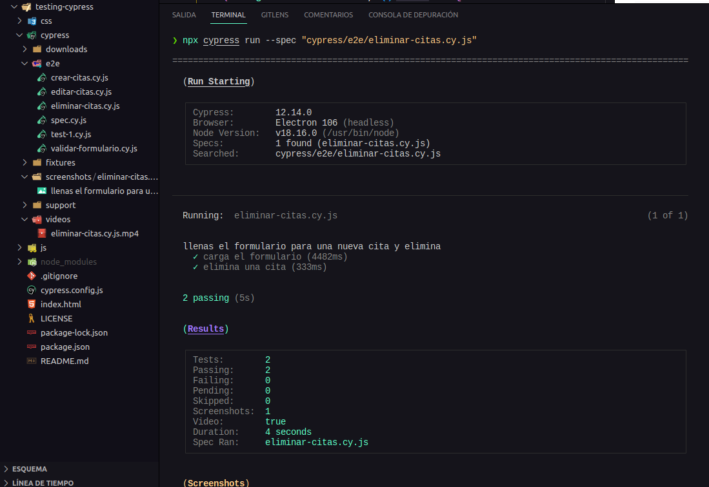
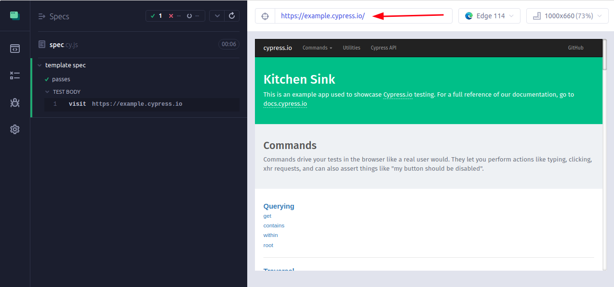
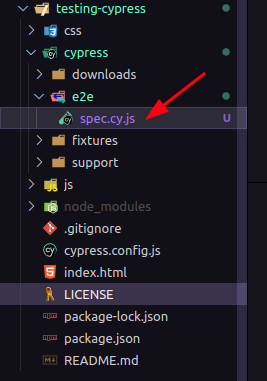
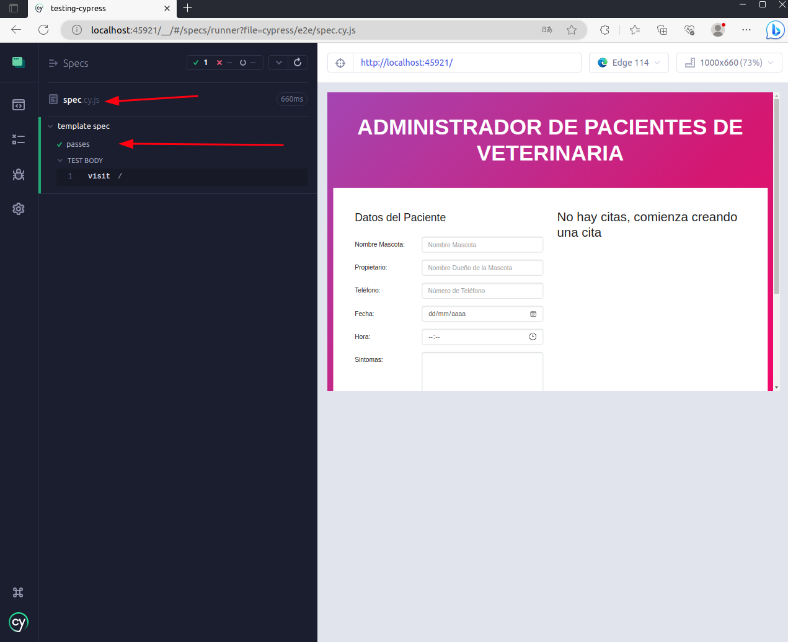

# Sección 33: **Cypress**

## 33.1 Qué es Cypress?

Cypress es un framework de pruebas de código abierto utilizado para realizar pruebas automatizadas en aplicaciones web. Especificamente, Cypress se utiliza para realizar pruebas de extremo a extremo (end-to-end) en aplicaciones web modernas.

A diferencia de otras herramientas de prueba, Cypress se ejecuta directamente en el navegador web en lugar de utilizar un control remoto o un controlador externo. Esto significa que tiene un acceso directo y completo a todas las funciones y objetos del navegador, lo que permite una interacción más robusta y precisa con la aplicación.

Cypress proporciona una API fácil de usar y potente para escribir y organizar pruebas. Además, viene con una interfaz de usuario amigable que muestra en tiempo real las acciones realizadas durante la ejecución de las pruebas y facilita la depuración.

Algunas de las características destacadas de Cypress incluyen:

1. Tiempo de ejecución en el mismo contexto que la aplicación: Esto significa que las pruebas pueden acceder directamente al DOM y a las APIs del navegador.
2. Recarga en tiempo real (live reloading): Los cambios realizados en las pruebas se reflejan automáticamente en el navegador, lo que permite una iteración rápida durante el proceso de desarrollo de las pruebas.
3. Visibilidad y depuración: Cypress muestra en tiempo real el estado de la aplicación, el DOM y las acciones realizadas durante las pruebas, lo que facilita la depuración de problemas.
4. Esperas automáticas y aserciones: Cypress maneja automáticamente las esperas para garantizar que los elementos estén presentes y sean interactivos antes de realizar acciones sobre ellos. También proporciona un conjunto de aserciones para validar el comportamiento esperado de la aplicación.

En el contexto de Cypress, los tipos de pruebas que puedes realizar son principalmente pruebas de extremo a extremo (end-to-end tests). Estas pruebas se centran en simular el comportamiento del usuario en la aplicación, desde la interacción con la interfaz de usuario hasta la validación de resultados.

Dentro de las pruebas de extremo a extremo, puedes abordar diferentes aspectos de tu aplicación, como:

1. Pruebas de flujo de usuario: Estas pruebas se enfocan en simular el recorrido del usuario a través de la aplicación, interactuando con diferentes elementos de la interfaz de usuario, como hacer clic en botones, llenar formularios y navegar entre páginas.
2. Pruebas de integración: Estas pruebas se centran en verificar la correcta interacción entre los diferentes componentes y módulos de tu aplicación. Puedes probar la integración de componentes, servicios externos, API, bases de datos, etc.
3. Pruebas de regresión: Estas pruebas se realizan para garantizar que las nuevas actualizaciones o cambios en la aplicación no introduzcan regresiones o errores en funcionalidades previamente implementadas. Ayudan a mantener la estabilidad y calidad del software a medida que evoluciona.
4. Pruebas de rendimiento: Estas pruebas se utilizan para evaluar el rendimiento de tu aplicación en términos de velocidad, escalabilidad y capacidad de respuesta bajo diferentes condiciones de carga. Puedes utilizar herramientas adicionales junto con Cypress para realizar pruebas de rendimiento más avanzadas.

Es importante destacar que Cypress está diseñado específicamente para las pruebas de extremo a extremo, donde se simula la interacción del usuario con la interfaz de usuario y se validan los resultados esperados. Otros tipos de pruebas, como las pruebas unitarias o las pruebas de integración de nivel inferior, generalmente se realizan utilizando otras herramientas o frameworks específicos.

En resumen, Cypress es una herramienta poderosa para realizar pruebas automatizadas de extremo a extremo en aplicaciones web, brindando una experiencia de desarrollo fluida y facilitando la detección temprana de errores.

## 33.2 Instalando y Primeros Pasos con Cypress

Antes de iniciar consulta el sitio web oficial de Cypress (**https://www.cypress.io/**) y su documentación oficial para obtener la información más actualizada sobre la última versión de Cypress y sus características más recientes.

Empecemos! en el contexto de Node.js en la gestión de paquetes al instalar herramientas o frameworks, existen dos categorías principales para las dependencias: dependencias de desarrollo (devDependencies) y dependencias de producción (dependencies). A continuación, te explico las diferencias entre ambas:

### Dependencias de desarrollo (devDependencies):

Estas son las dependencias que se requieren únicamente durante el desarrollo del proyecto, pero no se necesitan en el entorno de producción. Generalmente, se incluyen herramientas, bibliotecas y paquetes relacionados con las pruebas, tareas de construcción, tareas de compilación, linters, bundlers, entre otros. Estas dependencias no se envían a los servidores de producción y no afectan el funcionamiento de la aplicación en ese entorno.

### Dependencias de producción (dependencies):

Estas son las dependencias que son necesarias para que la aplicación se ejecute correctamente en el entorno de producción. Son los paquetes y bibliotecas que se utilizan directamente en la lógica de la aplicación y que son necesarios para su correcto funcionamiento. Estas dependencias se instalan en los servidores de producción y se incluyen en el paquete final que se entrega a los usuarios.

La elección de sí una dependencia se incluye como dependencia de desarrollo o de producción depende de su propósito y su uso en el proyecto. En el caso de Cypress, generalmente se incluye como dependencia de desarrollo porque está destinado a realizar pruebas automatizadas durante el desarrollo de la aplicación. Cypress no es necesario en el entorno de producción, ya que su función es ayudar a los desarrolladores a escribir y ejecutar pruebas.

Al instalar Cypress como una dependencia de desarrollo, te aseguras de que no se incluya en el paquete final de producción y evitas aumentar el tamaño del paquete y las dependencias innecesarias en el entorno de producción.

Para instalar Cypress como una dependencia de desarrollo, sigue estos pasos:

1. Asegúrate de tener Node.js instalado en tu sistema. Puedes verificarlo ejecutando el siguiente comando en tu terminal:

   ```
   node -v
   ```

   Si no tienes Node.js instalado, descárgalo e instálalo desde el sitio oficial de Node.js (**[https://nodejs.org](https://nodejs.org/)**).

2. Crea un nuevo directorio para tu proyecto de Cypress, o navega al directorio existente donde deseas instalarlo.
3. Inicializa un nuevo proyecto de Node.js ejecutando el siguiente comando en tu terminal:

   ```
   npm init -y
   ```

   Esto creará un archivo **`package.json`** en tu directorio.

4. Ahora, instala Cypress como una dependencia de desarrollo ejecutando el siguiente comando:

   ```
   npm install cypress --save-dev
   ```

   Esto descargará e instalará Cypress en tu proyecto y lo añadirá como una dependencia de desarrollo en el archivo **`package.json`**.

5. Después de la instalación, ejecuta el siguiente comando para abrir el Launchpad de Cypress:

   ```
   npx cypress open
   ```

   El Launchpad es tu portal a Cypress, te ayuda con la incorporación, la elección de un tipo de prueba (E2E en nuestro caso) y el lanzamiento de un navegador.

   

### Abriendo la aplicación

Al abrir Cypress, tu viaje de pruebas comienza con el Launchpad. Su función es guiarte a través de las decisiones y tareas de configuración que necesitas completar antes de comenzar a escribir tu primera prueba.


Si es la primera vez que usas Cypress, te llevará a través de los siguientes pasos en orden.

#### Elegir un tipo de prueba


El Launchpad te presenta tu decisión más importante primero: ¿Qué tipo de prueba debo hacer? ¿Pruebas de extremo a extremo (E2E), donde ejecuto toda mi aplicación y visito páginas para probarlas? ¿O pruebas de componentes, donde monto componentes individuales de mi aplicación y los pruebo de forma aislada? Si no estás seguro del tipo que deseas y simplemente quieres continuar con tu viaje de pruebas, elige E2E por ahora, ¡siempre puedes cambiar esto más adelante!

#### Configuración rápida


En el siguiente paso, el Launchpad generará una serie de archivos de configuración apropiados para el tipo de prueba que has elegido, y los cambios se mostrarán para que los revises. Para obtener más información sobre la configuración generada, consulta la referencia de configuración de Cypress, o simplemente desplázate hacia abajo y haz clic en "Continuar".

#### Lanzamiento de un navegador


Por último, se te presenta la lista de navegadores compatibles que Cypress encontró en tu sistema. Nuevamente, no te preocupes, puedes cambiar de navegador cuando quieras. ¡Ahora PRESIONA EL BOTÓN DE INICIO!

##

Al elegir tu navegador en el Launchpad, se te presentará una lista de tus especificaciones/pruebas (specs) con sus nombres, ubicaciones e información sobre las últimas ejecuciones grabadas. Aquí puedes lanzar las especificaciones haciendo clic en ellas, crear nuevas pruebas en blanco o ejemplos, o buscar pruebas por nombre (útil para suites de pruebas grandes).


Una vez que seleccionas la prueba que quieres hacer se abrira el **`Test Runner`** en sí. Cypress ejecuta pruebas de forma interactiva, lo que te permite ver los comandos a medida que se ejecutan, al mismo tiempo que visualizas la aplicación o el componente que se está probando y exploras su DOM (Modelo de Objetos del Documento).


También puedes configurar Cypress para ajustarlo a tus necesidades específicas editando el archivo de configuración `cypress.config.js`

Recuerda que Cypress requiere una aplicación web existente para realizar las pruebas. Asegúrate de tener una aplicación web disponible para probar o crea una antes de comenzar a utilizar Cypress.

### npm (jest) vs npx (cypress)

La diferencia en cómo se ejecuta Cypress con **`npx`** y Jest con **`npm`** se debe a cómo están diseñados y cómo se manejan en el ecosistema de pruebas.

1. Cypress con **`npx`**: Cypress se ejecuta utilizando el comando **`npx cypress`**. La razón de esto es que Cypress proporciona un ejecutable global llamado "cypress" que se instala como una dependencia de desarrollo en tu proyecto. Sin embargo, en lugar de requerir una instalación global, **`npx`** permite ejecutar el comando **`cypress`** sin necesidad de instalarlo previamente de forma global en tu sistema. Esto es útil porque te permite ejecutar Cypress directamente desde el directorio del proyecto sin preocuparte por versiones o problemas de compatibilidad.
2. Jest con **`npm`**: Jest es un framework de pruebas para JavaScript que se instala como una dependencia de desarrollo utilizando el comando **`npm install jest --save-dev`**. Una vez instalado, puedes ejecutar las pruebas de Jest simplemente utilizando el comando **`npm test`**. Jest busca automáticamente los archivos de prueba en tu proyecto y los ejecuta utilizando su propia CLI (Interfaz de línea de comandos).

La diferencia en cómo se ejecutan Cypress y Jest no está relacionada directamente con la funcionalidad de las herramientas en sí, sino más bien con las opciones de ejecución proporcionadas por cada uno y cómo se distribuyen e instalan las dependencias.

Es importante tener en cuenta que tanto Cypress como Jest son opciones populares para realizar pruebas automatizadas en proyectos de desarrollo, pero se utilizan en contextos diferentes. Cypress se enfoca en pruebas de extremo a extremo para aplicaciones web, mientras que Jest es un framework de pruebas más generalizado para pruebas unitarias, pruebas de integración y pruebas funcionales.

En resumen, la diferencia en cómo se ejecuta Cypress con **`npx`** y Jest con **`npm`** se debe a las opciones de ejecución y las características específicas de cada herramienta, así como a su integración y distribución en el ecosistema de pruebas.

### npx cypress run vs npx cypress open

#### **npx cypress open**

Este comando abre el Test Runner de Cypress, una interfaz gráfica que te permite interactuar con tus pruebas de forma visual. Desde el Test Runner, puedes seleccionar pruebas específicas para ejecutar, ver los resultados en tiempo real, depurar pruebas y ejecutar pruebas en diferentes navegadores. Es útil para un enfoque interactivo de desarrollo y depuración de pruebas.


#### **npx cypress run**

Este comando ejecuta las pruebas de Cypress en modo de línea de comandos, sin abrir el Test Runner gráfico. Las pruebas se ejecutan en segundo plano y generan informes de resultados en la terminal o en formatos específicos como JSON o JUnit.

Este modo es útil para la ejecución automatizada de pruebas, como en entornos de integración continua (CI) o cuando deseas ejecutar tus pruebas sin la intervención manual en una interfaz gráfica.

Cuando ejecutas Cypress en modo de línea de comandos utilizando el comando npx cypress run, se genera una carpeta llamada "videos" que contiene los videos grabados durante la ejecución de las pruebas.

La carpeta "videos" se crea automáticamente en el directorio raíz de tu proyecto de Cypress y contendrá los videos de cada ejecución de prueba. Cada video se guarda con un nombre único y generalmente tiene el formato .mp4.

Los videos generados durante la ejecución de Cypress pueden ser útiles para la depuración y el análisis posterior de las pruebas, ya que te permiten ver la reproducción exacta de lo que sucedió durante la ejecución de cada prueba.



- Para ejecutar solo una prueba específica con el comando **`npx cypress run`**, puedes utilizar la opción **`--spec`** seguida de la ruta del archivo de prueba.

  Aquí tienes un ejemplo de cómo ejecutar una sola prueba:

  con **`npx cypress run`**:

  ```
  npx cypress run --spec "cypress/e2e/my-test.spec.js"
  ```

  En el ejemplo anterior, se ejecutará únicamente la prueba ubicada en el archivo **`my-test.spec.js`** dentro de la carpeta **`cypress/e2e`**.

  Asegúrate de proporcionar la ruta correcta del archivo de prueba que deseas ejecutar. Puedes especificar el nombre del archivo o también puedes incluir rutas relativas o absolutas, dependiendo de la ubicación de tu archivo de prueba dentro del proyecto.

  Recuerda que debes estar ubicado en el directorio raíz de tu proyecto de Cypress al ejecutar este comando.

La elección entre **`npx cypress open`** y **`npx cypress run`** depende del contexto y los requisitos de tu proyecto:

- Si estás desarrollando y depurando pruebas de forma interactiva, **`npx cypress open`** te brinda una interfaz gráfica que facilita la selección y ejecución de pruebas, así como la visualización en tiempo real de los resultados.
- Si buscas una ejecución automatizada de tus pruebas, especialmente en entornos de CI, **`npx cypress run`** es más adecuado. Este modo permite la ejecución de pruebas en segundo plano, generando informes y resultados para su posterior análisis.

No hay un comando que sea "mejor" en general, ya que ambos tienen su utilidad dependiendo de tus necesidades específicas. Puedes utilizar **`npx cypress open`** durante el desarrollo y las pruebas locales, y luego pasar a **`npx cypress run`** para la ejecución automatizada en tu flujo de trabajo de CI.

En resumen, **`npx cypress open`** es útil para un enfoque interactivo y visual durante el desarrollo y depuración de pruebas, mientras que **`npx cypress run`** es más adecuado para ejecuciones automatizadas en entornos de CI.

### Estructura proyecto con Cypress

La estructura básica de un proyecto con Cypress puede variar según las preferencias y necesidades específicas del equipo de desarrollo.

Cypress ahora recomienda nombrar tus pruebas de extremo a extremo como test.cy.js y tus pruebas de componentes como test.spec.js. Esto, por supuesto, es solo una recomendación, y puedes especificar cualquier patrón utilizando la opción specPattern en el archivo cypress.config.js.

a continuación te presento una estructura comúnmente utilizada para organizar un proyecto de Cypress:

```jsx
|-- cypress
|   |-- e2e
|   |   |-- example.spec.js
|   |   |-- example.cy.js
|   |-- fixtures
|   |   |-- example.json
|   |-- support
|   |   |-- commands.js
|   |   |-- e2e.js
|   |-- videos
|   |-- screenshots
|-- node_modules
|-- cypress.config.js
|-- package.json
```


1. Directorio raíz del proyecto: En este nivel se encuentran los archivos y carpetas principales del proyecto.
   - `cypress.config.js`: Es el archivo de configuración de Cypress. Aquí puedes establecer diferentes opciones de configuración para tus pruebas, como la URL base, la carpeta de pruebas personalizada, las variables de entorno, entre otros. registrar plugins personalizados para modificar el comportamiento de Cypress.
   - **`package.json`**: Es el archivo de configuración de npm. Aquí se definen las dependencias y scripts del proyecto, incluyendo las dependencias de Cypress.
   - **`node_modules/`**: Este directorio contiene las dependencias de tu proyecto instaladas a través de npm.
   - **`cypress/`**: Este directorio contiene todos los archivos y carpetas relacionados con las pruebas en Cypress.
2. Carpeta "e2e": En esta carpeta se encuentran los archivos de prueba de Cypress. Puedes organizar tus pruebas en subcarpetas según tus necesidades. Por ejemplo:
   - **`e2e/example.spec.js`**: Un archivo de prueba de ejemplo para mostrar la estructura y sintaxis de una prueba en Cypress.
     - El formato **`spec.js`** o **`cy.js`** se refieren a los archivos de especificaciones (specifications) en Cypress. Se utilizan para escribir las pruebas en Cypress.
     - Un archivo de especificación (**`spec.js`**) en Cypress contiene una o más pruebas que se ejecutarán en el entorno de prueba. Puedes organizar tus pruebas en diferentes archivos de especificación según la lógica y la funcionalidad que estés probando.
3. Carpeta "fixtures": En esta carpeta puedes colocar archivos estáticos utilizados en tus pruebas, como datos de prueba o archivos de configuración.
   - **`fixtures/example.json`**: Un archivo de ejemplo que contiene datos de prueba en formato JSON.
4. Carpeta "support": En esta carpeta se encuentran los archivos de soporte utilizados por tus pruebas. Algunos archivos comunes son:
   - **`support/e2e.js`**: Aquí puedes definir funciones y configuraciones personalizadas que se aplican a todas tus pruebas.
   - **`support/commands.js`**: En este archivo, puedes agregar comandos personalizados que extienden las capacidades de Cypress y se pueden utilizar en tus pruebas.
5. Carpeta "screenshots" y "videos": Estas carpetas se utilizan para almacenar capturas de pantalla y grabaciones de video de tus pruebas cuando se ejecutan en modo **`npx cypress run`**.

Esto es solo una estructura básica y puedes personalizarla según tus necesidades. Puedes agregar más carpetas, archivos de configuración adicional o estructurar las pruebas de acuerdo con la arquitectura y características de tu proyecto.

## 33.3. Nuestra primera prueba en Cypress

### Iniciando nuestra app en cypress

Configuración de ruta de acceso de nuestra aplicación para iniciar en cypress. Esta modificación te permite utilizar la URL base configurada en lugar de tener que escribir la URL completa en cada prueba, lo que hace que tus pruebas sean más legibles y fáciles de mantener.

#### **baseUrl**

1. Abre el archivo de configuración de Cypress. **`cypress.config.js.`**

   ```jsx
   const { defineConfig } = require("cypress");

   module.exports = defineConfig({
     e2e: {},
   });
   ```

2. En el archivo de configuración, agrega una nueva propiedad llamada "baseUrl" y asigna la URL base que deseas utilizar. Por ejemplo:

   ```jsx
   const { defineConfig } = require("cypress");

   module.exports = defineConfig({
     e2e: {
       baseUrl: "http://localhost:8080",
     },
   });
   ```

   Asegúrate de reemplazar "http://localhost:8080" con la URL base de tu aplicación.

3. Guarda los cambios en el archivo de configuración.

   A partir de ahora, Cypress utilizará la URL base especificada en todas las pruebas. Puedes acceder a ella utilizando **`cy.visit()`** u otros comandos de navegación. Por ejemplo:

   ```jsx
   // archivo de prueba
   describe("The Home Page", () => {
     it("successfully loads", () => {
       cy.visit("/");
     });
   });
   ```

   Esto abrirá la URL base y navegará a la ruta especificada ("/" en este caso).

### Añadir un archivo de prueba

Asumiendo que has instalado Cypress con éxito y has abierto Cypress, ahora es el momento de añadir tu primera prueba. Vamos a hacerlo con el botón “Create new empty spec”.


Al hacer clic en él, debería ver un cuadro de diálogo donde puede introducir el nombre de su nueva prueba/especificación/test. De momento, acepta el nombre por defecto.


La prueba recién generada se muestra en un cuadro de diálogo de confirmación. Ciérrelo con el botón ✕.


Una vez que hayamos creado ese archivo, deberías verlo inmediatamente en la lista de especificaciones de extremo a extremo (E2E). Cypress supervisa los archivos de especificaciones para detectar cambios y los muestra automáticamente.


Aunque todavía no hayamos escrito ningún código -no pasa nada-, vamos a hacer clic en la prueba recientemente creada, y a ver cómo Cypress la lanza.

Alerta de spoiler: probablemente va a FALLAR. No te preocupes, es solo porque aún no has configurado Cypress para que visite tu página de tu aplicación. (anteriormente, configuramos la ruta de acceso en los archivos de configuración de cypress)



Para corregir esto, deberás abrir el archivo de prueba recientemente creado ubicado en la carpeta `cypress/e2e/` en tu proyecto:



Y editar la prueba recientemente creada llamada por defecto `spec.cy.js`:

```jsx
describe("template spec", () => {
  it("passes", () => {
    cy.visit("https://example.cypress.io");
  });
});
```

reemplazar **`cy.visit('https://example.cypress.io')`** por **`cy.visit("/")`**, la prueba visitará la ruta base especificada en la propiedad **`baseUrl`** que configuraste previamente:

```jsx
describe("template spec", () => {
  it("passes", () => {
    cy.visit("/");
  });
});
```

Al ejecutar la prueba modificada, verás que la prueba se realiza con éxito y Cypress abrirá la URL base que has especificado con tu aplicación.



## 33.4 Comandos de accion (action), Aserción (asertion) y consultas(query)

Un test en Cypress se compone de varios elementos clave. A continuación, se presenta una descripción de cada uno de ellos:

### Elementos que conforman un test:

#### Declaración de referencia de tipos:

Al comienzo del archivo de prueba, se suele incluir una declaración de referencia de tipos para Cypress. Esto permite que el editor de código proporcione autocompletado y verificación de tipos para las funciones y comandos de Cypress. Por ejemplo:

```jsx
/// <reference types="cypress" />
```

#### Bloque describe:

Se utiliza para agrupar los tests relacionados en un conjunto o suite de pruebas. Ayuda a organizar y estructurar las pruebas de manera lógica. Por ejemplo:

```jsx
describe("Suite de pruebas", () => {
  // Aquí se definen los tests
});
```

#### Bloque it:

Representa un caso de prueba individual. Contiene una descripción del escenario que se está probando y una función que define las acciones y las aserciones a realizar. Por ejemplo:

```jsx
it("Descripción del caso de prueba", () => {
  // Aquí se definen las acciones y aserciones
});
```

### Comandos de Cypress:

Los comandos de Cypress se pueden clasificar en una de las siguientes categorías:

1. Query: Son comandos que leen el estado de tu aplicación. Estos comandos te permiten buscar elementos en el DOM, obtener valores, propiedades o atributos de elementos, entre otras acciones. Algunos ejemplos de comandos de consulta son **`cy.get()`**, **`cy.contains()`**, **`cy.find()`**, **`cy.should()`**.
2. Assertion: Son comandos que realizan afirmaciones sobre un estado dado. Estos comandos te permiten verificar que ciertos elementos o valores cumplen con ciertas condiciones. Algunos ejemplos de comandos de afirmación son **`cy.expect()`**, **`cy.should()`**, **`cy.assert()`**.
3. Action: Son comandos que interactúan con tu aplicación como lo haría un usuario. Estos comandos te permiten hacer clic en elementos, ingresar texto en campos de entrada, enviar formularios, desplazarte por la página, entre otras acciones. Algunos ejemplos de comandos de acción son **`cy.click()`**, **`cy.type()`**, **`cy.submit()`**, **`cy.scroll()`**.
4. Otros: Esta categoría incluye cualquier otro comando que sea útil para escribir pruebas, pero que no encaja directamente en las categorías anteriores. Por ejemplo, los comandos para manejar ventanas emergentes, establecer cookies, realizar solicitudes de red, entre otros.

Al utilizar una combinación de estos comandos en tus pruebas de Cypress, puedes interactuar con tu aplicación, verificar su estado y realizar afirmaciones para garantizar su correcto funcionamiento.

### Query

Los comandos de consulta (query) en Cypress se utilizan para leer el estado de tu aplicación y buscar elementos en el DOM. Estos comandos te permiten interactuar con elementos y obtener información sobre ellos. Puedes utilizarlos en combinación con otros comandos para interactuar con tu aplicación, verificar estados y realizar pruebas más completas.

| Comando         | Descripción                                                                                       | Ejemplo de Uso                              |
| --------------- | ------------------------------------------------------------------------------------------------- | ------------------------------------------- |
| .as()           | Asigna un alias para su uso posterior.                                                            | cy.get('button').as('myButton')             |
| .children()     | Obtiene los elementos hijos de un elemento.                                                       | cy.get('ul').children('li')                 |
| .closest()      | Obtiene el primer elemento ancestral que coincide con un selector.                                | cy.get('button').closest('div')             |
| .contains()     | Selecciona un elemento por su contenido de texto.                                                 | cy.contains('Login')                        |
| .document()     | Obtiene el objeto window.document de la página activa.                                            | cy.document()                               |
| .eq()           | Selecciona un elemento por su índice dentro de una colección.                                     | cy.get('li').eq(2)                          |
| .filter()       | Filtra elementos con un selector.                                                                 | cy.get('li').filter('.active')              |
| .find()         | Encuentra elementos descendientes con un selector.                                                | cy.get('.container').find('button')         |
| .first()        | Selecciona el primer elemento de una colección.                                                   | cy.get('li').first()                        |
| .focused()      | Obtiene el elemento del DOM que actualmente tiene el enfoque.                                     | cy.focused()                                |
| .get()          | Encuentra elementos del DOM por selector, o lee un alias creado previamente con el comando .as(). | cy.get('input') / cy.get('@myAlias')        |
| .hash()         | Obtiene el fragmento de URL de la página activa.                                                  | cy.hash()                                   |
| .invoke()       | Invoca una función en el sujeto previamente obtenido.                                             | cy.get('input').invoke('val')               |
| .its()          | Obtiene el valor de una propiedad en el sujeto previamente obtenido.                              | cy.get('input').its('value')                |
| .last()         | Selecciona el último elemento de una colección.                                                   | cy.get('li').last()                         |
| .location()     | Obtiene el objeto window.location de la página activa.                                            | cy.location()                               |
| .next()         | Obtiene el siguiente elemento hermano.                                                            | cy.get('li').next()                         |
| .nextAll()      | Obtiene todos los elementos hermanos siguientes.                                                  | cy.get('li').nextAll()                      |
| .nextUntil()    | Obtiene todos los elementos hermanos siguientes hasta llegar a un selector.                       | cy.get('li').nextUntil('.active')           |
| .not()          | Filtra los elementos seleccionados con un selector.                                               | cy.get('li').not('.active')                 |
| .parent()       | Obtiene el elemento padre de un elemento DOM.                                                     | cy.get('button').parent()                   |
| .parents()      | Obtiene todos los elementos padres de un elemento DOM.                                            | cy.get('button').parents()                  |
| .parentsUntil() | Obtiene todos los elementos padres hasta llegar a un selector.                                    | cy.get('button').parentsUntil('.container') |
| .prev()         | Obtiene el elemento hermano anterior.                                                             | cy.get('li').prev()                         |
| .prevAll()      | Obtiene todos los elementos hermanos anteriores.                                                  | cy.get('li').prevAll()                      |
| .prevUntil()    | Obtiene todos los elementos hermanos anteriores hasta llegar a un selector.                       | cy.get('li').prevUntil('.active')           |
| .root()         | Obtiene el elemento raíz del DOM.                                                                 | cy.root()                                   |
| .shadow()       | Accede al shadow DOM de un elemento.                                                              | cy.get('my-component').shadow()             |
| .siblings()     | Obtiene todos los elementos hermanos.                                                             | cy.get('li').siblings()                     |
| .title()        | Obtiene la propiedad document.title de la página activa.                                          | cy.title()                                  |
| .url()          | Obtiene la URL de la página activa.                                                               | cy.url()                                    |
| .window()       | Obtiene el objeto window de la página activa.                                                     | cy.window()                                 |

### Assertion

Las aserciones (assertions) son comandos en Cypress que permiten realizar afirmaciones o verificaciones sobre el estado de tu aplicación durante las pruebas. Las aserciones se utilizan para verificar si un determinado estado o condición se cumple, y si no es así, el test se pausará y fallará.

Es importante destacar que las assertions en Cypress son encadenadas, lo que significa que se pueden utilizar varias assertions en una sola línea de código.

Cypress proporciona una amplia gama de comandos de aserción que te permiten verificar diferentes aspectos del estado de tu aplicación. Aquí tienes una tabla con algunos de los comandos de aserción más comunes en Cypress, junto con una breve descripción de su uso y un ejemplo:

| Comando                                   | Descripción                                                              | Ejemplo                                                         | Descripción del Ejemplo                                                        |
| ----------------------------------------- | ------------------------------------------------------------------------ | --------------------------------------------------------------- | ------------------------------------------------------------------------------ |
| .should('exist')                          | Verifica que un elemento exista en el DOM.                               | cy.get('button').should('exist')                                | Verifica que exista al menos un botón en el DOM.                               |
| .should('not.exist')                      | Verifica que un elemento no exista en el DOM.                            | cy.get('input').should('not.exist')                             | Verifica que no haya ningún campo de entrada en el DOM.                        |
| .should('be.visible')                     | Verifica que un elemento sea visible en la pantalla.                     | cy.get('.modal').should('be.visible')                           | Verifica que una modal esté visible en la pantalla.                            |
| .should('not.be.visible')                 | Verifica que un elemento no sea visible en la pantalla.                  | cy.get('.loader').should('not.be.visible')                      | Verifica que un indicador de carga no esté visible en la pantalla.             |
| .should('be.hidden')                      | Verifica que un elemento esté oculto.                                    | cy.get('.dropdown').should('be.hidden')                         | Verifica que un menú desplegable esté oculto.                                  |
| .should('have.text', texto)               | Verifica que un elemento tenga el texto especificado.                    | cy.get('h1').should('have.text', 'Bienvenido')                  | Verifica que un encabezado tenga el texto "Bienvenido".                        |
| .should('not.have.text', texto)           | Verifica que un elemento no tenga el texto especificado.                 | cy.get('span').should('not.have.text', 'Error')                 | Verifica que un elemento de tipo span no contenga el texto "Error".            |
| .should('contain', texto)                 | Verifica que un elemento contenga el texto especificado.                 | cy.get('.card').should('contain', 'Producto')                   | Verifica que una tarjeta contenga el texto "Producto".                         |
| .should('not.contain', texto)             | Verifica que un elemento no contenga el texto especificado.              | cy.get('.message').should('not.contain', 'Advertencia')         | Verifica que un mensaje no contenga el texto "Advertencia".                    |
| .should('have.value', valor)              | Verifica que un elemento tenga el valor especificado.                    | cy.get('input[name="username"]').should('have.value', 'admin')  | Verifica que un campo de entrada tenga el valor "admin".                       |
| .should('not.have.value', valor)          | Verifica que un elemento no tenga el valor especificado.                 | cy.get('input[type="checkbox"]').should('not.have.value', 'on') | Verifica que una casilla de verificación no tenga el valor "on".               |
| .should('have.class', clase)              | Verifica que un elemento tenga la clase especificada.                    | cy.get('button').should('have.class', 'primary')                | Verifica que un botón tenga la clase "primary".                                |
| .should('not.have.class', clase)          | Verifica que un elemento no tenga la clase especificada.                 | cy.get('a').should('not.have.class', 'disabled')                | Verifica que un enlace no tenga la clase "disabled".                           |
| .should('be.enabled')                     | Verifica que un elemento esté habilitado.                                | cy.get('input[type="submit"]').should('be.enabled')             | Verifica que un botón de envío esté habilitado.                                |
| .should('be.disabled')                    | Verifica que un elemento esté deshabilitado.                             | cy.get('input[type="text"]').should('be.disabled')              | Verifica que un campo de entrada de texto esté deshabilitado.                  |
| .should('be.checked')                     | Verifica que un elemento de tipo checkbox esté seleccionado.             | cy.get('input[type="checkbox"]').should('be.checked')           | Verifica que una casilla de verificación esté seleccionada.                    |
| .should('not.be.checked')                 | Verifica que un elemento de tipo checkbox no esté seleccionado.          | cy.get('input[type="radio"]').should('not.be.checked')          | Verifica que un botón de opción no esté seleccionado.                          |
| .should('be.selected')                    | Verifica que un elemento de un select esté seleccionado.                 | cy.get('select').should('be.selected', 'option1')               | Verifica que la opción "option1" esté seleccionada en un elemento `select`.    |
| .should('not.be.selected')                | Verifica que un elemento de un select no esté seleccionado.              | cy.get('select').should('not.be.selected', 'option2')           | Verifica que la opción "option2" no esté seleccionada en un elemento `select`. |
| .should('have.attr', atributo, valor)     | Verifica que un elemento tenga un atributo con el valor especificado.    | cy.get('img').should('have.attr', 'src', '/img/logo.png')       | Verifica que una imagen tenga el atributo src con el valor "/img/logo.png".    |
| .should('not.have.attr', atributo, valor) | Verifica que un elemento no tenga un atributo con el valor especificado. | cy.get('a').should('not.have.attr', 'target', '\_blank')        | Verifica que un enlace no tenga el atributo target con el valor "\_blank".     |

### Action

Los comandos de acción en Cypress son aquellos que interactúan con tu aplicación de la misma manera que un usuario lo haría. Estos comandos simulan acciones como hacer clic en elementos, escribir en campos de entrada, seleccionar opciones de lista desplegable y otras interacciones similares. A continuación, se presenta una tabla con los principales comandos de acción en Cypress, junto con su descripción, ejemplo y descripción del ejemplo:

| Comando        | Descripción                                             | Ejemplo                                                | Descripción del Ejemplo                                                                                                  |
| -------------- | ------------------------------------------------------- | ------------------------------------------------------ | ------------------------------------------------------------------------------------------------------------------------ |
| visit          | Visita una URL específica.                              | cy.visit('https://www.example.com')                    | Visita el sitio web en la URL proporcionada.                                                                             |
| click          | Haz clic en un elemento o conjunto de elementos.        | cy.get('button').click()                               | Hace clic en el primer botón encontrado en la página.                                                                    |
| type           | Escribe texto en un campo de entrada.                   | cy.get('input[name="username"]').type('usuario123')    | Escribe 'usuario123' en el campo de entrada con el nombre de usuario.                                                    |
| clear          | Borra el contenido de un campo de entrada.              | cy.get('input[name="password"]').clear()               | Borra el contenido del campo de entrada de la contraseña.                                                                |
| submit         | Envía un formulario.                                    | cy.get('form').submit()                                | Envía el formulario encontrado en la página.                                                                             |
| check          | Marca una casilla de verificación.                      | cy.get('input[type="checkbox"]').check()               | Marca la primera casilla de verificación encontrada en la página.                                                        |
| uncheck        | Desmarca una casilla de verificación.                   | cy.get('input[type="checkbox"]').uncheck()             | Desmarca la primera casilla de verificación encontrada en la página.                                                     |
| select         | Selecciona una opción de un menú desplegable.           | cy.get('select').select('Opción 1')                    | Selecciona la opción 'Opción 1' del menú desplegable encontrado en la página.                                            |
| trigger        | Activa un evento personalizado en un elemento.          | cy.get('button').trigger('mouseover')                  | Activa el evento 'mouseover' en el primer botón encontrado en la página.                                                 |
| dblclick       | Realiza un doble clic en un elemento.                   | cy.get('button').dblclick()                            | Realiza un doble clic en el primer botón encontrado en la página.                                                        |
| rightclick     | Realiza un clic derecho en un elemento.                 | cy.get('button').rightclick()                          | Realiza un clic derecho en el primer botón encontrado en la página.                                                      |
| scrollIntoView | Desplaza la página para hacer visible un elemento.      | cy.get('#elementId').scrollIntoView()                  | Desplaza la página para hacer visible el elemento con el ID especificado.                                                |
| wait           | Espera un período de tiempo específico.                 | cy.wait(2000)                                          | Espera 2 segundos antes de continuar.                                                                                    |
| should         | Realiza una aserción sobre un elemento.                 | cy.get('button').should('be.visible')                  | Verifica que el primer botón encontrado sea visible en la página.                                                        |
| contains       | Encuentra un elemento que contenga un texto específico. | cy.contains('Login')                                   | Encuentra un elemento que contenga el texto 'Login'.                                                                     |
| within         | Realiza una acción dentro de un alcance específico.     | cy.get('.container').within(() => { ... })             | Realiza acciones dentro del alcance del elemento con la clase 'container'.                                               |
| each           | Realiza una acción en cada elemento de una colección.   | cy.get('li').each(($el, index) => { ... })             | Realiza una acción para cada elemento `li` encontrado en la página.                                                      |
| first          | Selecciona el primer elemento de una colección.         | cy.get('button').first().click()                       | Selecciona el primer botón encontrado y realiza un clic en él.                                                           |
| last           | Selecciona el último elemento de una colección.         | cy.get('button').last().click()                        | Selecciona el último botón encontrado y realiza un clic en él.                                                           |
| eq             | Selecciona un elemento de una colección por su índice.  | cy.get('button').eq(2).click()                         | Selecciona el tercer botón encontrado (índice 2) y realiza un clic en él.                                                |
| scrollTo       | Desplaza la página a un elemento específico.            | cy.get('#elementId').scrollIntoView().scrollTo(0, 200) | Desplaza la página verticalmente hacia abajo en 200 píxeles después de hacer visible el elemento con el ID especificado. |
| hover          | Realiza un desplazamiento del ratón sobre un elemento.  | cy.get('button').hover()                               | Realiza un desplazamiento del ratón sobre el primer botón encontrado en la página.                                       |

### Ejemplo test completo en cypress

Aquí tienes un ejemplo que muestra cómo implementar una aserción (assertion), una acción (action) y una consulta (query) en una prueba de Cypress:

```jsx
describe("Prueba de ejemplo", () => {
  it("Realizar una búsqueda y verificar resultados", () => {
    // Visitar la página de inicio
    cy.visit("/");

    // Ingresar un término de búsqueda en el campo de búsqueda
    cy.get("input[type='text']").type("Cypress");

    // Hacer clic en el botón de búsqueda
    cy.get("button[type='submit']").click();

    // Verificar que se muestren los resultados de búsqueda
    cy.get(".resultado-busqueda").should("exist");

    // Verificar que el primer resultado contenga el texto esperado
    cy.get(".resultado-busqueda").first().should("contain", "Cypress");

    // Comprobar que se muestran resultados de búsqueda
    cy.get(".search-results").should("be.visible");

    // Verificar que haya al menos 5 resultados de búsqueda
    cy.get(".resultado-busqueda").should("have.length.at.least", 5);
  });
});
```

- **`describe("Prueba de ejemplo", () => { ... });`**: El bloque **`describe`** se utiliza para agrupar pruebas relacionadas. En este caso, estamos creando un grupo de pruebas llamado "Prueba de ejemplo".
- **`it("Realizar una búsqueda y verificar resultados", () => { ... });`**: El bloque **`it`** se utiliza para definir una prueba individual dentro del grupo **`describe`**. Aquí estamos describiendo la prueba "Realizar una búsqueda y verificar resultados".
- **`cy.visit("/");`**: **`cy.visit()`** se utiliza para visitar una URL en el navegador. En este caso, estamos visitando la página de inicio, que se especifica como "/".
- **`cy.get("input[type='text']").type("Cypress");`**: **`cy.get()`** se utiliza para seleccionar un elemento en la página basado en un selector. Aquí estamos seleccionando el campo de búsqueda (un input de tipo texto) y escribiendo el texto "Cypress" usando **`.type()`**.
- **`cy.get("button[type='submit']").click();`**: Aquí estamos seleccionando el botón de búsqueda (un botón de tipo submit) y haciendo clic en él usando **`.click()`**.
- **`cy.get(".resultado-busqueda").should("exist");`**: Estamos seleccionando el elemento con la clase "resultado-busqueda" y verificando que exista en la página usando **`.should("exist")`**.
- **`cy.get(".resultado-busqueda").first().should("contain", "Cypress");`**: Aquí seleccionamos el primer elemento con la clase "resultado-busqueda" y verificamos que contenga el texto "Cypress" usando **`.should("contain", "Cypress")`**.
- **`cy.get(".search-results").should("be.visible");`**: Estamos seleccionando el elemento con la clase "search-results" y verificando que esté visible en la página usando **`.should("be.visible")`**.
- **`cy.get(".resultado-busqueda").should("have.length.at.least", 5);`**: Seleccionamos todos los elementos con la clase "resultado-busqueda" y verificamos que haya al menos 5 elementos usando **`.should("have.length.at.least", 5)`**.

En resumen, este código de ejemplo muestra cómo realizar una serie de acciones, como visitar una página, interactuar con campos de entrada y botones, y realizar aserciones para verificar que los elementos y resultados esperados se encuentren en la página.

Cypress proporciona una sintaxis expresiva y fácil de entender para realizar pruebas de extremo a extremo de manera efectiva. Con este ejemplo, deberías tener una mejor comprensión de cómo se estructuran y ejecutan las pruebas en Cypress.

Este ejemplo te muestra cómo utilizar aserciones (assertions) para verificar resultados, acciones (actions) para interactuar con la página y consultas (queries) para seleccionar elementos de la página. Puedes adaptar este ejemplo a tus necesidades y utilizar otros comandos y aserciones de Cypress para realizar distintas acciones y comprobaciones en tu aplicación.
