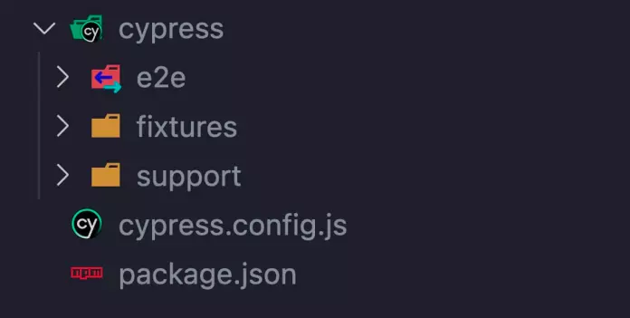

# Sección 33: **Cypress**

## 33.1 Qué es Cypress?

Cypress es un framework de pruebas de código abierto utilizado para realizar pruebas automatizadas en aplicaciones web. Especificamente, Cypress se utiliza para realizar pruebas de extremo a extremo (end-to-end) en aplicaciones web modernas.

A diferencia de otras herramientas de prueba, Cypress se ejecuta directamente en el navegador web en lugar de utilizar un control remoto o un controlador externo. Esto significa que tiene un acceso directo y completo a todas las funciones y objetos del navegador, lo que permite una interacción más robusta y precisa con la aplicación.

Cypress proporciona una API fácil de usar y potente para escribir y organizar pruebas. Además, viene con una interfaz de usuario amigable que muestra en tiempo real las acciones realizadas durante la ejecución de las pruebas y facilita la depuración.

Algunas de las características destacadas de Cypress incluyen:

1. Tiempo de ejecución en el mismo contexto que la aplicación: Esto significa que las pruebas pueden acceder directamente al DOM y a las APIs del navegador.
2. Recarga en tiempo real (live reloading): Los cambios realizados en las pruebas se reflejan automáticamente en el navegador, lo que permite una iteración rápida durante el proceso de desarrollo de las pruebas.
3. Visibilidad y depuración: Cypress muestra en tiempo real el estado de la aplicación, el DOM y las acciones realizadas durante las pruebas, lo que facilita la depuración de problemas.
4. Esperas automáticas y aserciones: Cypress maneja automáticamente las esperas para garantizar que los elementos estén presentes y sean interactivos antes de realizar acciones sobre ellos. También proporciona un conjunto de aserciones para validar el comportamiento esperado de la aplicación.

En el contexto de Cypress, los tipos de pruebas que puedes realizar son principalmente pruebas de extremo a extremo (end-to-end tests). Estas pruebas se centran en simular el comportamiento del usuario en la aplicación, desde la interacción con la interfaz de usuario hasta la validación de resultados.

Dentro de las pruebas de extremo a extremo, puedes abordar diferentes aspectos de tu aplicación, como:

1. Pruebas de flujo de usuario: Estas pruebas se enfocan en simular el recorrido del usuario a través de la aplicación, interactuando con diferentes elementos de la interfaz de usuario, como hacer clic en botones, llenar formularios y navegar entre páginas.
2. Pruebas de integración: Estas pruebas se centran en verificar la correcta interacción entre los diferentes componentes y módulos de tu aplicación. Puedes probar la integración de componentes, servicios externos, API, bases de datos, etc.
3. Pruebas de regresión: Estas pruebas se realizan para garantizar que las nuevas actualizaciones o cambios en la aplicación no introduzcan regresiones o errores en funcionalidades previamente implementadas. Ayudan a mantener la estabilidad y calidad del software a medida que evoluciona.
4. Pruebas de rendimiento: Estas pruebas se utilizan para evaluar el rendimiento de tu aplicación en términos de velocidad, escalabilidad y capacidad de respuesta bajo diferentes condiciones de carga. Puedes utilizar herramientas adicionales junto con Cypress para realizar pruebas de rendimiento más avanzadas.

Es importante destacar que Cypress está diseñado específicamente para las pruebas de extremo a extremo, donde se simula la interacción del usuario con la interfaz de usuario y se validan los resultados esperados. Otros tipos de pruebas, como las pruebas unitarias o las pruebas de integración de nivel inferior, generalmente se realizan utilizando otras herramientas o frameworks específicos.

En resumen, Cypress es una herramienta poderosa para realizar pruebas automatizadas de extremo a extremo en aplicaciones web, brindando una experiencia de desarrollo fluida y facilitando la detección temprana de errores.

## 33.2 Instalando y Primeros Pasos con Cypress

Antes de iniciar consulta el sitio web oficial de Cypress (**https://www.cypress.io/**) y su documentación oficial para obtener la información más actualizada sobre la última versión de Cypress y sus características más recientes.

Empecemos! en el contexto de Node.js en la gestión de paquetes al instalar herramientas o frameworks, existen dos categorías principales para las dependencias: dependencias de desarrollo (devDependencies) y dependencias de producción (dependencies). A continuación, te explico las diferencias entre ambas:

### Dependencias de desarrollo (devDependencies):

Estas son las dependencias que se requieren únicamente durante el desarrollo del proyecto, pero no se necesitan en el entorno de producción. Generalmente, se incluyen herramientas, bibliotecas y paquetes relacionados con las pruebas, tareas de construcción, tareas de compilación, linters, bundlers, entre otros. Estas dependencias no se envían a los servidores de producción y no afectan el funcionamiento de la aplicación en ese entorno.

### Dependencias de producción (dependencies):

Estas son las dependencias que son necesarias para que la aplicación se ejecute correctamente en el entorno de producción. Son los paquetes y bibliotecas que se utilizan directamente en la lógica de la aplicación y que son necesarios para su correcto funcionamiento. Estas dependencias se instalan en los servidores de producción y se incluyen en el paquete final que se entrega a los usuarios.

La elección de sí una dependencia se incluye como dependencia de desarrollo o de producción depende de su propósito y su uso en el proyecto. En el caso de Cypress, generalmente se incluye como dependencia de desarrollo porque está destinado a realizar pruebas automatizadas durante el desarrollo de la aplicación. Cypress no es necesario en el entorno de producción, ya que su función es ayudar a los desarrolladores a escribir y ejecutar pruebas.

Al instalar Cypress como una dependencia de desarrollo, te aseguras de que no se incluya en el paquete final de producción y evitas aumentar el tamaño del paquete y las dependencias innecesarias en el entorno de producción.

Para instalar Cypress como una dependencia de desarrollo, sigue estos pasos:

1. Asegúrate de tener Node.js instalado en tu sistema. Puedes verificarlo ejecutando el siguiente comando en tu terminal:

   ```
   node -v
   ```

   Si no tienes Node.js instalado, descárgalo e instálalo desde el sitio oficial de Node.js (**[https://nodejs.org](https://nodejs.org/)**).

2. Crea un nuevo directorio para tu proyecto de Cypress, o navega al directorio existente donde deseas instalarlo.
3. Inicializa un nuevo proyecto de Node.js ejecutando el siguiente comando en tu terminal:

   ```
   npm init -y
   ```

   Esto creará un archivo **`package.json`** en tu directorio.

4. Ahora, instala Cypress como una dependencia de desarrollo ejecutando el siguiente comando:

   ```
   npm install cypress --save-dev
   ```

   Esto descargará e instalará Cypress en tu proyecto y lo añadirá como una dependencia de desarrollo en el archivo **`package.json`**.

5. Después de la instalación, ejecuta el siguiente comando para abrir el Launchpad de Cypress:

   ```
   npx cypress open
   ```

   El Launchpad es tu portal a Cypress, te ayuda con la incorporación, la elección de un tipo de prueba (E2E en nuestro caso) y el lanzamiento de un navegador.
   

### Abriendo la aplicación

Al abrir Cypress, tu viaje de pruebas comienza con el Launchpad. Su función es guiarte a través de las decisiones y tareas de configuración que necesitas completar antes de comenzar a escribir tu primera prueba.


Si es la primera vez que usas Cypress, te llevará a través de los siguientes pasos en orden.

#### Elegir un tipo de prueba


El Launchpad te presenta tu decisión más importante primero: ¿Qué tipo de prueba debo hacer? ¿Pruebas de extremo a extremo (E2E), donde ejecuto toda mi aplicación y visito páginas para probarlas? ¿O pruebas de componentes, donde monto componentes individuales de mi aplicación y los pruebo de forma aislada? Si no estás seguro del tipo que deseas y simplemente quieres continuar con tu viaje de pruebas, elige E2E por ahora, ¡siempre puedes cambiar esto más adelante!

#### Configuración rápida


En el siguiente paso, el Launchpad generará una serie de archivos de configuración apropiados para el tipo de prueba que has elegido, y los cambios se mostrarán para que los revises. Para obtener más información sobre la configuración generada, consulta la referencia de configuración de Cypress, o simplemente desplázate hacia abajo y haz clic en "Continuar".

#### Lanzamiento de un navegador


Por último, se te presenta la lista de navegadores compatibles que Cypress encontró en tu sistema. Nuevamente, no te preocupes, puedes cambiar de navegador cuando quieras. ¡Ahora PRESIONA EL BOTÓN DE INICIO!

##

Al elegir tu navegador en el Launchpad, se te presentará una lista de tus especificaciones/pruebas (specs) con sus nombres, ubicaciones e información sobre las últimas ejecuciones grabadas. Aquí puedes lanzar las especificaciones haciendo clic en ellas, crear nuevas pruebas en blanco o ejemplos, o buscar pruebas por nombre (útil para suites de pruebas grandes).


Una vez que seleccionas la prueba que quieres hacer se abrira el **`Test Runner`** en sí. Cypress ejecuta pruebas de forma interactiva, lo que te permite ver los comandos a medida que se ejecutan, al mismo tiempo que visualizas la aplicación o el componente que se está probando y exploras su DOM (Modelo de Objetos del Documento).


También puedes configurar Cypress para ajustarlo a tus necesidades específicas editando el archivo de configuración `cypress.config.js`

Recuerda que Cypress requiere una aplicación web existente para realizar las pruebas. Asegúrate de tener una aplicación web disponible para probar o crea una antes de comenzar a utilizar Cypress.

### npm (jest) vs npx (cypress)

La diferencia en cómo se ejecuta Cypress con **`npx`** y Jest con **`npm`** se debe a cómo están diseñados y cómo se manejan en el ecosistema de pruebas.

1. Cypress con **`npx`**: Cypress se ejecuta utilizando el comando **`npx cypress`**. La razón de esto es que Cypress proporciona un ejecutable global llamado "cypress" que se instala como una dependencia de desarrollo en tu proyecto. Sin embargo, en lugar de requerir una instalación global, **`npx`** permite ejecutar el comando **`cypress`** sin necesidad de instalarlo previamente de forma global en tu sistema. Esto es útil porque te permite ejecutar Cypress directamente desde el directorio del proyecto sin preocuparte por versiones o problemas de compatibilidad.
2. Jest con **`npm`**: Jest es un framework de pruebas para JavaScript que se instala como una dependencia de desarrollo utilizando el comando **`npm install jest --save-dev`**. Una vez instalado, puedes ejecutar las pruebas de Jest simplemente utilizando el comando **`npm test`**. Jest busca automáticamente los archivos de prueba en tu proyecto y los ejecuta utilizando su propia CLI (Interfaz de línea de comandos).

La diferencia en cómo se ejecutan Cypress y Jest no está relacionada directamente con la funcionalidad de las herramientas en sí, sino más bien con las opciones de ejecución proporcionadas por cada uno y cómo se distribuyen e instalan las dependencias.

Es importante tener en cuenta que tanto Cypress como Jest son opciones populares para realizar pruebas automatizadas en proyectos de desarrollo, pero se utilizan en contextos diferentes. Cypress se enfoca en pruebas de extremo a extremo para aplicaciones web, mientras que Jest es un framework de pruebas más generalizado para pruebas unitarias, pruebas de integración y pruebas funcionales.

En resumen, la diferencia en cómo se ejecuta Cypress con **`npx`** y Jest con **`npm`** se debe a las opciones de ejecución y las características específicas de cada herramienta, así como a su integración y distribución en el ecosistema de pruebas.

### npx cypress run vs npx cypress open

#### **npx cypress open**

Este comando abre el Test Runner de Cypress, una interfaz gráfica que te permite interactuar con tus pruebas de forma visual. Desde el Test Runner, puedes seleccionar pruebas específicas para ejecutar, ver los resultados en tiempo real, depurar pruebas y ejecutar pruebas en diferentes navegadores. Es útil para un enfoque interactivo de desarrollo y depuración de pruebas.

#### **npx cypress run**

Este comando ejecuta las pruebas de Cypress en modo de línea de comandos, sin abrir el Test Runner gráfico. Las pruebas se ejecutan en segundo plano y generan informes de resultados en la terminal o en formatos específicos como JSON o JUnit. Este modo es útil para la ejecución automatizada de pruebas, como en entornos de integración continua (CI) o cuando deseas ejecutar tus pruebas sin la intervención manual en una interfaz gráfica.

La elección entre **`npx cypress open`** y **`npx cypress run`** depende del contexto y los requisitos de tu proyecto:

- Si estás desarrollando y depurando pruebas de forma interactiva, **`npx cypress open`** te brinda una interfaz gráfica que facilita la selección y ejecución de pruebas, así como la visualización en tiempo real de los resultados.
- Si buscas una ejecución automatizada de tus pruebas, especialmente en entornos de CI, **`npx cypress run`** es más adecuado. Este modo permite la ejecución de pruebas en segundo plano, generando informes y resultados para su posterior análisis.

No hay un comando que sea "mejor" en general, ya que ambos tienen su utilidad dependiendo de tus necesidades específicas. Puedes utilizar **`npx cypress open`** durante el desarrollo y las pruebas locales, y luego pasar a **`npx cypress run`** para la ejecución automatizada en tu flujo de trabajo de CI.

En resumen, **`npx cypress open`** es útil para un enfoque interactivo y visual durante el desarrollo y depuración de pruebas, mientras que **`npx cypress run`** es más adecuado para ejecuciones automatizadas en entornos de CI.

### Estructura proyecto con Cypress

La estructura básica de un proyecto con Cypress puede variar según las preferencias y necesidades específicas del equipo de desarrollo.

Cypress ahora recomienda nombrar tus pruebas de extremo a extremo como test.cy.js y tus pruebas de componentes como test.spec.js. Esto, por supuesto, es solo una recomendación, y puedes especificar cualquier patrón utilizando la opción specPattern en el archivo cypress.config.js.

a continuación te presento una estructura comúnmente utilizada para organizar un proyecto de Cypress:

```jsx
|-- cypress
|   |-- e2e
|   |   |-- example.spec.js
|   |   |-- example.cy.js
|   |-- fixtures
|   |   |-- example.json
|   |-- support
|   |   |-- commands.js
|   |   |-- e2e.js
|   |-- videos
|   |-- screenshots
|-- node_modules
|-- cypress.config.js
|-- package.json
```



1. Directorio raíz del proyecto: En este nivel se encuentran los archivos y carpetas principales del proyecto.
   - `cypress.config.js`: Es el archivo de configuración de Cypress. Aquí puedes establecer diferentes opciones de configuración para tus pruebas, como la URL base, la carpeta de pruebas personalizada, las variables de entorno, entre otros. registrar plugins personalizados para modificar el comportamiento de Cypress.
   - **`package.json`**: Es el archivo de configuración de npm. Aquí se definen las dependencias y scripts del proyecto, incluyendo las dependencias de Cypress.
   - **`node_modules/`**: Este directorio contiene las dependencias de tu proyecto instaladas a través de npm.
   - **`cypress/`**: Este directorio contiene todos los archivos y carpetas relacionados con las pruebas en Cypress.
2. Carpeta "e2e": En esta carpeta se encuentran los archivos de prueba de Cypress. Puedes organizar tus pruebas en subcarpetas según tus necesidades. Por ejemplo:
   - **`e2e/example.spec.js`**: Un archivo de prueba de ejemplo para mostrar la estructura y sintaxis de una prueba en Cypress.
     - El formato **`spec.js`** o **`cy.js`** se refieren a los archivos de especificaciones (specifications) en Cypress. Se utilizan para escribir las pruebas en Cypress.
     - Un archivo de especificación (**`spec.js`**) en Cypress contiene una o más pruebas que se ejecutarán en el entorno de prueba. Puedes organizar tus pruebas en diferentes archivos de especificación según la lógica y la funcionalidad que estés probando.
3. Carpeta "fixtures": En esta carpeta puedes colocar archivos estáticos utilizados en tus pruebas, como datos de prueba o archivos de configuración.
   - **`fixtures/example.json`**: Un archivo de ejemplo que contiene datos de prueba en formato JSON.
4. Carpeta "support": En esta carpeta se encuentran los archivos de soporte utilizados por tus pruebas. Algunos archivos comunes son:
   - **`support/e2e.js`**: Aquí puedes definir funciones y configuraciones personalizadas que se aplican a todas tus pruebas.
   - **`support/commands.js`**: En este archivo, puedes agregar comandos personalizados que extienden las capacidades de Cypress y se pueden utilizar en tus pruebas.
5. Carpeta "screenshots" y "videos": Estas carpetas se utilizan para almacenar capturas de pantalla y grabaciones de video de tus pruebas cuando se ejecutan en modo **`npx cypress run`**.

Esto es solo una estructura básica y puedes personalizarla según tus necesidades. Puedes agregar más carpetas, archivos de configuración adicional o estructurar las pruebas de acuerdo con la arquitectura y características de tu proyecto.
