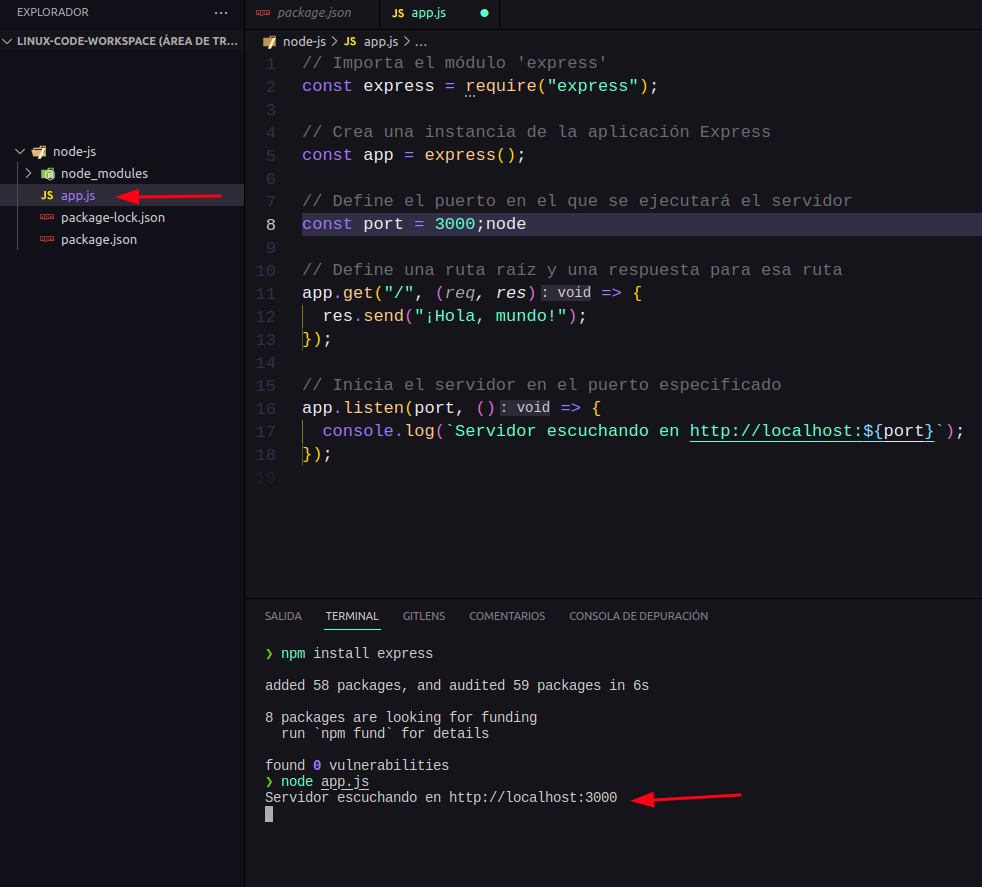

# Sección 34: **Introducción NodeJS**

## 34.1. ¿Qué es Node.js?

Node.js es un entorno de tiempo de ejecución de código abierto y multiplataforma que permite ejecutar código JavaScript fuera de un navegador web. Fue creado por Ryan Dahl en 2009 y se basa en el motor de JavaScript V8 de Google Chrome. Node.js proporciona una arquitectura orientada a eventos y no bloqueante, lo que significa que puede manejar un gran número de solicitudes simultáneas sin bloquear la ejecución de otras operaciones.

Una de las principales características de Node.js es su capacidad para crear aplicaciones de servidor altamente escalables y de alto rendimiento. Al utilizar JavaScript tanto en el cliente como en el servidor, es posible compartir código y lógica entre ambas partes, lo que facilita el desarrollo de aplicaciones web completas. Además, Node.js cuenta con un amplio ecosistema de paquetes y módulos, administrados a través del gestor de paquetes npm, que permite a los desarrolladores aprovechar una gran cantidad de funcionalidades preexistentes.

Node.js se utiliza ampliamente para desarrollar aplicaciones web y servicios backend, pero también se puede utilizar para crear aplicaciones de línea de comandos, herramientas de automatización, servidores de tiempo real, microservicios y mucho más. Al ser de código abierto y tener una gran comunidad de desarrolladores, Node.js continúa evolucionando y mejorando constantemente.

Node.js ofrece varias ventajas y tiene una amplia gama de aplicaciones.

### Algunas de las ventajas más destacadas de Node.js son:

1. Eficiencia y rendimiento: Node.js utiliza una arquitectura no bloqueante y orientada a eventos, lo que permite manejar múltiples solicitudes simultáneas de manera eficiente. Esto lo hace especialmente adecuado para aplicaciones que requieren una alta concurrencia y rendimiento.
2. Compartir código entre el cliente y el servidor: Al utilizar JavaScript tanto en el cliente como en el servidor, se puede compartir código y lógica, lo que simplifica el desarrollo y la mantenibilidad de las aplicaciones.
3. Amplio ecosistema de paquetes: Node.js cuenta con npm, el gestor de paquetes más grande del mundo, que proporciona acceso a miles de módulos y bibliotecas listos para usar. Esto permite a los desarrolladores aprovechar funcionalidades preexistentes y acelerar el desarrollo de aplicaciones.
4. Escalabilidad: Node.js es altamente escalable y puede manejar una gran cantidad de solicitudes concurrentes con recursos mínimos. También permite la creación de arquitecturas distribuidas y basadas en microservicios.
5. Desarrollo rápido: La facilidad de uso y la disponibilidad de paquetes y módulos preexistentes permiten un desarrollo rápido y eficiente de aplicaciones.

### Algunas de las aplicaciones más comunes de Node.js son:

1. Aplicaciones web en tiempo real: Node.js es especialmente adecuado para aplicaciones que requieren actualizaciones en tiempo real, como chats en vivo, sistemas de colaboración y juegos multijugador.
2. APIs y servicios web: Node.js es ampliamente utilizado para desarrollar servicios web y APIs (Application Programming Interfaces) debido a su capacidad de manejar solicitudes concurrentes y su eficiencia en el manejo de datos.
3. Aplicaciones de streaming: La naturaleza no bloqueante de Node.js lo hace ideal para aplicaciones de streaming, como transmisión de audio y video en tiempo real.
4. Herramientas de línea de comandos: Node.js se puede utilizar para crear scripts y herramientas de línea de comandos, automatizando tareas y agilizando el flujo de trabajo.
5. Aplicaciones de Internet de las cosas (IoT): Node.js se utiliza en el desarrollo de aplicaciones para dispositivos conectados a Internet, permitiendo la comunicación y el control de sensores y actuadores.

## 34.2. ¿Qué es Express?

Express es un framework web rápido y minimalista para Node.js. Proporciona una capa de abstracción sobre el núcleo de Node.js, lo que facilita la creación de aplicaciones web y servicios API de manera eficiente y sencilla. Express es extremadamente popular y ampliamente utilizado en la comunidad de desarrollo de Node.js debido a su simplicidad y flexibilidad.

Algunas características y ventajas de Express son:

1. Enrutamiento: Express facilita la definición de rutas y manejo de solicitudes HTTP. Permite establecer rutas para diferentes URL y métodos HTTP, y proporciona un mecanismo sencillo para manejar y responder a esas solicitudes.
2. Middleware: Express utiliza una arquitectura de middleware que permite agregar funciones de procesamiento en el flujo de solicitud y respuesta. Esto permite realizar tareas como el manejo de sesiones, autenticación, compresión, registro, entre otros, de manera modular y reutilizable.
3. Integración con motor de plantillas: Express permite renderizar vistas HTML utilizando diferentes motores de plantillas populares como EJS, Handlebars o Pug (anteriormente conocido como Jade). Esto facilita la generación de páginas HTML dinámicas basadas en datos enviados desde el servidor.
4. Soporte para API RESTful: Express es una opción popular para crear servicios API RESTful. Permite definir rutas, manejar métodos HTTP como GET, POST, PUT y DELETE, y responder con datos JSON, lo que hace que el desarrollo de APIs sea rápido y sencillo.
5. Amplio ecosistema: Express cuenta con una gran comunidad de desarrolladores y un ecosistema sólido de paquetes y módulos de terceros. A través de npm (Node Package Manager), puedes acceder a una amplia variedad de complementos y middleware para agregar funcionalidades adicionales a tu aplicación.

### Middleware

En Express, el middleware es una función que se ejecuta durante el ciclo de procesamiento de una solicitud HTTP antes de que se envíe una respuesta. El middleware se utiliza para realizar diversas tareas, como la manipulación de la solicitud, la modificación de la respuesta, la autenticación, el manejo de errores, el registro de solicitudes, etc. Básicamente, es una forma de agregar funcionalidades adicionales a una aplicación web de Express.

El middleware se puede utilizar a nivel de aplicación o a nivel de ruta en Express. A nivel de aplicación, el middleware se aplica a todas las solicitudes que llegan a la aplicación. A nivel de ruta, el middleware se aplica solo a las solicitudes que coinciden con una ruta específica.

Express ofrece una amplia variedad de funciones de middleware incorporadas, como **`express.json()`** para el análisis de datos JSON, **`express.urlencoded()`** para el análisis de datos enviados a través de formularios, **`express.static()`** para servir archivos estáticos, entre otros. También puedes crear tu propio middleware personalizado para satisfacer las necesidades específicas de tu aplicación.

En resumen, Express es un framework web ligero pero potente que simplifica el desarrollo de aplicaciones web y APIs en Node.js. Ofrece una gran flexibilidad, un sistema de enrutamiento intuitivo, middleware modular y una amplia comunidad de soporte, lo que lo convierte en una opción popular para construir aplicaciones web rápidas y escalables en Node.js.

## 34.3 Instalando Node

Para utilizar Node.js, sigue estos pasos:

Paso 1: Instalación

- Ve al sitio web oficial de Node.js (**[https://nodejs.org](https://nodejs.org/)**) y descarga la versión correspondiente a tu sistema operativo.
- Sigue las instrucciones de instalación proporcionadas en el sitio web para completar la instalación de Node.js en tu computadora.

Paso 2: Creación de un archivo de proyecto

- Crea una carpeta en tu sistema de archivos para tu proyecto de Node.js.
- Inicializa un nuevo proyecto de Node.js ejecutando el siguiente comando:
  ```
  npm init -y
  ```
  Esto creará un archivo package.json con la configuración básica del proyecto.
- Ejecuta el siguiente comando en la terminal para instalar el módulo **`express`**, que es un framework web popular para Node.js: **`npm install express`**
- Abre un editor de texto o un entorno de desarrollo integrado (IDE) de tu elección y crea un nuevo archivo en esa carpeta con una extensión de archivo ".js". Por ejemplo, "app.js".

Paso 3: Configuración del proyecto

- Abre el archivo "app.js" en tu editor de texto o IDE y comienza a escribir tu código de Node.js.

Paso 4: Escritura de código de Node.js

- Abre **`app.js`** en tu editor de texto o IDE y escribe el siguiente código:

```jsx
// Importa el módulo 'express'
const express = require("express");

// Crea una instancia de la aplicación Express
const app = express();

// Define el puerto en el que se ejecutará el servidor
const port = 3000;

// Define una ruta raíz y una respuesta para esa ruta
app.get("/", (req, res) => {
  res.send("¡Hola, mundo!");
});

// Inicia el servidor en el puerto especificado
app.listen(port, () => {
  console.log(`Servidor escuchando en http://localhost:${port}`);
});
```

- En este código, primero importamos el módulo **`express`** que instalamos en el paso anterior a través de npm. Asignamos el objeto **`express`** a la constante **`express`**.
- Luego, creamos una instancia de la aplicación Express utilizando **`express()`**. Esto nos permite utilizar todas las funcionalidades y métodos proporcionados por Express en nuestra aplicación.
- A continuación, definimos la variable **`port`** para especificar en qué puerto queremos que se ejecute nuestro servidor. En este caso, utilizamos el puerto 3000. Esto indica en qué puerto queremos que nuestro servidor escuche las solicitudes entrantes. Puedes cambiar este número de puerto según tus necesidades.
- Luego, definimos una ruta raíz utilizando **`app.get('/', ...)`**. El primer parámetro es la ruta **`/`**, que es la ruta raíz de nuestro servidor. El segundo parámetro es una función de controlador **`(req, res) => { ... }`**, que se ejecutará cuando se acceda a esta ruta. En este caso, estamos utilizando el método **`send()`** del objeto **`res`** para enviar la respuesta "¡Hola, mundo!" al cliente que realizó la solicitud.
- Finalmente, llamamos al método **`app.listen()`** para iniciar el servidor en el puerto especificado. También mostramos un mensaje en la consola para indicar que el servidor está escuchando correctamente. Estamos utilizando el método **`listen()`** de nuestra aplicación Express para iniciar el servidor en el puerto especificado (**`port`**). La función de callback se ejecuta cuando el servidor se inicia correctamente, y simplemente muestra un mensaje en la consola indicando que el servidor está escuchando en la URL **`http://localhost:3000`**.
- A partir de ahí, puedes comenzar a escribir tu lógica de aplicación utilizando las funciones y métodos proporcionados por los módulos de Node.js y JavaScript.

Paso 5: Ejecución de la aplicación Node.js

- Abre una terminal o línea de comandos y navega hasta la carpeta de tu proyecto de Node.js. Asegúrate de estar en la carpeta de tu proyecto.
- Ejecuta tu aplicación Node.js escribiendo **`node app.js`** en la terminal.

  

- Verás un mensaje en la terminal que indica que el servidor está escuchando en el puerto 3000. Esto iniciará la ejecución de tu código y comenzará a escuchar en el puerto especificado (si estás creando un servidor web).
- Abre un navegador web y visita **`http://localhost:3000`**.
- Verás el mensaje "¡Hola, mundo!", que se muestra en la página, lo cual significa que tu servidor Node.js está funcionando correctamente.

  

- De esta manera has levantado un servidor web básico utilizando Node.js y Express.

### Utilizar la sintaxis de import/export en nuestro proyecto

En Node.js, puedes usar las palabras clave **`import`** y **`export`** para importar y exportar módulos y evitar la sintaxis de requerimiento (require) de CommonJS, que es la forma tradicional (antigua) de importar módulos en Node.js.

Para poder utilizar módulos en tu proyecto de Node.js, puedes seguir estos pasos:

1. Asegúrate de tener un archivo **`package.json`** válido en la raíz de tu proyecto.
2. Abre el archivo **`package.json`**
3. Agrega o modifica la sección **`"type"`** en el archivo **`package.json`** y establece su valor como **`"module"`**. Esto indica que estás utilizando módulos ECMAScript. También, agrega una sección **`"scripts"`** si aún no la tienes.

   ```
   {
     "name": "nombre_del_proyecto",
     "version": "1.0.0",
     "type": "module",
     "description": "node js project",
     "scripts": {
       "test": "echo \"Error: no test specified\" && exit 1"
     },
     "author": "Mario Karajallo",
     "license": "ISC",
     "dependencies": {
       "express": "^4.18.2"
     }
   }
   ```

   Hemos agregado **`"type": "module"`** a la sección **`"type"`** del archivo **`package.json`**.

4. Guarda los cambios en el archivo **`package.json`**.
5. Después de configurar el archivo **`package.json`**, puedes utilizar la sintaxis **`import`** y **`export`** en tu código JavaScript. Ejemplo nuestro app.js

   ```jsx
   // app.js
   // Importa el módulo 'express' y archivos js utilizando la sintaxis de import/export
   import express from "express";

   // Crea una instancia de la aplicación Express
   const app = express();

   // Define el puerto en el que se ejecutará el servidor
   const port = 3000;

   // Define una ruta raíz y una respuesta para esa ruta
   app.get("/", (req, res) => {
     res.send("¡Hola, mundo!");
   });

   // Inicia el servidor en el puerto especificado
   app.listen(port, () => {
     console.log(`Servidor escuchando en http://localhost:${port}`);
   });
   ```

6. Ejecutamos en la terminal `node app` y vemos como funciona ahora con la sintaxis de import/export

### Nodemon

Nodemon es una herramienta de desarrollo para Node.js que facilita la tarea de reiniciar automáticamente la aplicación cada vez que se detectan cambios en los archivos del proyecto. Esto es especialmente útil durante el desarrollo, ya que te permite ahorrar tiempo y esfuerzo al no tener que reiniciar manualmente la aplicación cada vez que realizas cambios en tu código.

Al utilizar Nodemon, puedes iniciar tu aplicación Node.js con el comando **`nodemon`** en lugar de **`node`**. Nodemon monitorea los archivos en tu proyecto y, cuando detecta un cambio, reinicia automáticamente la aplicación. Esto te permite ver los resultados actualizados de tus cambios de inmediato, sin tener que detener y reiniciar manualmente el servidor cada vez.

Para usar Nodemon, primero debes instalarlo en tu proyecto a través de npm. Puedes hacerlo ejecutando el siguiente comando en la línea de comandos:

```
npm install --save-dev nodemon
```

Una vez que Nodemon esté instalado, puedes ejecutar tu aplicación con Nodemon de la siguiente manera, con el nombre del archivo principal de tu aplicación. :

```
nodemon app.js
```

Nodemon iniciará tu aplicación y la mantendrá en ejecución. Si realizas cambios en los archivos de tu proyecto y los guardas, Nodemon detectará automáticamente los cambios y reiniciará la aplicación para reflejar los cambios actualizados.

#### **npm run dev**

Si deseas utilizar el comando **`npm run dev`** en lugar de **`nodemon`** para ejecutar tu aplicación Node.js con reinicio automático, puedes configurar un script personalizado en tu archivo **`package.json`**. Aquí tienes los pasos para hacerlo:

1. Abre el archivo **`package.json.`**
2. Encuentra la sección **`"scripts"`** en el archivo **`package.json`**. Si no existe, puedes agregarla como un objeto vacío.
3. Agrega un nuevo script llamado **`"dev"`** dentro de la sección **`"scripts"`** y establece su valor como **`nodemon app.js`** o **`nodemon <ruta del archivo principal de tu aplicación>`**. Puedes elegir el nombre **`dev`** para el script, pero puedes cambiarlo según tus preferencias.

   ```
   //package.json
   {
     "name": "nombre_del_proyecto",
     "version": "1.0.0",
     "scripts": {
       "dev": "nodemon app.js"
     },
     "dependencies": {
       // Dependencias del proyecto
     },
     "devDependencies": {
       // Dependencias de desarrollo del proyecto
     }
   }
   ```

4. Guarda los cambios en el archivo **`package.json`**.

   Ahora, puedes ejecutar tu aplicación con el comando **`npm run dev`** en lugar de **`nodemon`**. Ejecuta el siguiente comando en la línea de comandos:

   ```
   npm run dev
   ```

   Esto iniciará tu aplicación utilizando **`nodemon`** según la configuración especificada en el script **`"dev"`** en el archivo **`package.json`**. Nodemon monitoreará los archivos en tu proyecto y reiniciará automáticamente la aplicación cuando se detecten cambios.

Con estos pasos básicos, puedes comenzar a desarrollar y ejecutar aplicaciones utilizando Node.js. Puedes aprovechar la amplia gama de módulos y paquetes disponibles a través de npm para agregar funcionalidad adicional a tu proyecto. Además, Node.js ofrece una gran documentación y una activa comunidad de desarrollo que puede ayudarte en tu viaje de desarrollo con Node.js.

## 34.4 MVC - Modelo Vista Controlador

Los modelos vista controlador (MVC) es un patrón de diseño de software que se utiliza comúnmente en el desarrollo de aplicaciones web. Proporciona una estructura organizada y modular para separar la lógica de negocio, la presentación de la interfaz de usuario y la gestión de las interacciones entre ellos.

### Modelo (Model)

El Modelo en el patrón MVC representa la lógica de negocio y los datos de la aplicación. Es la capa encargada de manejar la manipulación y gestión de los datos, así como de realizar cálculos y llevar a cabo operaciones relacionadas con la lógica de negocio.

El Modelo encapsula la estructura de datos, las reglas de negocio y las operaciones de acceso a los datos. Puede incluir clases, objetos y métodos que definen cómo se almacenan, recuperan y manipulan los datos de la aplicación.

#### Ejemplo del Modelo en el patron MVC

Un ejemplo común de uso del Modelo en el patrón MVC es en una aplicación de comercio electrónico. En este caso, el Modelo podría incluir clases y métodos para gestionar los productos, los clientes, los pedidos, el inventario, etc.

El Modelo se encargaría de interactuar con la base de datos para recuperar y almacenar la información sobre los productos y los clientes. También podría contener métodos para realizar cálculos como el total de un pedido, verificar la disponibilidad de productos en el inventario o aplicar descuentos.

Además, el Modelo puede contener la lógica de negocio relacionada con las reglas del comercio electrónico, como la validación de los datos del cliente, el cálculo de los impuestos o el seguimiento de los estados de los pedidos.

En resumen, el Modelo en el patrón MVC es la capa encargada de la lógica de negocio y la gestión de los datos en una aplicación. Proporciona una representación estructurada de los datos y define cómo se manipulan y acceden a ellos. Su uso puede variar dependiendo del tipo de aplicación, pero su objetivo principal es separar la lógica de negocio de la interfaz de usuario y facilitar la gestión de los datos.

### Vista (View)

La vista en el patrón Modelo Vista Controlador (MVC) es el componente encargado de la presentación de la interfaz de usuario al usuario final. Su principal función es mostrar los datos proporcionados por el modelo de una manera adecuada y comprensible para el usuario.

La Vista se encarga de presentar los datos de manera adecuada para que el usuario pueda entenderlos y realizar acciones sobre ellos. Puede incluir elementos como botones, formularios, tablas, gráficos, etc., que permiten al usuario interactuar con la aplicación.

Algunos puntos clave sobre la vista en el contexto de MVC:

1. Responsabilidad de presentación: La vista se centra únicamente en la representación visual de los datos. No debe contener lógica de negocio compleja ni realizar modificaciones en los datos. Su objetivo principal es mostrar la información de una manera fácil de entender para el usuario.
2. Interfaz de usuario: La vista se encarga de presentar los elementos de la interfaz de usuario, como formularios, botones, listas, tablas, etc. Estos elementos permiten al usuario interactuar con la aplicación.
3. Independencia del modelo: La vista no tiene conocimiento directo del modelo subyacente. Recibe los datos del controlador y los muestra de acuerdo con las necesidades de presentación. La vista no realiza operaciones directamente en los datos, sino que los muestra tal como los recibe.
4. Actualización de la vista: Cuando ocurren cambios en el modelo, el controlador es responsable de actualizar la vista correspondiente para reflejar los cambios. Esto permite que la vista siempre muestre los datos más recientes al usuario.
5. Flexibilidad en la representación: Dependiendo del tipo de aplicación y de los requisitos de presentación, la vista puede ser implementada utilizando tecnologías como HTML/CSS para aplicaciones web, interfaces gráficas para aplicaciones de escritorio, o incluso tecnologías como JSON o XML para servicios web y API.

Es importante destacar que en aplicaciones más grandes y complejas, es común utilizar sistemas de plantillas o frameworks para la construcción de las vistas. Estos sistemas proporcionan herramientas y componentes reutilizables que facilitan la creación y mantenimiento de la interfaz de usuario.

#### Ejemplo de Vista en el patron MVC

Siguiendo el ejemplo de una aplicación de comercio electrónico, la Vista en el patrón MVC podría ser la interfaz de usuario que muestra los productos disponibles, el carrito de compras y las opciones de pago. Además, permitiría al usuario interactuar con la aplicación agregando productos al carrito, realizando compras y visualizando el estado de los pedidos.

En la Vista, se mostrarían los productos disponibles en forma de lista o cuadrícula, con detalles como el nombre, la imagen, el precio y una breve descripción. También se podrían incluir filtros o categorías para que el usuario pueda buscar productos específicos.

Al seleccionar un producto, la Vista podría mostrar una página de detalles con información más detallada sobre el producto, incluyendo imágenes adicionales, reseñas de clientes y opciones de personalización.

Además, la Vista podría incluir un carrito de compras, que muestra los productos agregados y su cantidad. Se mostraría el precio total de los productos y se proporcionarían opciones para editar la cantidad, eliminar productos o proceder al pago.

La Vista también permitiría al usuario ingresar la información de envío y seleccionar el método de pago preferido. Podría incluir formularios para ingresar la dirección de entrega, seleccionar una tarjeta de crédito y proporcionar detalles adicionales requeridos para el pago.

Una vez que el usuario haya realizado el pago, la Vista podría mostrar una confirmación de la compra y proporcionar información sobre el estado del pedido, como el número de seguimiento y la fecha estimada de entrega.

En resumen, en el ejemplo de una aplicación de comercio electrónico, la Vista en el patrón MVC se encargaría de mostrar los productos, permitir la interacción con el carrito de compras y la realización de pagos, así como mostrar información relevante sobre el estado de los pedidos. Su objetivo principal es proporcionar una interfaz visualmente atractiva y fácil de usar para que el usuario pueda navegar por los productos, agregarlos al carrito y realizar compras de manera intuitiva.

#### Template Engine

Un template engine (motor de plantillas) es una herramienta que permite generar vistas dinámicas en una aplicación web. Proporciona una forma de combinar datos y plantillas predefinidas para generar la salida final que se muestra al usuario.

La principal función de un template engine es separar la lógica de presentación de los datos en una aplicación web. En lugar de mezclar directamente código HTML y lógica de programación en un solo archivo, un template engine permite definir plantillas HTML o de otro tipo que contienen marcadores o etiquetas especiales. Estos marcadores indican dónde se insertarán los datos dinámicos generados por la aplicación.

Cuando la aplicación se ejecuta, el template engine procesa las plantillas y los datos proporcionados, reemplazando los marcadores por los valores correspondientes. El resultado es una vista completa generada dinámicamente que se envía al usuario.

La relación entre el template engine y la vista en el patrón MVC es estrecha. La vista se encarga de la presentación visual de los datos, y el template engine es la herramienta que facilita la generación de esa presentación. La vista puede utilizar el template engine para acceder a las plantillas, combinarlas con los datos del modelo y generar la salida final que se enviará al usuario.

Algunos ejemplos populares de template engines incluyen:

##### **Handlebars**:

Es un motor de plantillas muy popular utilizado en aplicaciones web. Permite generar vistas dinámicas combinando plantillas predefinidas con datos proporcionados desde el lado del servidor.

- Aquí tienes un ejemplo de una plantilla sencilla en Handlebars para que puedas ver su sintaxis básica:

  ```html
  <!DOCTYPE html>
  <html>
    <head>
      <title>{{titulo}}</title>
    </head>
    <body>
      <h1>{{titulo}}</h1>
      <p>{{contenido}}</p>
    </body>
  </html>
  ```

  En esta plantilla, se utilizan los marcadores **`{{titulo}}`** y **`{{contenido}}`** para indicar los lugares donde se insertarán los datos dinámicos. Puedes utilizar estos marcadores en cualquier parte del código HTML para generar contenido dinámico.

- Cuando compiles esta plantilla utilizando Handlebars y proporcionando los datos correspondientes, los marcadores se reemplazarán con los valores reales. Por ejemplo, si proporcionas los siguientes datos:
  ```jsx
  const data = {
    titulo: "Mi página web",
    contenido: "¡Bienvenido a mi sitio web!",
  };
  ```
  La plantilla generará el siguiente HTML:
  ```html
  <!DOCTYPE html>
  <html>
    <head>
      <title>Mi página web</title>
    </head>
    <body>
      <h1>Mi página web</h1>
      <p>¡Bienvenido a mi sitio web!</p>
    </body>
  </html>
  ```
  Así, puedes ver cómo los datos proporcionados se insertan en los marcadores correspondientes en la plantilla para generar la salida final.

Recuerda que este es un ejemplo muy básico, pero Handlebars ofrece muchas más funcionalidades, como condicionales, bucles y parciales, para crear plantillas más poderosas y dinámicas. Puedes explorar la documentación oficial de Handlebars para obtener más detalles sobre su sintaxis y características avanzadas.

##### **EJS - Embedded JavaScript**

EJS (Embedded JavaScript) es un motor de plantillas para JavaScript que te permite generar vistas dinámicas en aplicaciones web. Al igual que Handlebars, EJS utiliza marcadores en las plantillas para insertar datos dinámicos.

Algunas Caracteristicas:

- Integración con JavaScript: EJS está diseñado para integrarse de manera fluida con JavaScript. Puedes utilizar código JavaScript dentro de tus plantillas para realizar operaciones lógicas, acceder a variables y realizar otras tareas relacionadas con la lógica de programación.
- Sintaxis familiar: EJS utiliza una sintaxis similar a la de HTML, lo que hace que sea fácil de leer y entender. Utiliza etiquetas **`<% %>`** para el código JavaScript embebido y **`<%= %>`** para imprimir variables en la salida de la plantilla.
- Control de flujo: EJS te permite utilizar estructuras de control de flujo, como condicionales y bucles, dentro de tus plantillas. Puedes utilizar las etiquetas **`<% if (condition) { %> ... <% } %>`** para condicionales y **`<% for (var i = 0; i < array.length; i++) { %> ... <% } %>`** para bucles.
- Reutilización de código: EJS admite la inclusión de parciales, lo que te permite reutilizar secciones de código en diferentes plantillas. Puedes utilizar la etiqueta **`<%- include('partial') %>`** para incluir un parcial en una plantilla.
- Integración con Express: EJS es ampliamente utilizado en aplicaciones web con el framework Express.js. Puedes configurar Express para utilizar EJS como motor de plantillas y renderizar tus vistas dinámicas fácilmente.
- Amplia compatibilidad: EJS es compatible con una variedad de entornos y marcos de desarrollo de JavaScript. Puedes utilizar EJS tanto en aplicaciones web basadas en Node.js como en aplicaciones front-end utilizando herramientas de construcción como Webpack o Browserify.

Aquí tienes un ejemplo sencillo de una plantilla EJS para que puedas ver su sintaxis básica:

```html
<!DOCTYPE html>
<html>
  <head>
    <title><%= titulo %></title>
  </head>
  <body>
    <h1><%= titulo %></h1>
    <p><%= contenido %></p>
  </body>
</html>
```

- En esta plantilla, se utilizan las etiquetas **`<%= %>`** para insertar datos dinámicos en la plantilla. Los datos se pasan a la plantilla a través de un objeto que contiene las variables correspondientes.
- Cuando utilizas EJS para renderizar esta plantilla con los datos adecuados, los valores de las variables se insertarán en los lugares correspondientes. Por ejemplo, si proporcionas los siguientes datos:

```jsx
const datos = {
  titulo: "Mi página web",
  contenido: "¡Bienvenido a mi sitio web!",
};
```

- La plantilla generará el siguiente HTML:

```html
<!DOCTYPE html>
<html>
  <head>
    <title>Mi página web</title>
  </head>
  <body>
    <h1>Mi página web</h1>
    <p>¡Bienvenido a mi sitio web!</p>
  </body>
</html>
```

- En este ejemplo, los valores de **`titulo`** y **`contenido`** se insertan en los lugares correspondientes utilizando las etiquetas **`<%= %>`**.

Recuerda que este es solo un ejemplo básico para mostrarte la sintaxis de EJS. EJS también admite características avanzadas, como condicionales, bucles y la inclusión de parciales, que te permiten crear plantillas más dinámicas y reutilizables. Puedes consultar la documentación oficial de EJS para obtener más información sobre todas las características y opciones disponibles.

##### **PUG**

Pug (anteriormente conocido como Jade) es un motor de plantillas para JavaScript que se caracteriza por su sintaxis concisa y minimalista. Proporciona una forma eficiente de generar vistas HTML de forma dinámica en aplicaciones web.

Aquí tienes algunos puntos clave sobre Pug:

- Sintaxis simplificada: Pug utiliza una sintaxis simplificada que se basa en la indentación en lugar de etiquetas de apertura y cierre. Esto ayuda a reducir la cantidad de código necesario y mejora la legibilidad de las plantillas.
- Indentación y anidamiento: En Pug, la indentación se utiliza para definir la estructura y el anidamiento de los elementos HTML. Esto elimina la necesidad de etiquetas de cierre y hace que las plantillas sean más limpias y fáciles de leer.
- Etiquetas y atributos simplificados: Pug utiliza una sintaxis simplificada para definir etiquetas y atributos. Por ejemplo, en lugar de **`<div class="container">`**, en Pug se escribe **`.container`**. Los atributos se definen dentro de paréntesis después de la etiqueta, por ejemplo, **`a(href='/home', title='Inicio')`**.
- Variables e interpolación: Pug permite utilizar variables dentro de las plantillas y realizar interpolación de valores. Puedes utilizar **`#{variable}`** para interpolar una variable en el contenido de un elemento.
- Control de flujo: Pug ofrece una serie de construcciones para controlar el flujo en las plantillas, como condicionales, bucles y manejo de errores. Esto permite generar contenido de forma dinámica en función de las condiciones y datos disponibles.
- Reutilización de código: Pug admite la inclusión de bloques y archivos parciales para la reutilización de código. Puedes definir bloques de contenido y luego incluirlos en varias plantillas para generar vistas consistentes.
- Amplia compatibilidad: Pug es compatible con Node.js y se puede integrar fácilmente con frameworks y herramientas populares como Express.js.

Un ejemplo sencillo de una plantilla Pug sería el siguiente:

```html
doctype html html head title #{titulo} body h1 #{titulo} p #{contenido}
```

- En este ejemplo, **`titulo`** y **`contenido`** son variables que se interpolan en la plantilla para generar el contenido dinámico.

Recuerda que Pug tiene su propia sintaxis y características, por lo que puede llevar algo de tiempo familiarizarse con ellas si estás acostumbrado a otros motores de plantillas. Sin embargo, una vez que te adaptes, Pug puede ser una herramienta poderosa y eficiente para generar vistas HTML en aplicaciones web.

#### La "Master Page" (página maestra)

La "Master Page" (página maestra) es un patrón o técnica comúnmente utilizada en el desarrollo web para crear un diseño coherente y reutilizable en un sitio web. Consiste en tener una plantilla principal que define la estructura y el diseño general de una página, y luego se utiliza esa plantilla como base para crear otras páginas del sitio.

En una Master Page, se define el esqueleto de la página, como la estructura del encabezado, el pie de página, la barra de navegación y otras secciones comunes a todas las páginas del sitio. Estas partes de la página se mantienen consistentes en todas las páginas, lo que ayuda a mantener la apariencia y la experiencia de usuario coherentes.

La Master Page también puede incluir elementos estáticos, como logotipos, enlaces a redes sociales o elementos de navegación que son comunes en todo el sitio. Además, puede tener áreas dinámicas o marcadores de posición donde se insertará el contenido específico de cada página.

Cuando se crea una página individual en el sitio, se basa en la Master Page y se completa con el contenido específico de esa página. El contenido único se inserta en las áreas dinámicas o marcadores de posición definidos en la Master Page.

La principal ventaja de utilizar una Master Page es la eficiencia en el desarrollo y el mantenimiento del sitio web. Al definir una vez el diseño y la estructura general en la Master Page, cualquier cambio realizado en la plantilla principal se reflejará automáticamente en todas las páginas que la utilizan. Esto ahorra tiempo y esfuerzo al actualizar el diseño o agregar nuevas secciones al sitio.

Además, la Master Page ayuda a mantener la coherencia visual en todas las páginas, lo que mejora la experiencia del usuario y crea una imagen de marca sólida.

Es importante destacar que el concepto de "Master Page" puede variar dependiendo del framework o CMS utilizado. Por ejemplo, en [ASP.NET](http://asp.net/), se utiliza el término "Master Page", mientras que en otros sistemas como WordPress se pueden utilizar plantillas o temas para lograr una funcionalidad similar.

### Controlador (Controller)

El Controlador en el patrón MVC actúa como intermediario entre el Modelo y la Vista. Es responsable de manejar las interacciones del usuario, procesar eventos y actualizar tanto el Modelo como la Vista en consecuencia.

El Controlador recibe eventos y acciones del usuario que provienen de la Vista. Estos eventos pueden ser acciones como hacer clic en un botón, enviar un formulario o seleccionar un elemento de una lista. El Controlador captura estos eventos y realiza las acciones correspondientes.

Una vez que el Controlador recibe un evento, se encarga de interpretarlo y determinar qué acciones tomar en función de la lógica de negocio. Puede realizar validaciones, cálculos o consultas al Modelo para obtener información adicional necesaria para procesar el evento.

Después de procesar el evento, el Controlador actualiza el Modelo con los cambios correspondientes. Esto puede implicar la actualización de datos, la creación de nuevos registros o la eliminación de registros existentes en la base de datos.

Además de actualizar el Modelo, el Controlador también se encarga de actualizar la Vista para reflejar los cambios realizados. Puede enviar nuevas datos a la Vista, actualizar elementos visuales o cambiar la apariencia de la interfaz de usuario según sea necesario.

#### Ejemplo del Controlador en el patron MVC

Un ejemplo de uso del Controlador en el contexto de una aplicación de comercio electrónico podría ser el proceso de agregar un producto al carrito de compras. Cuando el usuario hace clic en el botón "Agregar al carrito" en la Vista, se genera un evento que es capturado por el Controlador.

El Controlador procesa el evento verificando la disponibilidad del producto, actualizando la cantidad en el carrito y realizando cálculos relacionados con el precio total. Luego, actualiza el Modelo con los cambios realizados, como agregar el producto al carrito y actualizar los datos relacionados con la cantidad y el precio total.

Después de actualizar el Modelo, el Controlador también actualiza la Vista para reflejar los cambios realizados. Puede enviar los datos actualizados del carrito de compras a la Vista para mostrar la cantidad actualizada y el precio total. Además, puede actualizar visualmente la interfaz de usuario para resaltar que el producto ha sido agregado al carrito.

En resumen, el Controlador en el patrón MVC se encarga de procesar las interacciones del usuario, actualizar el Modelo y la Vista en consecuencia. Actúa como el intermediario entre la Vista y el Modelo, realizando las acciones necesarias para reflejar las acciones del usuario y mantener la coherencia entre la interfaz de usuario y los datos de la aplicación.

### ROUTER

El Router, también conocido como enrutador, es un componente que se utiliza en muchos frameworks y aplicaciones web para manejar las rutas o URLs de una aplicación y dirigir las solicitudes entrantes a la parte adecuada del código. Si bien el Router en sí mismo no es parte del patrón MVC, se relaciona con él al manejar las solicitudes y enrutarlas al controlador correspondiente.

En el contexto del patrón MVC, el Router se sitúa entre la Vista y el Controlador. Su función principal es determinar qué Controlador debe manejar una solicitud HTTP específica basada en la URL solicitada. Una vez que el Router ha identificado el Controlador adecuado, se encarga de pasar la solicitud al Controlador correspondiente para su procesamiento.

El enrutamiento suele basarse en patrones de URL definidos, donde se especifican las rutas y los controladores asociados a esas rutas. Cuando una solicitud llega al Router, este examina la URL y busca un patrón coincidente en sus definiciones de ruta. Una vez encontrado el patrón coincidente, el Router determina el Controlador correspondiente y pasa la solicitud a dicho Controlador.

El Router también puede manejar aspectos adicionales del enrutamiento, como la interpretación de parámetros de la URL y la ejecución de acciones específicas del Controlador en función de esos parámetros.

En resumen, el Router en el contexto del patrón MVC se encarga de manejar las rutas y las solicitudes entrantes, y de enrutarlas al Controlador adecuado. Su objetivo principal es asignar las solicitudes a los Controladores correspondientes para que se encarguen del procesamiento adecuado según la URL solicitada. Aunque no es una parte intrínseca del patrón MVC, el Router es un componente comúnmente utilizado junto con el patrón MVC en el desarrollo de aplicaciones web.

La idea principal detrás del patrón MVC es lograr una separación clara de responsabilidades y promover la modularidad y la reutilización del código. Al tener un modelo independiente de la vista y el controlador, se facilita el mantenimiento y la evolución de la aplicación, ya que los cambios en uno de los componentes no deberían afectar directamente a los otros dos.

El patrón MVC se utiliza ampliamente en muchos frameworks y tecnologías de desarrollo web, como Ruby on Rails, Laravel, Django, [ASP.NET](http://asp.net/) MVC, entre otros. Ayuda a estructurar las aplicaciones de manera organizada y promueve buenas prácticas de programación, como la separación de preocupaciones y la escalabilidad del código.


## 35.5 Sequelize ORM

Sequelize es una biblioteca de JavaScript que se utiliza como un mapeador objeto-relacional (ORM) para interactuar con bases de datos relacionales en aplicaciones Node.js. ORM es una técnica que permite mapear objetos en el código fuente a tablas en una base de datos relacional y realizar operaciones CRUD (crear, leer, actualizar y eliminar) en la base de datos utilizando métodos y propiedades de objetos.

Con Sequelize, puedes definir modelos que representan tablas en tu base de datos. Estos modelos contienen propiedades que representan las columnas de la tabla y métodos que se utilizan para realizar operaciones en la base de datos, como insertar registros, buscar registros, actualizar registros y eliminar registros.

Sequelize proporciona una capa de abstracción sobre la base de datos relacional subyacente, lo que significa que puedes interactuar con la base de datos utilizando objetos y métodos en lugar de escribir consultas SQL directamente. Sequelize se encarga de generar las consultas SQL necesarias según las operaciones que realices en los modelos.

Además, Sequelize también ofrece funcionalidades adicionales, como la validación de datos antes de ser almacenados en la base de datos, la gestión de transacciones para asegurar la atomicidad de las operaciones y la definición de relaciones entre modelos, como asociaciones uno a uno, uno a muchos y muchos a muchos.

En resumen, Sequelize es un ORM que simplifica la interacción con bases de datos relacionales en aplicaciones Node.js, permitiéndote trabajar con objetos y métodos en lugar de escribir consultas SQL directamente.

### Node y Sequelize

En un proyecto con Node.js, Sequelize puede ser utilizado como una herramienta para interactuar con una base de datos relacional de manera eficiente y estructurada. Al integrar Sequelize en un proyecto de Node.js, puedes aprovechar su funcionalidad ORM para realizar operaciones de base de datos de forma más sencilla.

Algunas formas en las que Sequelize se relaciona con un proyecto en Node.js son:

1. Definición de modelos: En tu proyecto, puedes definir modelos de Sequelize que representen las tablas de tu base de datos relacional. Estos modelos especifican las propiedades y relaciones de los datos que se almacenarán en la base de datos.
2. Migraciones de base de datos: Sequelize proporciona una funcionalidad de migración que te permite crear y modificar la estructura de tu base de datos de manera controlada. Puedes definir migraciones para crear o modificar tablas, columnas, índices y restricciones en tu base de datos, y Sequelize se encargará de aplicar estos cambios de manera ordenada.
3. Operaciones CRUD: Sequelize facilita las operaciones de creación, lectura, actualización y eliminación de registros en tu base de datos. Puedes utilizar los métodos proporcionados por Sequelize en los modelos para realizar estas operaciones de manera eficiente y segura.
4. Consultas complejas: Además de las operaciones CRUD básicas, Sequelize te permite realizar consultas más complejas utilizando su API de consulta. Puedes construir consultas personalizadas con filtros, ordenamientos, uniones y agrupaciones utilizando métodos y operadores de Sequelize.
5. Relaciones entre modelos: Si tu base de datos tiene relaciones entre tablas, Sequelize te permite definir y utilizar estas relaciones en tus modelos. Puedes establecer asociaciones uno a uno, uno a muchos y muchos a muchos, y Sequelize se encargará de gestionar estas relaciones en las consultas y operaciones de base de datos.

En resumen, Sequelize se integra en un proyecto de Node.js para facilitar la interacción con una base de datos relacional. Proporciona una abstracción de base de datos orientada a objetos y simplifica la realización de operaciones de base de datos, consultas y manejo de relaciones.

### Instalacion

Para instalar Sequelize en tu proyecto de Node.js, puedes seguir estos pasos:

1. Abre una terminal o línea de comandos en la carpeta raíz de tu proyecto.
2. Asegúrate de tener Node.js y npm (Node Package Manager) instalados en tu sistema.
3. Ejecuta el siguiente comando en la terminal para instalar Sequelize y sus dependencias:

   ```
   npm install sequelize
   ```

4. Dependiendo del tipo de base de datos que estés utilizando, también necesitarás instalar el controlador (driver) correspondiente. Por ejemplo, si estás utilizando MySQL, ejecuta el siguiente comando:

   ```
   npm install mysql2
   ```

   Si estás utilizando PostgreSQL, puedes instalar el controlador **`pg`** o **`pg-hstore`**:

   ```
   npm install pg
   npm install pg-hstore
   ```

   Si estás utilizando otro tipo de base de datos, consulta la documentación de Sequelize para encontrar el controlador adecuado.

5. Una vez que Sequelize y los controladores estén instalados, puedes comenzar a usarlo en tu proyecto importando la biblioteca y configurando la conexión a la base de datos, como se muestra en el ejemplo anterior.

Recuerda que también puedes utilizar un gestor de paquetes como yarn en lugar de npm si lo prefieres.

Con estos pasos, Sequelize estará instalado y listo para ser utilizado en tu proyecto de Node.js. Asegúrate de consultar la documentación oficial de Sequelize para obtener más detalles sobre su configuración y uso.

### Veamos un ejemplo sencillo de como implementar

Veamos algunos ejemplos sencillos para ilustrar cómo usar Sequelize en un proyecto de Node.js. Asumiremos que ya tienes instalado Node.js y que has creado un proyecto de Node.js con una base de datos relacional (por ejemplo, MySQL o PostgreSQL) configurada.

1. Configuración e inicialización de Sequelize:

   ```jsx
   // Importamos las dependencias necesarias
   const Sequelize = require("sequelize");

   // Configuramos la conexión a la base de datos
   const sequelize = new Sequelize(
     "nombre_base_de_datos",
     "usuario",
     "contraseña",
     {
       host: "localhost",
       dialect: "mysql", // o 'postgres', dependiendo del tipo de base de datos
     }
   );

   // Definimos un modelo sencillo
   const Usuario = sequelize.define("usuario", {
     nombre: {
       type: Sequelize.STRING,
       allowNull: false,
     },
     edad: {
       type: Sequelize.INTEGER,
       allowNull: true,
     },
   });

   // Sincronizamos el modelo con la base de datos (crea la tabla si no existe)
   sequelize.sync();
   ```

2. Creación de registros:

   ```jsx
   // Crear un nuevo usuario
   Usuario.create({
     nombre: "Juan",
     edad: 30,
   })
     .then((usuario) => {
       console.log("Usuario creado:", usuario.toJSON());
     })
     .catch((err) => {
       console.error("Error al crear usuario:", err);
     });
   ```

3. Consulta de registros:

   ```jsx
   // Buscar todos los usuarios
   Usuario.findAll()
     .then((usuarios) => {
       console.log(
         "Usuarios encontrados:",
         usuarios.map((u) => u.toJSON())
       );
     })
     .catch((err) => {
       console.error("Error al buscar usuarios:", err);
     });

   // Buscar usuarios con una condición específica (por ejemplo, todos los usuarios mayores de 25)
   Usuario.findAll({
     where: {
       edad: { [Sequelize.Op.gt]: 25 }, // [Op.gt] representa el operador "mayor que"
     },
   })
     .then((usuarios) => {
       console.log(
         "Usuarios mayores de 25:",
         usuarios.map((u) => u.toJSON())
       );
     })
     .catch((err) => {
       console.error("Error al buscar usuarios:", err);
     });
   ```

4. Actualización de registros:

   ```jsx
   // Buscar un usuario por su nombre y actualizar su edad
   Usuario.update(
     { edad: 35 },
     {
       where: {
         nombre: "Juan",
       },
     }
   )
     .then((resultado) => {
       console.log("Registros actualizados:", resultado[0]);
     })
     .catch((err) => {
       console.error("Error al actualizar registros:", err);
     });
   ```

5. Eliminación de registros:

   ```jsx
   // Eliminar un usuario por su nombre
   Usuario.destroy({
     where: {
       nombre: "Juan",
     },
   })
     .then((resultado) => {
       console.log("Registros eliminados:", resultado);
     })
     .catch((err) => {
       console.error("Error al eliminar registros:", err);
     });
   ```

Estos son solo ejemplos básicos para que te familiarices con Sequelize. La biblioteca ofrece muchas más funcionalidades y opciones avanzadas para trabajar con bases de datos relacionales en proyectos Node.js.
