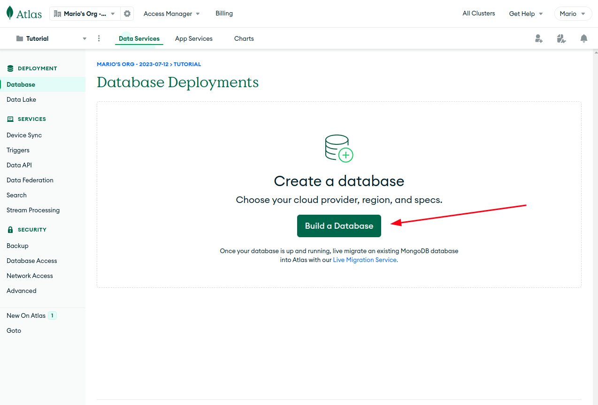
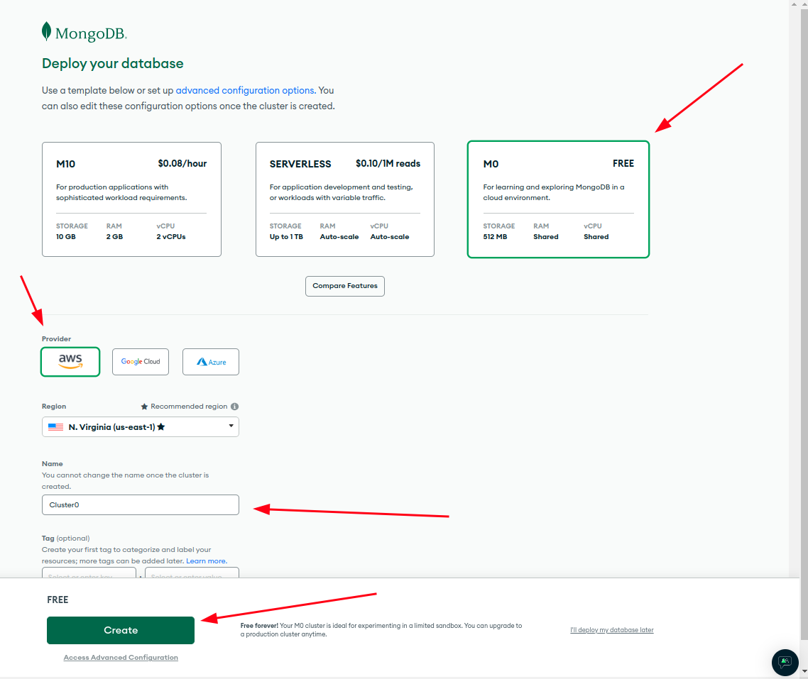
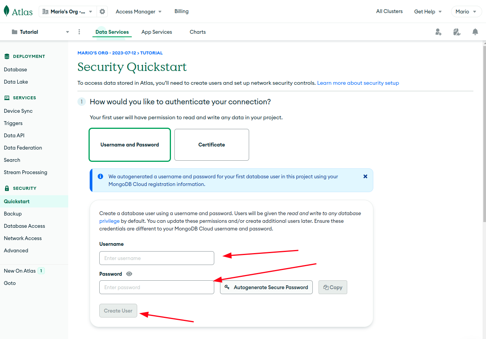
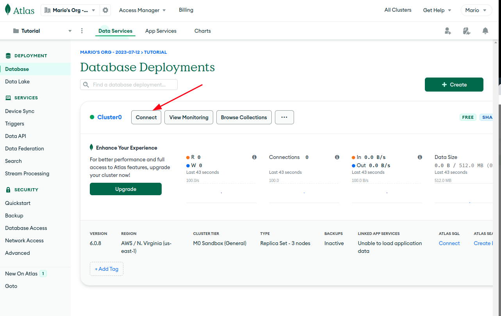
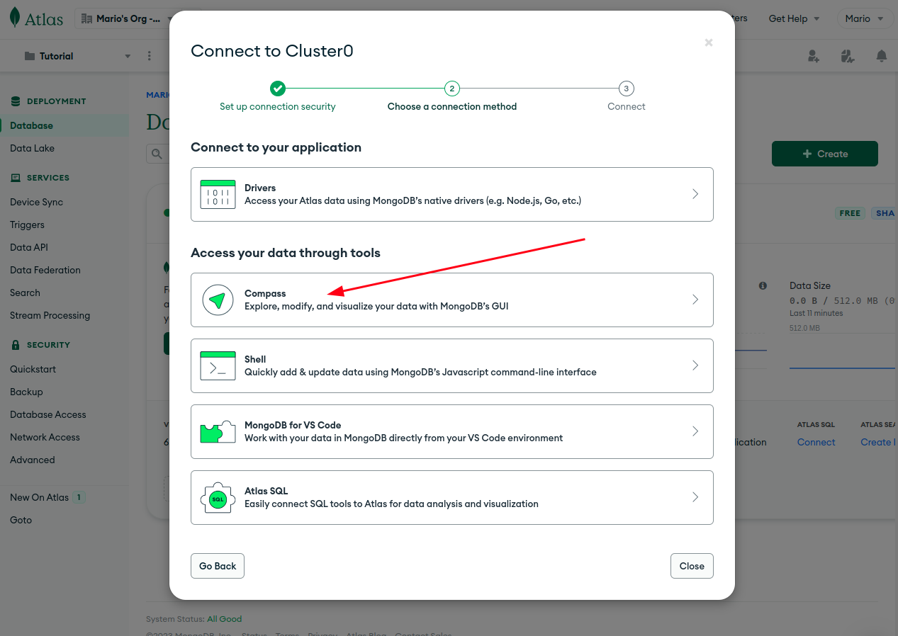
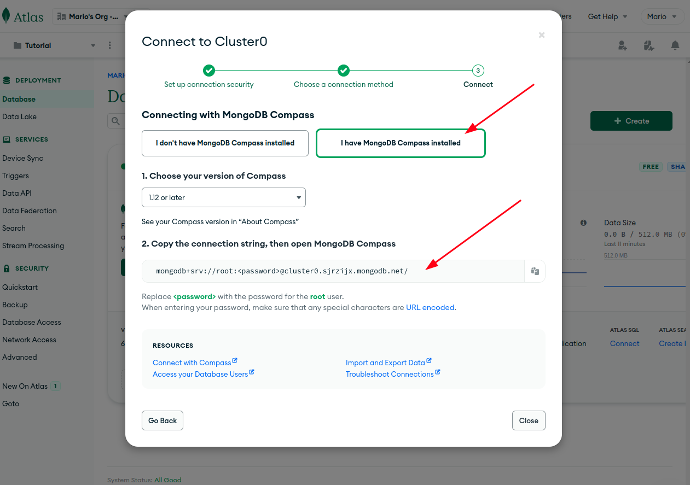
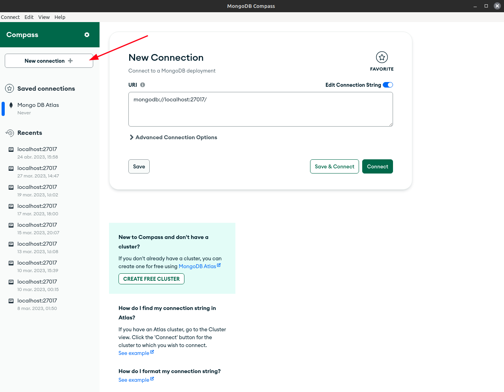
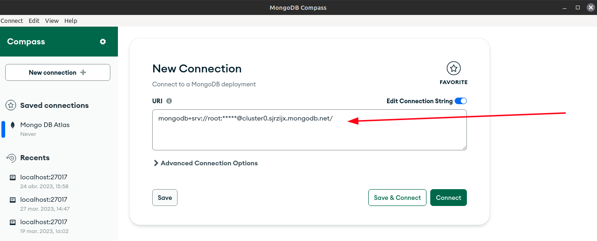
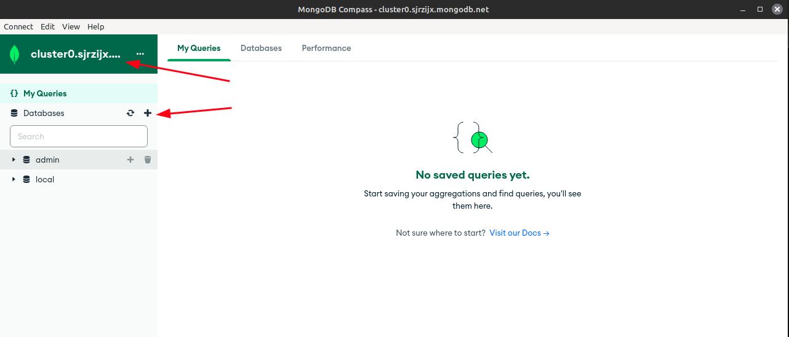

# Sección 36: **FullStack Java Script**

## 36.1. Full Stack y JavaScript

### FullStack

"Full stack" en el contexto de JavaScript se refiere a un desarrollador que tiene conocimientos y experiencia tanto en el desarrollo del lado del cliente (front-end) como en el desarrollo del lado del servidor (back-end) utilizando JavaScript.

Esto significa que un desarrollador full stack de JavaScript puede trabajar en todos los aspectos de una aplicación web, desde la interfaz de usuario que los usuarios ven y con la que interactúan hasta la lógica empresarial y la gestión de bases de datos en el servidor.

Un desarrollador full stack de JavaScript generalmente tiene habilidades en las siguientes áreas:

#### Front-end (lado del cliente):

El frontend en un entorno full stack con JavaScript es la parte de una aplicación web que se encarga de la interfaz de usuario y la interacción con los usuarios. Es la capa visible de la aplicación que los usuarios interactúan directamente a través de su navegador web.

En el frontend con JavaScript, se utilizan tecnologías como HTML, CSS y JavaScript para construir y diseñar la interfaz de usuario, y para hacer que la aplicación sea interactiva y receptiva a las acciones del usuario.

Las principales tecnologías y herramientas utilizadas en el frontend con JavaScript son:

1. **HTML (HyperText Markup Language)**: Es el lenguaje de marcado utilizado para estructurar y organizar el contenido de la página web. Define los elementos y la disposición de los elementos en la página.
2. **CSS (Cascading Style Sheets)**: Se utiliza para dar estilo y presentación a los elementos HTML. Con CSS, puedes controlar el diseño, el tamaño, los colores y otros aspectos visuales de la página.
3. **JavaScript**: Es un lenguaje de programación que permite hacer que la página web sea interactiva y dinámica. Con JavaScript, puedes realizar acciones como mostrar u ocultar elementos, responder a eventos del usuario (como hacer clic en un botón), realizar validaciones, animaciones y muchas otras funcionalidades.
4. **Frameworks y bibliotecas**: Existen varios frameworks y bibliotecas en JavaScript que facilitan el desarrollo del frontend. Algunos ejemplos populares son React, Angular y Vue.js. Estos frameworks proporcionan herramientas para crear componentes reutilizables, gestionar el estado de la aplicación y optimizar el rendimiento.
5. **Gestión de estado**: Para aplicaciones más grandes y complejas, es común utilizar bibliotecas o patrones de gestión de estado como Redux o Vuex. Estas herramientas ayudan a mantener un flujo de datos coherente y predecible en la aplicación.
6. **AJAX (Asynchronous JavaScript and XML)**: Con AJAX, se pueden realizar solicitudes y recibir respuestas del servidor de forma asíncrona sin tener que recargar toda la página. Esto permite actualizar partes específicas de la interfaz de usuario sin interrumpir la experiencia del usuario.
7. **Diseño responsive**: En el desarrollo frontend, es esencial asegurarse de que la aplicación sea accesible y se vea bien en diferentes dispositivos y tamaños de pantalla. Se utiliza CSS y prácticas de diseño responsivo para lograr esto.

En resumen, el frontend en un entorno full stack con JavaScript se centra en crear la parte visible de la aplicación web, utilizando HTML, CSS y JavaScript, junto con frameworks y bibliotecas para facilitar el desarrollo y mejorar la experiencia del usuario. El frontend se comunica con el backend a través de API para enviar y recibir datos y mantener la aplicación funcionando de manera fluida y eficiente.

#### Back-end (lado del servidor):

El backend en un entorno full stack con JavaScript se refiere a la parte de una aplicación web que se ocupa de procesar datos, gestionar la lógica de negocio, interactuar con bases de datos y ofrecer servicios o API a través de la web. En otras palabras, el backend es la "espalda" de la aplicación que no es visible directamente para el usuario, pero es esencial para que la aplicación funcione correctamente.

En un entorno full stack con JavaScript, el backend se construye utilizando tecnologías y herramientas basadas en JavaScript, siendo Node.js la principal plataforma utilizada para este propósito. Algunas de las tecnologías y herramientas comunes utilizadas en el backend full stack con JavaScript son las siguientes:

1. **Node.js**: Es un entorno de ejecución de JavaScript del lado del servidor que permite ejecutar código JavaScript fuera del navegador. Node.js utiliza el motor V8 de Google Chrome para interpretar y ejecutar el código JavaScript.
2. **Express.js**: Es un framework minimalista y flexible para Node.js que facilita la creación de servidores web y la construcción de API RESTful. Express.js proporciona herramientas y funciones para manejar rutas, solicitudes HTTP, middleware y mucho más.
3. **Base de datos**: Para almacenar y gestionar datos, se utilizan diferentes tipos de bases de datos en el backend, como bases de datos relacionales (por ejemplo, MySQL, PostgreSQL) o bases de datos NoSQL (por ejemplo, MongoDB, Redis). Estas bases de datos permiten realizar operaciones de lectura y escritura en los datos de la aplicación.
4. **API (Application Programming Interface)**: El backend full stack con JavaScript proporciona una API que permite a la parte del frontend y otras aplicaciones externas interactuar con los datos y servicios de la aplicación. La API define cómo se pueden realizar solicitudes y recibir respuestas en un formato específico, como JSON.
5. **Seguridad y autenticación**: El backend debe implementar medidas de seguridad para proteger los datos y prevenir ataques maliciosos. Esto incluye técnicas como la validación de datos de entrada, el cifrado de contraseñas y la implementación de sistemas de autenticación y autorización.
6. **Pruebas automatizadas**: Es importante realizar pruebas automatizadas en el backend para asegurar su correcto funcionamiento y detectar posibles errores antes de implementarlos en producción. Para ello, se pueden utilizar herramientas como Mocha, Chai o Jest.
7. **Despliegue y gestión del servidor**: Una vez que el backend está listo, debe ser desplegado en un servidor para que la aplicación esté disponible en línea. Para esto, se utilizan herramientas como PM2, Nginx, Docker, entre otros.

En resumen, el backend full stack con JavaScript es la parte de la aplicación que se ejecuta en el servidor y se encarga de la lógica de negocio, la gestión de datos y la exposición de servicios a través de una API. Se construye utilizando Node.js y otras herramientas basadas en JavaScript para proporcionar un entorno completo en el desarrollo de aplicaciones web.

Tener habilidades en ambos lados de la pila (front-end y back-end) permite a los desarrolladores full stack de JavaScript crear aplicaciones completas y funcionales desde el inicio hasta el despliegue, lo que puede ser especialmente útil en proyectos más pequeños o en empresas emergentes donde los recursos pueden ser limitados. También les permite tener una visión más completa de cómo funciona una aplicación en su conjunto. Sin embargo, es importante tener en cuenta que el desarrollo full stack puede ser un campo amplio y en constante evolución, por lo que los desarrolladores full stack suelen estar en constante aprendizaje para mantenerse al día con las últimas tecnologías y prácticas.

## 36.2. Herramientas FullStack

Para desarrollar proyectos full stack, es necesario contar con un conjunto de herramientas que abarquen tanto el frontend como el backend de la aplicación. A continuación, te presento una lista de herramientas esenciales para proyectos full stack:

**Frontend:**

1. **Editor de código**: Un buen editor de código es fundamental para el desarrollo frontend. Algunas opciones populares son Visual Studio Code, Sublime Text o Atom.
2. **HTML, CSS y JavaScript**: Estas son las tecnologías básicas para construir la interfaz de usuario y la lógica interactiva en el frontend.
3. **Framework JavaScript**: Utilizar un framework como React, Angular o Vue.js puede ayudar a agilizar el desarrollo, proporcionar estructura y mejorar el rendimiento de la aplicación.
4. **Gestor de paquetes**: Herramientas como npm (Node Package Manager) o Yarn se utilizan para gestionar las dependencias y paquetes de JavaScript necesarios para el proyecto.
5. **Sistema de control de versiones**: Utilizar Git para realizar un seguimiento de los cambios en el código y colaborar con otros desarrolladores.
6. **Diseño responsivo**: Frameworks CSS como Bootstrap o Material-UI pueden facilitar el diseño responsivo y la creación de interfaces atractivas.
7. **Pruebas y depuración**: Herramientas como Jest, Enzyme o React Testing Library pueden ser útiles para realizar pruebas unitarias y de integración en el frontend.

**Backend:**

1. **Node.js**: Como mencionamos anteriormente, Node.js es una plataforma esencial para ejecutar código JavaScript en el servidor.
2. **Framework web**: Utilizar un framework como Express.js puede ayudar a crear servidores web y API RESTful de forma más rápida y sencilla.
3. **Base de datos**: Seleccionar una base de datos adecuada para el proyecto, como MySQL, PostgreSQL, MongoDB u otras bases de datos NoSQL.
4. **ORM (Object-Relational Mapping)** o ODM (Object-Document Mapping): Estas herramientas facilitan la interacción con la base de datos mediante el uso de objetos y clases en lugar de consultas SQL directas. Ejemplos incluyen Sequelize para bases de datos relacionales o Mongoose para MongoDB.
5. **Autenticación y seguridad**: Bibliotecas como Passport.js pueden ayudar a implementar la autenticación de usuarios y otras medidas de seguridad.
6. **Middleware**: Utilizar middleware para procesar solicitudes y respuestas en el servidor y realizar tareas como la autenticación, el registro de errores, etc.
7. **Pruebas automatizadas**: Herramientas como Mocha, Chai o Jest se utilizan para realizar pruebas unitarias y de integración en el backend.

**Despliegue y gestión:**

1. **Servidor web**: Un servidor como Nginx o Apache para alojar la aplicación en producción.
2. **Plataforma en la nube**: Servicios como AWS, Google Cloud Platform o Microsoft Azure para desplegar la aplicación en la nube.
3. **Contenedores**: Utilizar Docker para crear y gestionar contenedores, lo que facilita el despliegue y la escalabilidad.
4. **Gestor de procesos**: Utilizar herramientas como PM2 para gestionar y supervisar los procesos de Node.js en producción.

Estas son algunas de las herramientas fundamentales que un desarrollador necesita para proyectos full stack con JavaScript. Es importante tener en cuenta que la elección de herramientas puede variar según el tipo de proyecto, los requisitos específicos y las preferencias del equipo de desarrollo.

## 36.3. Creando y Conectando Base de datos para el backend

### Mongo DB Atlas & Mongo DB Compass

#### **MongoDB Atlas:**

MongoDB Atlas es un servicio de base de datos gestionado en la nube proporcionado por MongoDB, Inc. Es una plataforma en la nube que te permite crear, configurar y escalar clústeres de bases de datos MongoDB sin la necesidad de gestionar la infraestructura subyacente. Con MongoDB Atlas, puedes implementar y alojar tus bases de datos MongoDB en la nube de diferentes proveedores, como AWS, Google Cloud o Azure.

#### **MongoDB Compass:**

MongoDB Compass es una interfaz gráfica de usuario (GUI) que te permite interactuar y administrar bases de datos MongoDB de manera más visual y sencilla. Es una herramienta de escritorio que se instala en tu máquina local y te permite explorar, consultar y visualizar los datos almacenados en tus bases de datos MongoDB.

MongoDB Compass se utiliza generalmente durante el desarrollo y la administración de bases de datos MongoDB en tu entorno local o en una red local. Puedes utilizarlo para realizar consultas, insertar, actualizar y eliminar datos, analizar la estructura de las colecciones y obtener información sobre el rendimiento de las consultas.

**Para empezar a utilizar MongoDB Atlas y conectar con nuestro gestor de base de datos Mongo DB compass, sigue estos pasos:**

**Paso 1: Crear una cuenta en MongoDB Atlas**
Accede al sitio web de MongoDB Atlas en https://www.mongodb.com/cloud/atlas y crea una cuenta si aún no tienes una. Puedes registrarte utilizando tu correo electrónico u otras opciones de inicio de sesión.

**Paso 2: Crear un clúster**
Una vez que hayas iniciado sesión en MongoDB Atlas, puedes crear un nuevo clúster. Un clúster es un conjunto de servidores de bases de datos que trabajan juntos para proporcionar alta disponibilidad, escalabilidad y replicación de datos.

- Haz clic en el botón "Create a New Cluster" o "Build a Cluster".

  

- Selecciona una opción del proveedor de la nube (como AWS, Google Cloud o Azure) y la región geográfica donde deseas que se hospede el clúster.

  

- Configura las opciones del clúster, como el tamaño de las instancias, la versión de MongoDB y las opciones de seguridad.

**Paso 3: Configurar la seguridad**
Es esencial asegurar tu clúster de MongoDB Atlas. Configura las opciones de seguridad, como agregar direcciones IP a la lista de acceso, crear usuarios y contraseñas, y habilitar la autenticación y el cifrado de datos.

Recuerda que MongoDB Atlas es un servicio en la nube, lo que significa que deberás pagar por el uso del clúster según el plan que elijas (free hasta 500 mb). Puedes encontrar más detalles sobre los precios y las opciones de configuración en el sitio web de MongoDB Atlas.

**Paso 4: Conectarse a la base de datos**
Una vez que el clúster está configurado y en funcionamiento, puedes conectar con el gestor mongo db compass a la base de datos de MongoDB Atlas utilizando la cadena de conexión proporcionada en la consola de administración de MongoDB Atlas.

Obtener la cadena de conexión de MongoDB Atlas
En el panel de MongoDB Atlas, selecciona tu clúster y haz clic en el botón "Connect" (Conectar). A continuación, elige la opción que puedas utilizar la herramienta compass.

Esto te mostrará la cadena de conexión que debes utilizar para conectarte a tu clúster desde una aplicación cliente como MongoDB Compass, no olvides tener instalado la aplicacion en tu sistema.

**Paso 5: Copiar la cadena de conexión**

Haz clic en el botón "Copy" (Copiar) junto a la cadena de conexión para copiarla al portapapeles.

**Paso 6: Abrir MongoDB Compass**
Abre MongoDB Compass en tu máquina local si aún no lo has hecho.

**Paso 7: Conectar con MongoDB Compass**

- Al abrir MongoDB Compass, selecciona la opción "Connect" (Conectar) en la pantalla principal.

  

- En la ventana emergente "New Connection" (Nueva conexión), selecciona la pestaña "Connect using MongoDB URI" (Conectar utilizando URI de MongoDB).
- Pega la cadena de conexión que copiaste en el paso 5 en el campo "MongoDB Connection URI".
- Haz clic en el botón "Connect" (Conectar) para establecer la conexión con tu clúster de MongoDB Atlas.

  

**Paso 8: Ingresar credenciales (si es necesario)**
Si tu clúster de MongoDB Atlas está configurado con autenticación, MongoDB Compass te pedirá ingresar las credenciales (usuario y contraseña) antes de establecer la conexión.

Paso 9: Seleccionar la base de datos
Una vez conectado, MongoDB Compass te mostrará una lista de todas las bases de datos disponibles en tu clúster. Selecciona o crea la base de datos con la que deseas trabajar haciendo clic en su nombre, por defecto al iniciar aparecerá la base de datos admin y local.

¡Listo! Ahora estás conectado a tu clúster de MongoDB Atlas desde MongoDB Compass, y puedes explorar, consultar y administrar tus bases de datos de manera más visual y amigable utilizando la interfaz gráfica de MongoDB Compass.
